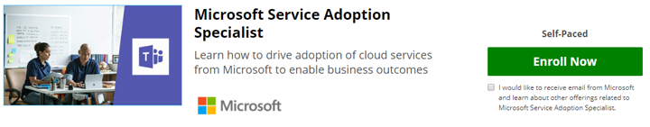

# Valider vos compétences : devenir spécialiste de l’adoption de service

Si l’adoption de service fait partie de votre rôle ou si vous souhaitez approfondir la formation formelle sur cette rubrique, vous pouvez vous inscrire au cours en ligne fourni par Microsoft sur notre site partenaire, EdX.org. 

Ce cours en ligne de spécialiste de [l’adoption de](/learn/paths/m365-service-adoption/) service **est gratuit.**  Si vous souhaitez recevoir votre certificat EdX pour l’achèvement, des frais de 99,00 dollars sont requis.  Ce cours a été rédigé par [Karuana Gatimu](https://linkedin.com/in/karuanagatimu) de Microsoft Teams Engineering avec les commentaires de plusieurs experts informatiques Microsoft MVP et Microsoft.  Les meilleures pratiques contenues dans ce secteur ont été rassemblées à partir de l’observation de l’industrie dans son ensemble et sont complémentaires à une formation formelle sur la gestion des changements organisationnels.  

Ce cours contient des conseils pratiques, des outils et du contenu supplémentaire qui vous permettront de valider vos compétences dans cette fonctionnalité commerciale importante.  

En savoir plus dans [notre annonce](https://aka.ms/AdoptionCertAnnouncement) sur la publication de ce cours. 

Rejoignez notre communauté en ligne d’utilisateurs professionnels et de professionnels de l’informatique en savoir plus sur l’adoption. https://aka.ms/DriveAdoption