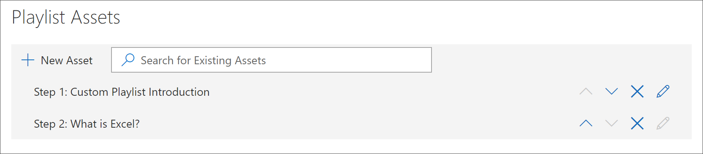

# Ajouter des ressources à une playlist personnaliséeAdd Assets to a Custom Playlist

Les voies de formation vous permettent d’ajouter les composants suivants à une liste de lecture :With learning pathways, you can add the following assets to a playlist:

- **Ressources d’apprentissage microsoft 365 existantes** : il s’agit des biens qui font partie du catalogue Microsoft Online ou des ressources que votre organisation a déjà ajoutées aux voies d’apprentissage.**Existing Microsoft 365 learning pathways assets** - these are assets that are part of the Microsoft online catalog or assets that your organization has already added to learning pathways.
- **Nouvelles ressources** : il s’agit des biens que vous ajoutez aux voies d’apprentissage créées à partir de pages SharePoint créées ou de composants SharePoint déjà disponibles sur un site SharePoint de votre organisation.**New assets** - these are assets that you add to learning pathways that are built from SharePoint pages that you create or SharePoint assets that are already available on a SharePoint site in your organization. 

> [!TIP]
> Si un élément de la liste de lecture Microsoft ne répond pas à vos besoins, créez une nouvelle sélection, puis ajoutez les ressources Microsoft et les ressources nouvellement créées à la sélection pour créer l’expérience souhaitée.If a Microsoft playlist asset doesn't meet your needs, create a new playlist and then add the Microsoft assets and any newly created assets to the playlist to build the experience you want. Vous ne pouvez pas modifier les sélections de voies d’apprentissage fournies par Microsoft, mais vous pouvez ajouter des éléments de chemin d’apprentissage fournis à une playlist personnalisée.You can't modify learning pathways playlists supplied by Microsoft, but you can add learning pathways-supplied assets to a custom playlist.   

## Créer une nouvelle ressource pour une playlistCreate a new asset for a playlist

Il existe deux options pour ajouter une nouvelle ressource à une playlist.There are two options for adding a new asset to a playlist.

- **Page créer un élément** : avec cette option, les voies d’apprentissage généreront une nouvelle page SharePoint vierge et l’ajouteront à la playlist.**Create Asset Page** - with this option, learning pathways will generate a new,  blank SharePoint page for you and add it to the playlist. Vous pouvez ensuite ajouter du contenu à la page et l’enregistrer.You can then add content to the page and save it.  
- **Entrez l’URL** : avec cette option, vous créez la page à l’avance ou vous disposez déjà de la page disponible et vous spécifiez l’URL pour ajouter la page à la playlist.**Enter the URL** - with this option, you build the page in advance or you already have the page available and you specify the URL to add the page to the playlist.

### Page créer un élémentCreate Asset Page 
À l’aide de l’option **créer un élément** de la page, vous fournissez un titre pour l’élément, puis cliquez sur créer une page d’inventaire pour créer et ouvrir une nouvelle page SharePoint à des fins de modification.With the **Create Asset Page** option, you provide a title for the Asset, then click Create Asset page to create and open a new SharePoint page for editing. 

1.  Si la sélection n’est pas déjà ouverte pour modification, à partir de la page **administration de formation personnalisée** , cliquez sur la liste de lecture que vous souhaitez modifier.If the playlist isn't already open for editing, from the **Custom Learning Administration** page, click the playlist you wish to edit. 
2. Pour ajouter une nouvelle ressource à une sélection, cliquez sur **nouvelle ressource**.To add a new asset to a playlist, click **New Asset**. 
3. Entrez un titre.Enter a title. Dans cet exemple, entrez « ajouter des biens à une liste de lecture », puis cliquez sur **créer une page d’actif**.In this example enter “Add Assets to a Playlist”, and then click **Create Asset Page**.

4. Cliquez sur **ouvrir la page**.Click **Open Page**.
5. Cliquez sur l’icône **modifier** , puis cliquez sur **modifier le composant WebPart** dans la zone de titre.Click the **Edit** icon, and then click **Edit Web part** in the Title area.
6. Sous **disposition**, cliquez sur **standard**.Under **Layout**, click **Plain**. 
7. Ajoutez une nouvelle section à une colonne, puis ajoutez un exemple de texte à la page de sorte qu’il ressemble à l’exemple suivant.Add a new one-column section, and then add some sample text to the page so it looks like the following example. 

7. Cliquez sur **Publier**.Click **Publish**.
8. Revenez à la page **administration de formation personnalisée** .Return to the **Custom Learning Administration** page. 
9. Renseignez les autres propriétés de l’élément, puis cliquez sur enregistrer l' **élément.**Fill out the remainder of the properties for the asset, and then click **Save Asset.**

### Entrez l’URLEnter the URL
Avec l’option **Entrez l’URL** , vous fournissez un titre pour l’élément, puis cliquez sur **Entrez l’URL** pour spécifier la page SharePoint que vous souhaitez ajouter à la liste de lecture.With the **Enter the URL** option, you provide a title for the Asset, then click **Enter the URL** to specify the SharePoint page you want to add to the playlist. 

1.  Si la sélection n’est pas ouverte pour modification, à partir de la page Administration de l' **apprentissage personnalisée** , cliquez sur la liste de lecture que vous souhaitez modifier.If the playlist isn't open for editing, from the **Custom Learning Administration** page, click the playlist you wish to edit. 
2. Pour ajouter une nouvelle ressource à une sélection, cliquez sur **nouvelle ressource**.To add a new asset to a playlist, click **New Asset**. 
3. Entrez un titre.Enter a title. Dans cet exemple, entrez « introduction de la playlist personnalisée », puis cliquez sur **entrer l’URL**.In this example, enter “Custom Playlist Introduction”, and then click **Enter URL**. 

4. Entrez l’URL de la page SharePoint que vous avez créée dans une section précédente [créer des pages SharePoint pour les playlists personnalisées ](custom_createnewpage.md) , puis renseignez les champs restants, comme indiqué dans l’illustration suivante.Enter the URL of the SharePoint page you created in a previous [Create SharePoint pages for custom playlists ](custom_createnewpage.md) section, and then fill out the remainder of the fields, as shown in the following illustration.

5. Cliquez sur **enregistrer l’élément**.Click **Save Asset**. 

## Ajouter un élément existant à une liste de lectureAdd an existing asset to a playlist

Les biens existants consistent en des éléments de voies d’apprentissage fournis par Microsoft ou des biens qui ont déjà été ajoutés aux voies d’apprentissage par votre organisation.Existing assets consist of Microsoft-provided learning pathways assets or assets that have already been added to learning pathways by your organization. 

- Dans la zone de **recherche** , entrez une expression de recherche, puis sélectionnez un élément dans les résultats de la recherche.In the **Search** box, enter a Search phrase, and then select an asset from the Search results. Dans cet exemple, entrez « qu’est-ce qu’Excel ? »In this example, enter “What is Excel?” pour ajouter une rubrique d’introduction Excel à la sélection.to add an Excel intro topic to the playlist.

## Modifier, déplacer et supprimer des ressourcesEdit, move, and delete assets
Vous pouvez modifier les ressources personnalisées que vous créez, mais pas les biens de Microsoft.You can edit custom assets that you create, but not assets from Microsoft. Toutefois, vous pouvez supprimer toutes les ressources d’une sélection et modifier les ressources de commande.However, you can remove all assets from a playlist and change the order assets. 

### Modifier un élémentEdit an asset
- Cliquez sur le bouton modifier pour un élément, modifiez-le, puis cliquez sur enregistrer l’actif.Click the Edit button for an asset, modify the asset, and then click Save Asset. 

### Déplacer un élément dans une liste de lectureMove an asset in a playlist
- Cliquez sur la flèche vers le haut ou vers le bas située à droite de l’immobilisation pour déplacer l’ordre des éléments dans la liste de lecture.Click the up or down arrow to the right of the asset to move the asset order in the playlist

### Supprimer un élément d’une liste de lectureRemove an asset from a playlist
- Cliquez sur l’icône supprimer de la playlist X du bien.Click the Remove from Playlist X icon for the asset. 

## Afficher la liste de lecture en actionView the playlist in Action
À présent que vous avez ajouté des ressources à une sélection, nous allons fermer la playlist et la voir en action.Now that you've added assets to a playlist, let's close the playlist and see it in action. 

1. Cliquez sur **Fermer la playlist**.Click **Close Playlist**.
2. Cliquez sur l’onglet avec la page de **formation Office 365** .Click the tab with the **Office 365 training** page.
3. Actualisez la page, puis cliquez sur **premiers jours** sous **prise en main**.Refresh the page, and then click **First Days** under **Get Started**.
4. Cliquez sur **Starter Kit des chemins d’apprentissage** pour afficher votre première sélection en action.Click **Learning Pathways Starter Kit** to view your first playlist in action. 

