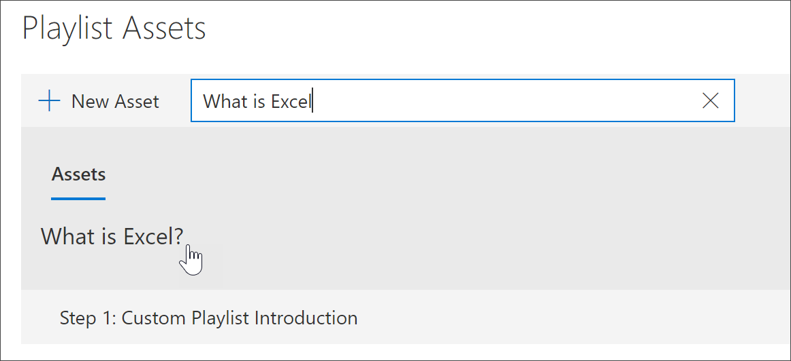

# Ajouter des ressources à une playlist personnalisée

Les voies de formation vous permettent d’ajouter les composants suivants à une liste de lecture :

- **Ressources d’apprentissage microsoft 365 existantes** : il s’agit des biens qui font partie du catalogue Microsoft Online ou des ressources que votre organisation a déjà ajoutées aux voies d’apprentissage.
- **Nouvelles ressources** : il s’agit des biens que vous ajoutez aux voies d’apprentissage créées à partir de pages SharePoint créées ou de composants SharePoint déjà disponibles sur un site SharePoint de votre organisation. 

> [!TIP]
> Si un élément de la liste de lecture Microsoft ne répond pas à vos besoins, créez une nouvelle sélection, puis ajoutez les ressources Microsoft et les ressources nouvellement créées à la sélection pour créer l’expérience souhaitée. Vous ne pouvez pas modifier les sélections de voies d’apprentissage fournies par Microsoft, mais vous pouvez ajouter des éléments de chemin d’apprentissage fournis à une playlist personnalisée.   

## Créer une nouvelle ressource pour une playlist

Il existe deux options pour ajouter une nouvelle ressource à une playlist.

- **Page créer un élément** : avec cette option, les voies d’apprentissage généreront une nouvelle page SharePoint vierge et l’ajouteront à la playlist. Vous pouvez ensuite ajouter du contenu à la page et l’enregistrer.  
- **Entrez l’URL** : avec cette option, vous créez la page à l’avance ou vous disposez déjà de la page disponible et vous spécifiez l’URL pour ajouter la page à la playlist.

### Page créer un élément 
À l’aide de l’option **créer un élément** de la page, vous fournissez un titre pour l’élément, puis cliquez sur créer une page d’inventaire pour créer et ouvrir une nouvelle page SharePoint à des fins de modification. 

1.  Si la sélection n’est pas déjà ouverte pour modification, à partir de la page **administration de formation personnalisée** , cliquez sur la liste de lecture que vous souhaitez modifier. 
2. Pour ajouter une nouvelle ressource à une sélection, cliquez sur **nouvelle ressource**. 
3. Entrez un titre. Dans cet exemple, entrez « ajouter des biens à une liste de lecture », puis cliquez sur **créer une page d’actif**.

4. Cliquez sur **ouvrir la page**.
5. Cliquez sur l’icône **modifier** , puis cliquez sur **modifier le composant WebPart** dans la zone de titre.
6. Sous **disposition**, cliquez sur **standard**. 
7. Ajoutez une nouvelle section à une colonne, puis ajoutez un exemple de texte à la page de sorte qu’il ressemble à l’exemple suivant. 

7. Cliquez sur **Publier**.
8. Revenez à la page **administration de formation personnalisée** . 
9. Renseignez les autres propriétés de l’élément, puis cliquez sur enregistrer l' **élément.**

### Entrez l’URL
Avec l’option **Entrez l’URL** , vous fournissez un titre pour l’élément, puis cliquez sur **Entrez l’URL** pour spécifier la page SharePoint que vous souhaitez ajouter à la liste de lecture. 

1.  Si la sélection n’est pas ouverte pour modification, à partir de la page Administration de l' **apprentissage personnalisée** , cliquez sur la liste de lecture que vous souhaitez modifier. 
2. Pour ajouter une nouvelle ressource à une sélection, cliquez sur **nouvelle ressource**. 
3. Entrez un titre. Dans cet exemple, entrez « introduction de la playlist personnalisée », puis cliquez sur **entrer l’URL**. 

4. Entrez l’URL de la page SharePoint que vous avez créée dans une section précédente [créer des pages SharePoint pour les playlists personnalisées](custom_createnewpage.md) , puis renseignez les champs restants, comme indiqué dans l’illustration suivante.

5. Cliquez sur **enregistrer l’élément**. 

## Ajouter un élément existant à une liste de lecture

Les biens existants consistent en des éléments de voies d’apprentissage fournis par Microsoft ou des biens qui ont déjà été ajoutés aux voies d’apprentissage par votre organisation. 

- Dans la zone de **recherche** , entrez une expression de recherche, puis sélectionnez un élément dans les résultats de la recherche. Dans cet exemple, entrez « qu’est-ce qu’Excel ? » pour ajouter une rubrique d’introduction Excel à la sélection.

## Modifier, déplacer et supprimer des ressources
Vous pouvez modifier les ressources personnalisées que vous créez, mais pas les biens de Microsoft. Toutefois, vous pouvez supprimer toutes les ressources d’une sélection et modifier les ressources de commande. 

### Modifier un élément
- Cliquez sur le bouton modifier pour un élément, modifiez-le, puis cliquez sur enregistrer l’actif. 

### Déplacer un élément dans une liste de lecture
- Cliquez sur la flèche vers le haut ou vers le bas située à droite de l’immobilisation pour déplacer l’ordre des éléments dans la liste de lecture.

### Supprimer un élément d’une liste de lecture
- Cliquez sur l’icône supprimer de la playlist X du bien. 

## Afficher la liste de lecture en action
À présent que vous avez ajouté des ressources à une sélection, nous allons fermer la playlist et la voir en action. 

1. Cliquez sur **Fermer la playlist**.
2. Cliquez sur l’onglet avec la page de **formation Office 365** .
3. Actualisez la page, puis cliquez sur **premiers jours** sous **prise en main**.
4. Cliquez sur **Starter Kit des chemins d’apprentissage** pour afficher votre première sélection en action. 

