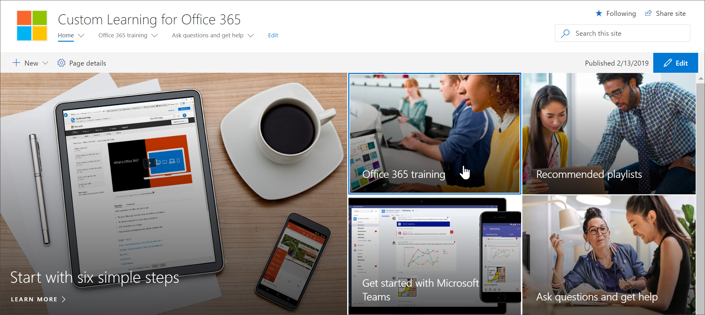

# Ajouter un site d’apprentissage personnalisé propriétairesAdd Owners Custom Learning site

Le site Formation personnalisée pour Office 365 est hébergé dans votre client Office 365. Vous devrez donc vous connectez à Office 365, si vous n’êtes pas déjà connecté, pour vous rendre sur le site.The Custom Learning for Office 365 site is hosted in your Office 365 tenant, so you'll need to sign in to Office 365, if you're not already signed in, to get to the site. 

## Sign in to Office 365Sign in to Office 365 

1.  Ouvrez votre navigateur web et accédez à office.com ou à l’emplacement de connexion de votre organisation.Open your Web browser and navigate to office.com or your organization’s sign-in location. 
2.  Connectez-vous à l’aide de vos nom d’utilisateur et mot de passe.Sign in with your user name and password.
3.  Accédez à l’emplacement du site.Navigate to the location of the site. Si ce n’est pas le cas, vous pouvez le trouver dans le courrier que vous avez reçu du service d’approvisionnement PnP.If you don't have it available, you can find it in the mail you recieved from the PnP Provisioning Service. Sélectionnez SharePoint dans la page d’accueil Office 365, puis sélectionnez le site Apprentissage personnalisé pour **Office 365.**Select SharePoint from the Office 365 Home page, and then select the **Custom Learning for Office 365** site. Vous l’avez peut-être nommé différemment.You may have named it different. 
5. Cliquez sur la vignette de formation **Office 365** pour voir la suite complète de la sélection de formation disponible avec l’apprentissage personnalisé et pour vérifier que l’apprentissage personnalisé fonctionne comme prévu.Click the **Office 365 training** tile to see the full suite of training playlist available with Custom Learning and to verify Custom Learning is working as expected. 

   

## Afficher tout le contenu d’apprentissage personnaliséView all the Custom Learning content
La page de formation Office 365 héberge le volet Web Apprentissage personnalisé configuré pour afficher toutes les formations disponibles pour l’apprentissage personnalisé.The Office 365 training page hosts the Custom Learning Web part configured to show all the training available for Custom Learning. 

1. Faites défiler la page vers le bas pour afficher toutes les catégories et sous-catégories.Scroll down the page to view all the categories and subcategories.
2. Lancez un peu le projet.Kick the tires a bit. Cliquez sur quelques sous-catégories, puis sur quelques playlists pour avoir une bonne expérience de l’organisation du contenu d’apprentissage personnalisé.Click a few subcategories, and then click a few playlists to get a feel for how Custom Learning content is organized. 

## Ajouter des propriétaires au siteAdd Owners to Site
En tant qu’administrateur client, il est peu probable que vous soyez la personne qui personnalisant le site, vous devrez donc affecter quelques propriétaires au site.As the Tenant Admin, it's unlikely you'll be the person customizing the site, so you'll need to assign a few owners to the site. Les propriétaires ont des privilèges d’administration sur le site pour pouvoir modifier les pages du site et renommer le site.Owners have administrative privileges on the site so they can modify site pages and rebrand the site. Ils ont également la possibilité de masquer et d’afficher le contenu remis via le volet Web Apprentissage personnalisé.They also have the ability to hide and show content delivered through the Custom Learning Web part. Ils ont également la possibilité de créer une playlist personnalisée et de les affecter à des sous-catégories personnalisées.They'll also have the ability to build custom playlist and assign them to custom subcategories.  

1. Dans le menu **Paramètres** SharePoint, cliquez sur **Autorisations du site.**From the SharePoint **Settings** menu, click **Site Permissions**.
2. Cliquez **sur Paramètres d’autorisation avancés.**Click **Advanced Permission Settings**.
3. Cliquez **sur Formation personnalisée pour les propriétaires d’Office 365.**Click **Custom learning for Office 365 Owners**.
4. Cliquez **sur Ajouter** des  >  **utilisateurs à ce groupe,** ajoutez les personnes que vous souhaitez être propriétaires, puis cliquez sur **Partager.**Click **New** > **Add Users to this group**, add the people you want to be Owners, and then click **Share**.

