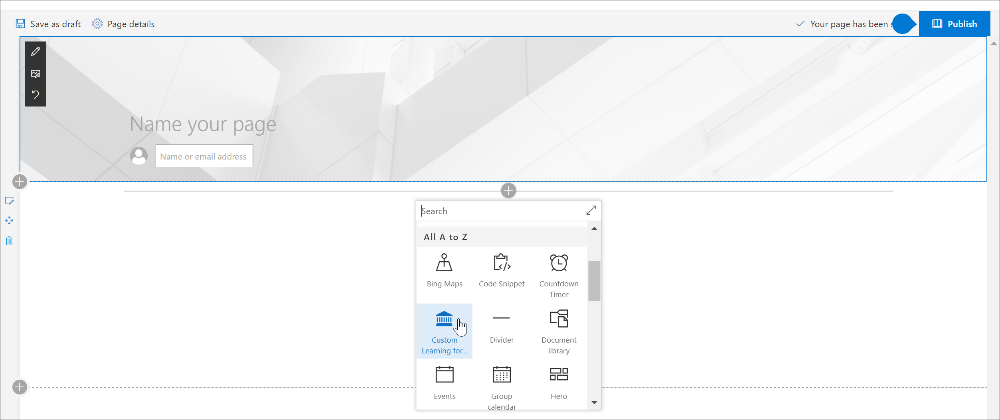
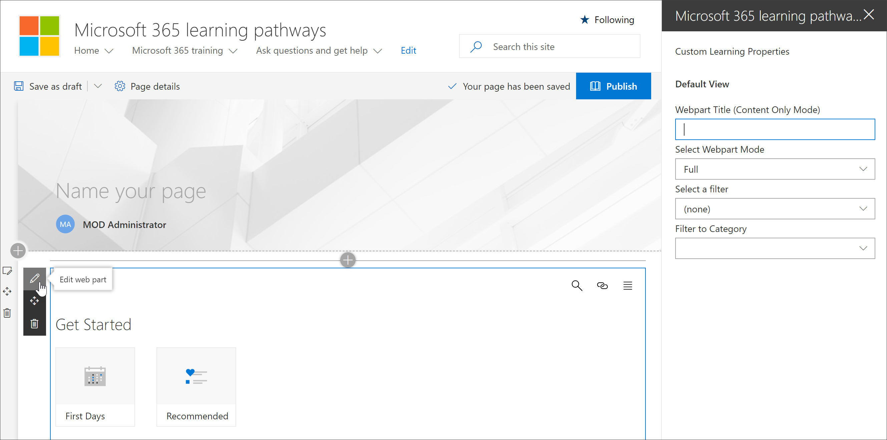

# Ajouter et modifier le composant WebPart formation personnalisée

La formation personnalisée vous permet d'ajouter le composant WebPart d'apprentissage personnalisé à une page SharePoint, puis de filtrer le contenu du composant WebPart pour répondre aux objectifs d'apprentissage de la page. Par exemple, vous pouvez créer une page de basculement vers OneDrive, puis ajouter le composant WebPart et le configurer pour afficher les sélections de migration OneDrive personnalisées créées spécialement pour votre organisation.

1.  Cliquez sur l'icône de l'engrenage SharePoint, puis cliquez sur **Ajouter une page**.
2.  Cliquez sur **Ajouter une nouvelle section (+)** sur le côté gauche de la page, puis cliquez sur **une seule colonne**.
3.  Cliquez **+** sur, puis sélectionnez **Custom Learning for Office 365** Web part. 

## Modifier le composant WebPart formation personnalisée
Vous pouvez modifier le composant WebPart d'apprentissage personnalisé pour afficher tout le contenu d'apprentissage personnalisé disponible ou une catégorie, une sous-catégorie, une liste de sélection ou un élément spécifique. 

1.  Cliquez sur **modifier le composant WebPart**.

2. Dans le volet des propriétés d'apprentissage personnalisées, filtrez le composant WebPart pour les éléments suivants. 

- Mode WebPart: complet
- Filtre: sous-catégorie
- Sous-catégorie: Excel

3. Votre page doit maintenant ressembler à ce qui suit: 

## Ajouter un titre et publier la page
1. Dans la zone de titre de la page, tapez «créer votre propre expérience».
2. Cliquez sur l'icône **modifier le composant WebPart** dans la zone de titre, sélectionnez **simple** sous **disposition**, puis fermez le volet des **Propriétés** .
3. Cliquez sur **Publier**.
