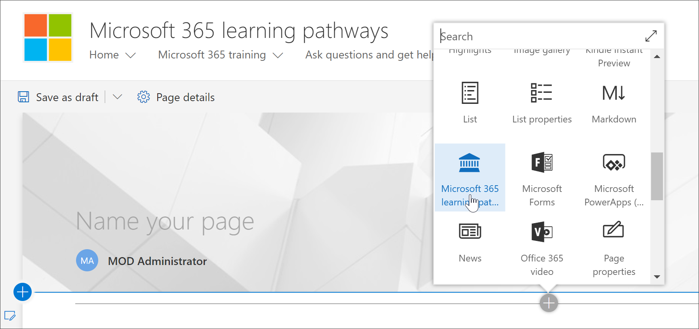

# Ajouter et modifier le composant WebPart formation personnaliséeAdd and Edit the Custom Learning web part

La formation personnalisée vous permet d'ajouter le composant WebPart d'apprentissage personnalisé à une page SharePoint, puis de filtrer le contenu du composant WebPart pour répondre aux objectifs d'apprentissage de la page.Custom Learning gives you the flexibility to add the Custom Learning Web part to a SharePoint page, and then filter the contents of the Web part to meet the learning objectives for the page. Par exemple, vous pouvez créer une page de basculement vers OneDrive, puis ajouter le composant WebPart et le configurer pour afficher les sélections de migration OneDrive personnalisées créées spécialement pour votre organisation.For example, you could create a "Make the Switch to OneDrive" page, then add the Web part and configure it to show custom OneDrive migration playlists created especially for your organization.

1.  Cliquez sur l'icône de l'engrenage SharePoint, puis cliquez sur **Ajouter une page**.Click the SharePoint Gear icon, and then click **Add a page**.
2.  Cliquez sur **Ajouter une nouvelle section (+)** sur le côté gauche de la page, puis cliquez sur **une seule colonne**.Click **Add a new section (+)** on the left-hand side of the page, and then click **One Column**.
3.  Cliquez **+** sur, puis sélectionnez **Custom Learning for Office 365** Web part.Click **+**, then select **Custom Learning for Office 365** web part. 

## Modifier le composant WebPart formation personnaliséeEdit the Custom Learning web part
Vous pouvez modifier le composant WebPart d'apprentissage personnalisé pour afficher tout le contenu d'apprentissage personnalisé disponible ou une catégorie, une sous-catégorie, une liste de sélection ou un élément spécifique.You can the edit Custom Learning Web part to show all the available Custom Learning content or a specific category, subcategory, playlist, or asset. 

1.  Cliquez sur **modifier le composant WebPart**.Click **Edit web part**.

2. Dans le volet des propriétés d'apprentissage personnalisées, filtrez le composant WebPart pour les éléments suivants.In the Custom Learning Properties pane, filter the Web part for the following. 

- Mode WebPart: completWebpart Mode: Full
- Filtre: sous-catégorieFilter: Subcategory
- Sous-catégorie: ExcelSubcategory: Excel

3. Votre page doit maintenant ressembler à ce qui suit:Your page should now look something like the following image: 

## Ajouter un titre et publier la pageAdd a title and publish the page
1. Dans la zone de titre de la page, tapez «créer votre propre expérience».In the title area of the page, type "Create your own experience".
2. Cliquez sur l'icône **modifier le composant WebPart** dans la zone de titre, sélectionnez **simple** sous **disposition**, puis fermez le volet des **Propriétés** .Click the **Edit web part** icon in the Title area, select **Plain** under **Layout**, and then close the **Properties** pane.
3. Cliquez sur **Publier**.Click **Publish**.
