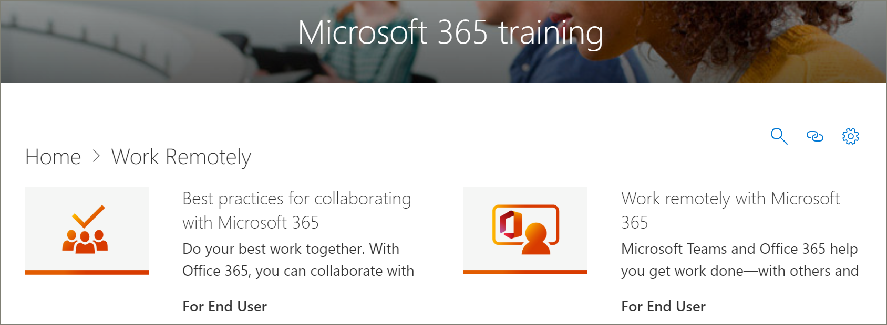

# Mises à jour de contenu des chemins d’apprentissage Microsoft 365
Les voies de formation visent à adhérer à un cycle de mise à jour de contenu trimestriel. La liste suivante répertorie les mises à jour de contenu pour le 2020 avril.

## Mises à jour de contenu d’avril 2020
 En réponse aux événements en cours, la mise à jour du contenu d’avril 2020 fournit des listes de sélections d’apprentissage et des ressources conçues pour permettre le travail à distance dans votre organisation. Nous avons ajouté un nouvel ensemble de tâches de sélection à distance, mis à jour de manière significative le contenu Microsoft Teams, en particulier pour les réunions Teams, ajouté un nouvel ensemble d’Office pour les playlists Web et ajouté de nouvelles ressources Microsoft Forms. Dans le cadre de la mise à jour, nous avons également fourni une liste de ressources de travail distantes pour les administrateurs.  
 
 Pour plus d’informations sur l’application des mises à jour de contenu et la gestion des mises à jour de contenu, voir [Manage content updates](custom_contentupdatesmanage.md). La liste suivante répertorie les mises à jour de contenu des chemins d’accès Microsoft 365 d’avril 2020. 

### Office 365 a été rebaptisé Microsoft 365
Office 365 a été rebaptisé Microsoft 365. La modification du nom est reflétée dans le contenu des chemins d’apprentissage Microsoft 365. 

### Playlists nouvelles ou mises à jour
Les playlists suivantes ont été ajoutées ou mises à jour.  

#### Travailler à distance (2 nouvelles playlists/11 nouvelles ressources)
Une nouvelle sous-catégorie travail à distance a été ajoutée aux voies d’apprentissage qui intègrent les sélections et les biens suivants : 

##### Travailler à distance (5 nouvelles ressources)
- Travailler à distance avec Office 365
- Prise en main sur Office.com
- Communiquer ou répondre
- Stocker vos fichiers professionnels
- Alternatives avancées
##### Meilleures pratiques pour collaborer avec Office 365 (6 nouvelles ressources)
- Prise en main
- Share
- Co-auteur
- Conversations dans des fichiers
- Satisfaction
- Mobile

### Teams (9 nouvelles ressources/6 ressources mises à jour)
De nombreuses mises à jour ont été apportées au contenu de teams. 
#### Collaborer dans teams and Channels (1 ressource nouveau/1 mis à jour)
- Créer et utiliser des canaux privés (nouveauté)
- Afficher ou masquer des canaux (mis à jour)
#### Démarrer des conversations et des appels (2 nouveaux/1 mis à jour)
- Démarrer et épingler des conversations (nouveauté)
- Masquer les conversations, supprimer les messages (nouveau)
- Passer des appels (mis à jour)
#### Explorer les applications et les outils (1 nouveau)
- Utiliser des applications (nouveau)
#### Utiliser des publications et des messages
- Publier un message sur plusieurs canaux (nouveau)
#### Gérer les réunions (3 nouveaux/4 ressources mises à jour)
- Participer à une réunion Teams (nouveau)
- Créer des réunions instantanées avec la Conférence maintenant (mise à jour)
- Réunion dans un canal (nouveau)
- Gérer les réunions (nouveau)
- Afficher votre écran pendant une réunion (mise à jour)
- Afficher les diapositives PowerPoint (mise à jour)
- Naviguer au cours d’une réunion Teams (mise à jour)
#### Utiliser la publication et les messages (1 nouveau)
- Publier un message sur plusieurs canaux (nouveau)

### Office pour le web
Office pour le Web fournit un ensemble de sélections pour les scénarios dans lesquels les utilisateurs souhaitent créer, partager et collaborer avec Office sur le Web. Cet ensemble de contenu est également utile pour les organisations qui effectuent le basculement de Google G suite vers Microsoft 365.
#### Prise en main (5 nouvelles ressources)
- Prise en main
- Trouver avec la recherche
- Créer des documents
- Reprendre le travail
- Fichiers recommandés
#### Outlook pour le Web
- Découverte d’Outlook pour le Web
- Créer une réponse à un message électronique
- Organiser votre boîte de réception
- Créer une signature et une réponse automatique
- Planifier un rendez-vous ou une réunion
- Créer un contact modifier
- Rechercher des messages électroniques, des contacts et des événements
#### Word pour le web
- Découverte de Word pour le Web
- Modifier la disposition du document
- Insérer des tableaux et des images
- Collaborer en ligne
- Des choses intéressantes dans Word pour le Web
#### Excel pour le web
- Découverte d’Excel pour le Web
- Créer des formules
- Insérer un tableau croisé dynamique
- Obtenir des idées
- Collaborer
- Gagner du temps avec le remplissage instantané
- Peindre une image avec une mise en forme conditionnelle
#### PowerPoint pour le web
- Découverte de PowerPoint pour le Web
- Insérer des images, des formes et plus
- Animation et transitions
- Créer une présentation avec d’autres personnes
- Lorsque vous êtes prêt à présenter
- Création de diapositives
#### Partager vos documents
- Partager vos documents
- Créer un lien partageable
- Sécuriser vos documents uniquement à des personnes spécifiques
- Partager avec une personne extérieure à votre organisation 

### Microsoft Forms 
Par demande, il existe également des nouvelles ressources de formulaires. 
#### Formulaires (4 nouvelles ressources) 
- Créer un formulaire 
- Partager un formulaire 
- Afficher les résultats d’un formulaire 
- Forum aux questions sur Microsoft Forms 

### Ressources pour la prise en charge de votre personnel distant
Vous pouvez utiliser les voies de formation pour créer une page d’accueil dans votre site de voies d’apprentissage pour prendre en charge les travailleurs distants. Ou vous pouvez ajouter le composant WebPart voies d’apprentissage à une page de support existante sur votre site de voies d’apprentissage et filtrer le composant WebPart pour afficher les sélections à distance. Voici une liste des ressources les plus populaires de Microsoft pour la prise en charge du travail à distance dans votre organisation. 
- [Comment déployer Microsoft teams](https://docs.microsoft.com/microsoftteams/how-to-roll-out-teams)
- [Réunions et conférences dans Microsoft Teams](https://docs.microsoft.com/microsoftteams/deploy-meetings-microsoft-teams-landing-page)
- [Prendre en charge les collaborateurs distants avec Microsoft teams](https://docs.microsoft.com/microsoftteams/support-remote-work-with-teams)
- [Forum aux questions : soutenir vos employés en télétravail](https://docs.microsoft.com/microsoftteams/faq-support-remote-workforce)
- [Les 9 principales façons pour Microsoft IT d’activer le travail à distance pour ses employés](https://www.microsoft.com/microsoft-365/blog/2020/03/12/top-9-ways-microsoft-it-enabling-remote-work-employees/)
- [Formation sur Microsoft teams](https://docs.microsoft.com/microsoftteams/training-microsoft-teams-landing-page)
- [Éducation : Centre d’enseignement Microsoft](https://education.microsoft.com) 
- [Éducation : prise en main de l’apprentissage à distance](https://education.microsoft.com/resource/4c0c02c0)

Pour plus d’informations sur la personnalisation des voies d’apprentissage, voir [Customize Learning voies](custom_overview.md). 

## Mises à jour de contenu de novembre 2019
Bienvenue dans la mise à jour du contenu des chemins d’apprentissage Microsoft 365. À partir de la mise à jour du 2019 novembre, nous fournirons un inventaire mis à jour du catalogue des voies d’apprentissage chaque trimestre. Pour la mise à jour de novembre 2019, les nouvelles sous-catégories de contenu et les playlists suivantes ont été ajoutées au catalogue des voies d’apprentissage. Pour plus d’informations sur l’application des mises à jour de contenu et la gestion des mises à jour de contenu, voir [Manage content updates](custom_contentupdatesmanage.md).    

### Équipes
Plusieurs nouvelles playlists ont été ajoutées à la sous-catégorie Teams.
- Utiliser des publications et des messages (3 biens)
- Charger et Rechercher des fichiers (2 ressources)
- Configurer et participer à des événements en direct (4 ressources)
- Gérer votre flux d’activités (2 ressources)
- Teams en déplacement (2 biens)

### Centre de réussite Microsoft 365
Nous avons ajouté une sous-catégorie de centre de réussite des chemins d’apprentissage Microsoft 365 à l’expérience des voies d’apprentissage. Le centre de réussite fournit les playlists suivantes.
- Nouveautés, nouveautés (3 ressources)
- Planifier le contenu de formation (2 biens)
- Personnaliser les voies de formation (8 biens ?)
- Adoption des voies de formation sur le lecteur (1 élément)
- Mesurer l’impact des voies de formation (1 ressource)

### Outlook
Les playlists suivantes ont été ajoutées à la sous-catégorie Outlook. 
- Outlook Mobile : gérer votre boîte de réception (4 ressources)
- Outlook Mobile : gérer votre temps (8 ressources)
- Outlook Mobile : personnes et connexions (5 ressources)
- Outlook Mobile : recherche et partage (4 ressources)

### OneDrive
Les ressources vidéo suivantes ont été ajoutées pour OneDrive. 
- Configurer votre iPhone ou iPad a été ajouté à la sélection Introduction à OneDrive
- Activer la sauvegarde OneDrive a été ajouté à la sélection gérer vos fichiers avec OneDrive

### Planificateur
Les playlists et les biens suivants ont été ajoutés au catalogue.  
- Démarrage rapide du planificateur (6 biens)
- Utiliser le planificateur (8 ressources)

### Accessibilité
La sous-catégorie d’accessibilité du contenu a été ajoutée avec les playlists suivantes. 
- Ressources et présentation de l’accessibilité Microsoft 365 (3 biens)
- Créer des messages électroniques plus accessibles dans Outlook (3 ressources)
- Créer des documents Word plus accessibles (8 ressources)
- Créer des classeurs Excel plus accessibles (3 ressources)
- Créer des diapositives plus accessibles dans PowerPoint (5 ressources)

### OneDrive
Remarque : les modifications doivent être ajoutées ici.....

### Sway
La sous-catégorie Sway de contenu a été ajoutée avec les playlists suivantes. 
- Lancement rapide Sway (4 ressources)
- Partager et accéder à Sway (5 ressources)
- Ajouter du contenu à Sway (11 ressources)
- Personnaliser Sway (5 ressources)

### Accès
- Démarrage rapide d’Access (4 ressources)
- Introduction à Access (3 biens)
- Créer une base de données Access (2 ressources)
- Ajouter des tables (2 ressources)
- Utiliser des relations (5 ressources)
- Ajouter et modifier des données (2 ressources)
- Gérer les données à l’aide de requêtes (5 ressources)
- Créer des formulaires (1 élément)
- Créer des rapports (2 ressources)
- Protéger les bases de données (1 élément)

