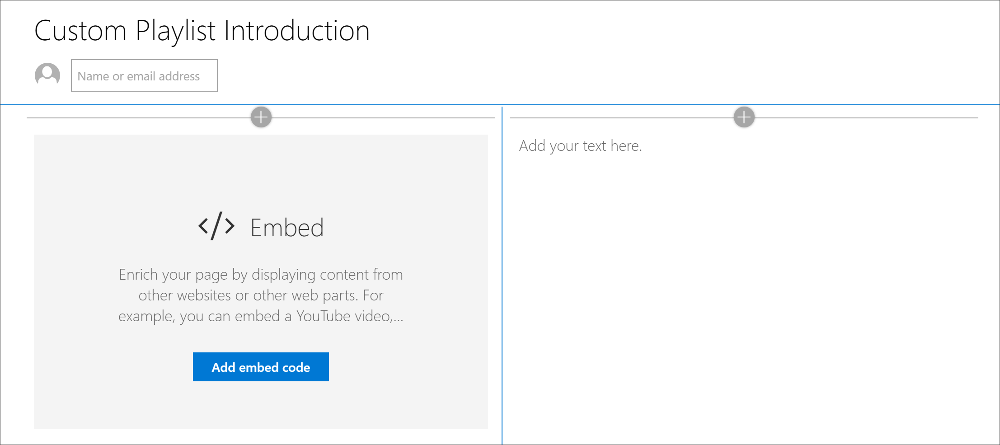

# Créer des pages SharePoint pour les playlists personnaliséesCreate SharePoint pages for Custom Playlists

L'une des fonctionnalités uniques de la formation personnalisée est la possibilité de créer des sélections assemblées à partir de biens provenant de Microsoft et de ressources SharePoint que vous créez. Dans cet exemple, nous allons créer une page SharePoint avant de créer une playlist. La possibilité de créer des sélections à partir de pages SharePoint permet de créer des pages à l'aide des composants WebPart disponibles auprès de Microsoft ou de votre organisation. Par exemple, une playlist peut inclure une page SharePoint avec des vidéos incorporées provenant de YouTube ou un formulaire créé à partir de formulaires Office 365, ou un rapport intégré Power BI. Dans cet exemple, nous allons vous montrer comment créer une page avec le composant WebPart embed et le composant WebPart texte.One of the unique features of Custom Learning is the ability to create playlists that are assembled from assets from Microsoft and from SharePoint assets that you create. In this example, we’ll create a SharePoint page in advance of creating a playlist. The ability to build playlists from SharePoint pages offers a variety of opportunities to build pages using the Web parts available from Microsoft or your organization. For example, a playlist can include a SharePoint page with embedded videos from YouTube, or a form built from Office 365 Forms, or an embedded Power BI report. In this example, we’ll show you how to build a page with the Embed web part and the Text web part.  

## Créer une page SharePoint pour une liste de lecture personnaliséeCreate a SharePoint page for a custom playlist

1. Cliquez sur l'icône de l' **engrenage** SharePoint, puis cliquez sur **Ajouter une page**.Click the SharePoint **Gear** icon, and then click **Add a page**.
2. Cliquez sur **Ajouter une nouvelle section (+)** sur le côté gauche de la page, puis cliquez sur **deux colonnes** pour la disposition de la section.Click **Add a new section (+)** on the left-hand side of the page, and then click **Two Columns** for the section layout.
3. Dans la colonne de gauche, cliquez sur +, puis sur \*\*\*\* le composant WebPart incorporer.In the left column, click + , and then click the **Embed** web part. 
4. Dans la colonne de droite, cliquez sur +, puis sur le composant WebPart **texte** . Votre page doit ressembler à ce qui suit.In the right column, click +, and then click the **Text** web part. Your page should look like this.

### Ajouter une vidéo et du texte à partir de YouTubeAdd a video and text from YouTube

1. Dans votre navigateur, accédez à YouTube. Pour cet exemple, recherchez «qu'est-ce que Office 365 – meilleures applications de productivité de Microsoft».In your browser, go to YouTube. For this example, search for “What is Office 365 – Microsoft’s best productivity apps”.
2. Cliquez sur la vidéo pour la lire, puis suspendez-la, puis cliquez dessus avec le bouton droit.Click the video to play it, then pause it, then right-click on it. 
3. Cliquez sur **copier le code incorporé**, puis revenez à la page SharePoint.Click **Copy embed code**, then return to the SharePoint page. 
4. Cliquez sur **Ajouter un code incorporé** dans le composant WebPart **embed** , puis ajoutez le code à partir de la vidéo YouTube.Click **Add embed code** in the **Embed** web part, and then add the code from the YouTube video.
5. ReVenez à la page YouTube et copiez le texte de **Description** de la vidéo.Return to the YouTube page and copy the **Description** text for the video. 
6. ReVenez à la page SharePoint, sélectionnez le composant WebPart **texte** , puis copiez le texte à partir de la vidéo YouTube.Return to the SharePoint page, select the **Text** web part, then copy the text from the YouTube video.
7. Sélectionnez l'icône **modifier le composant WebPart** dans la zone de titre de la page SharePoint, puis nommez la page «introduction de la playlist personnalisée».Select the **Edit web part** icon  in the Title area of the SharePoint page, and then name the page “Custom Playlist Introduction”. 
8. Pour **disposition**, sélectionnez **standard**, puis fermer la zone de propriétés **région de titre** . La page doit maintenant ressembler à ce qui suit.For **Layout**, select **Plain**, then close **Title Region** properties pane. The page should now look something like the following. 

### Publier la pagePublish the page

- Sélectionnez le bouton **publier** . Vous êtes maintenant prêt à ajouter cette page SharePoint à votre playlist personnalisée.Select the **Publish** button. Now you're ready to add this SharePoint page to your custom playlist. 