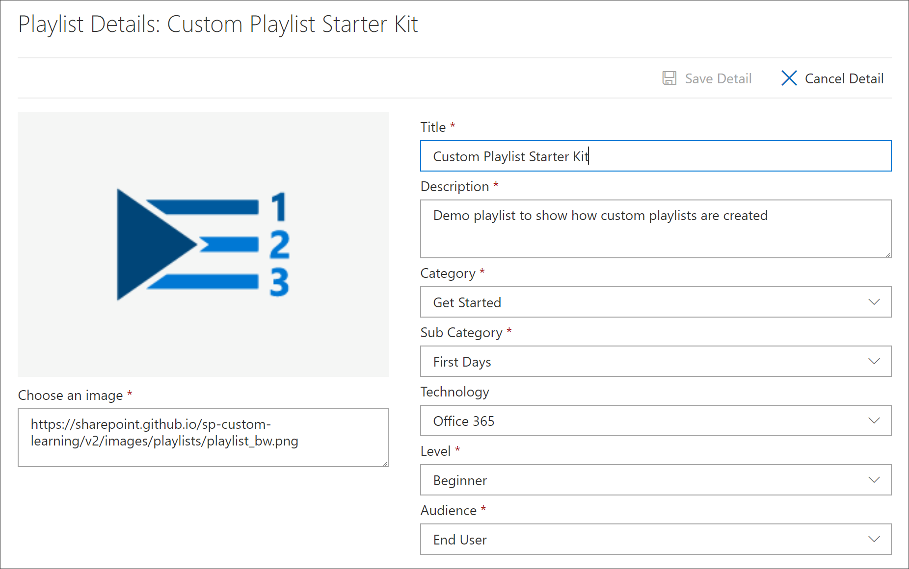

# Créer une playlist personnaliséeCreate a Custom Playlist

Lorsque vous créez une sélection, vous devez d'abord la créer avec les détails de la sélection, puis ajouter des ressources à la liste de lecture.When you create a playlist, you first create the playlist with the playlist details, and then add assets to the playlist. Vous pouvez ajouter une sélection à n'importe quelle sous-catégorie.You can add a playlist to any subcategory. Par exemple, vous pouvez ajouter une sélection à la **première** sous-catégorie jours ou à une sous-catégorie de **produits** comme **Excel**.For example, you can add a playlist to the **First Days** subcategory or a **Product** subcategory like **Excel**. Dans cette section, nous allons expliquer comment créer une sélection, puis ajouter des ressources à une playlist dans la section suivante, ajouter des [ressources à une playlist personnalisée](custom_addassets.md).In this section, we’ll cover how to create a playlist, and then cover adding assets to a playlist in the following section, [Add assets to a custom playlist](custom_addassets.md).

## Créer une playlistCreate a playlist 

1. Dans la page d' **Accueil** formation personnalisée, cliquez sur **formation Office 365**, sélectionnez le menu système dans le composant WebPart, puis sélectionnez administrer la **playlist**.From the Custom Learning **Home** page, click **Office 365 training**, select the system menu from the Web part, and then select **Administer Playlist**. 
2. Sélectionnez une sous-catégorie.Select a subcategory. Dans cet exemple, sélectionnez **First Days**.In this example, select **First Days**.  
3. Cliquez sur l'icône +.Click the + icon.  

4.  Renseignez les champs de la liste de lecture comme indiqué dans l'exemple suivant.Fill out the fields in the playlist as shown in the following example. Vous pouvez laisser l'icône par défaut pour cet exemple.You can leave the default icon for this example. 

5.  Lorsque vous avez fini, sélectionnez **enregistrer les détails**.When you are done, select **Save Detail**. 

## Modifier une playlistEdit a playlist

- Dans la page Administration de l' **apprentissage personnalisée** , cliquez sur la sélection, puis sur **modifier le détail**.From the **Custom Learning Administration** page, click the playlist, and then click **Edit Detail**.  

### Supprimer une playlistDelete a playlist

- Dans la page Administration de formation personnalisée, cliquez sur l'icône de **suppression** de la playlist.From the Custom Learning Administration page, click the **Delete** icon for the playlist.  

