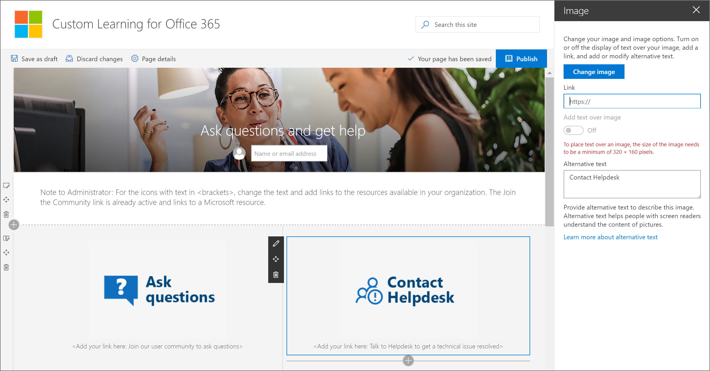

# Explorer le site d'apprentissage personnaliséExplore the Custom Learning site

> Remarque: pour explorer le site d'apprentissage personnalisé et ses fonctionnalités d'administration, vous aurez besoin d'autorisations d'administrateur de collection de sites, de propriétaire ou de membre sur le site.Note: To explore the Custom Learning site and it's administrative features, you'll need Site Collection Admin, Owner, or Member permissions to the site. Si vous ne disposez pas des autorisations neccesary, contactez l'administrateur du site.If you don't have the neccesary permissions, contact the Site Administrator for the site. Le site de formation personnalisée pour Office 365 est hébergé dans votre client Office 365, de sorte que vous devez vous connecter à Office 365 pour accéder au site.The Custom Learning for Office 365 site is hosted in your Office 365 tenant, so you'll need to sign in to Office 365 to get to the site. Si vous ne vous êtes pas déjà connecté à Office 365, connectez-vous maintenant.If you haven’t already signed into Office 365, sign in now. 

## Sign in to Office 365Sign in to Office 365 

1.  Ouvrez votre navigateur Web et accédez à office.com ou à l'emplacement de connexion de votre organisation.Open your Web browser and navigate to office.com or your organization’s sign-in location. 
2.  Connectez-vous avec votre nom d'utilisateur et votre mot de passe.Sign in with your user name and password.
3.  Accédez à l'emplacement du site à l'aide de l'URL fournie par votre administrateur client ou sélectionnez SharePoint à partir de la page d'accueil Office 365.Navigate to the location of the site using the URL supplied by your tenant administrator or select SharePoint from the Office 365 Home page. 

## Explorer le site d'apprentissage personnaliséExplore the Custom Learning site

Le site d'apprentissage personnalisé est basé sur un modèle de communication SharePoint, c'est pourquoi il est facile de modifier le site afin de répondre aux besoins de votre organisation.The Custom Learning site is based on a SharePoint communication template, so it's easy to modify the site to meet the needs of your organization. Vous pouvez modifier le nom du site, le logo, les éléments de menu et le contenu des pages.You can change the site name, logo, menu items, and the content on the pages. L'une des pages que vous souhaitez modifier pour votre organisation est la page poser des questions et obtenir de l'aide.One of the pages you'll want to modify for your organization is the Ask questions and get help page. Jetons un œil.Let's take a look.

### Afficher la page poser des questions et obtenir de l'aideView the Ask questions and get help page

Le site de formation personnalisée fournit un contenu par défaut pour vous aider à commencer à créer votre portail de formation et de support.The Custom Learning site provides default content to help you get starting building your training and support portal. En tant que administrateur ou propriétaire du site, l'une des choses que vous devez faire est modifier les liens figurant dans la **page poser une question et obtenir** de l'aide pointent vers les ressources de votre organisation.As an admininstrator or owner of the site, one of the things you’ll want to do is change the links on the **Ask question and get help page** point to resources in your organization. 

1.  À partir de la page d'accueil de formation personnalisée, cliquez sur l'élément de menu **poser des questions et obtenir de l'aide** .From the Custom Learning Home page, click the **Ask questions and get help** menu item.
2.  Cliquez sur le bouton **Modifier**.Click the **Edit** button.
3.  Placez le curseur de la souris sur une image d'option d'aide, puis cliquez sur **modifier le composant WebPart**.Hover over a Help option image, then click **Edit web part**.

Pour obtenir des instructions sur la personnalisation des pages de site, voir [personnaliser le site](custom_edithelp.md).For instructions on customizing site pages, see [Customize the site](custom_edithelp.md).

### Afficher le contenu de formation personnalisé dans le composant WebPartView the Custom Learning content in the web part
La page de formation Office 365 héberge le composant WebPart formation personnalisée configuré pour afficher toutes les formations disponibles pour une formation personnalisée.The Office 365 training page hosts the Custom Learning Web part configured to show all the training available for Custom Learning. 

1. Faites déFiler la page vers le bas pour afficher toutes les catégories et sous-catégories.Scroll down the page to view all the categories and subcategories.
2. Les pneus ont un bit.Kick the tires a bit. Cliquez sur quelques sous-catégories, puis cliquez sur quelques sélections pour avoir une idée de l'organisation du contenu d'apprentissage personnalisé.Click a few subcategories, and then click a few playlists to get a feel for how Custom Learning content is organized. 

Pour obtenir des instructions sur la personnalisation du composant WebPart d'apprentissage personnalisé, voir [personnaliser l'expérience d'apprentissage](custom_overview.md).For instructions on customizing the Custom Learning web part, see [Customize the Learning Experience](custom_overview.md).

### Obtenir une visite guidée complète du site et des conseils de personnalisationGet a complete site tour and customization guidance
Pour obtenir une présentation détaillée de l'apprentissage personnalisé, de la incuding du site, du composant WebPart, des fonctionnalités d'administration et de l'aide sur la façon de créer des expériences d'apprentissage uniques pour votre environnement, voir [Customize the Learning experience](custom_overview.md)For a detailed look at Custom Learning, incuding the site, the web part, administrative features, and guidance on how to build unique learning experiences for your environment, see [Customize the Learning Experience](custom_overview.md)

## Étapes suivantesNext Steps
- [Personnaliser l'expérience d'apprentissageCustomize the Learning Experience](custom_overview.md)
- [Adoption des lecteursDrive adoption](driveadoption.md) 
