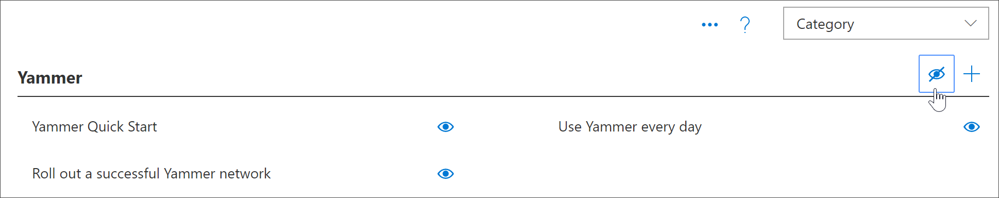

# Masquage et affichage des sous-catégoriesHide and show Subcategories

Avec l'administration de l'apprentissage personnalisée, vous pouvez masquer et afficher des sous-catégories. Par exemple, les entreprises qui ne déployent pas Yammer peuvent masquer la sous-catégorie Yammer, de sorte que le contenu Yammer ne sera pas disponible pour les utilisateurs. Cela empêche les appels de prise en charge indésirable des utilisateurs qui pourraient voir des informations liées à des services qui ne sont pas disponibles dans votre organisation.With Custom Learning Administration, you can hide and show subcategories. For example, companies that don’t roll out Yammer can hide the Yammer subcategory, so Yammer content won't be available to users. This prevents unwanted support calls from users who might otherwise see information related to services that aren't available in your organization.

## Masquer une sous-catégorieHide a subcategory 

1. Dans la page d'accueil formation personnalisée, cliquez sur la vignette de **formation Office 365** .From the Custom Learning Home page, click the **Office 365 training** tile.
2. Dans le composant WebPart formation personnalisée, sélectionnez le menu système, puis adMinistrer la **playlist**. Vous devez maintenant avoir deux onglets ouverts: un avec la page **administration de formation personnalisée** et un autre avec la page de **formation Office 365** .From the Custom Learning Web part, select the System menu, then select **Administer Playlist**. You should now have two tabs open: One with the **Custom Learning Administration** page, and one with the **Office 365 training** page. 
3. Dans la page **administration de formation personnalisée** , sous **catégorie**, sélectionnez une sous-catégorie, puis sélectionnez l'œil de la sous-catégorie pour la masquer. Pour cet exemple, masquez la sous-catégorie **Yammer** .From the **Custom Learning Administration** page, under **Category**, select a subcategory, and then select the eyeball for the subcategory to hide it. For this example, hide the **Yammer** subcategory.  

### Vérifier que la sous-catégorie est masquéeVerify the subcategory is hidden
- Pour vérifier que la sous-catégorie est masquée, sélectionnez l'onglet navigateur avec la page **prise en main de Office 365** chargée, puis actualisez la page. Vous devez maintenant voir la sous-catégorie Yammer masquée dans la catégorie produits.To verify the subcategory is hidden, select the browser tab with the **Get Started with Office 365** page loaded, and then refresh the page. You should now see the Yammer subcategory hidden in the Products category. 

## Afficher une sous-catégorieUnhide a subcategory 

- Dans la page Administration de l' **apprentissage personnalisée** , sous **catégorie**, sélectionnez une sous-catégorie, puis sélectionnez l'œil de la sous-catégorie masquée pour l'afficher. Pour cet exemple, affichez la sous-catégorie Yammer.From the **Custom Learning Administration** page, under **Category**, select a subcategory, and then select the eyeball for the hidden subcategory to unhide it. For this example, unhide the Yammer subcategory.