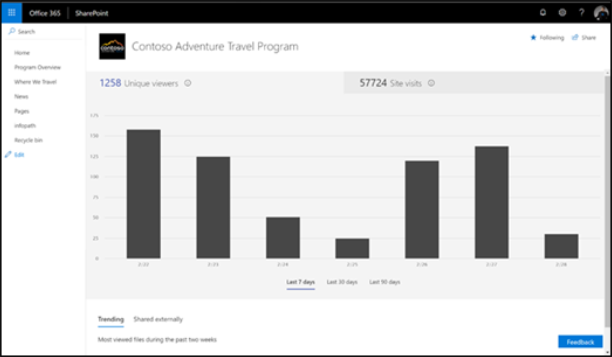

# Impact de la mesure des chemins de formation Microsoft 365

Les administrateurs doivent utiliser les fonctionnalités de création de rapports d’utilisation de site de SharePoint pour mesurer l’impact organisationnel des voies d’apprentissage de Microsoft 365. Il existe deux scénarios principaux de mesure de l’impact : 
- Impact au niveau du site : afficher les données d’utilisation pour le site spécifique de formation personnalisée pour Office 365 
- Impact au niveau de l’Organisation : comprendre l’apprentissage par le client pour l’utilisation d’Office 365 par rapport à tous les autres sites au sein de votre organisation

## Impact au niveau du site

En tant que propriétaire de site SharePoint Online, vous pouvez afficher des informations qui vous montrent comment les utilisateurs interagissent avec votre site. Par exemple, vous pouvez voir le nombre de personnes qui ont visité le site, le nombre d’utilisateurs qui ont visité le site et la liste des fichiers qui ont reçu le plus d’affichages. Afficher les [Détails du rapport](https://support.office.com/article/view-usage-data-for-your-sharepoint-site-2fa8ddc2-c4b3-4268-8d26-a772dc55779e). 

## Impact au niveau de l’Organisation
Le rapport d’utilisation du site SharePoint du centre d’administration Office 365 permet aux administrateurs d’obtenir une vue de haut niveau de la valeur que vous obtenez du site personnalisé de formation pour Office 365 par rapport à tous les autres sites SharePoint. Afficher les [Détails du rapport](https://docs.microsoft.com/office365/admin/activity-reports/sharepoint-site-usage?view=o365-worldwide).
 
Suivez l’article référencé pour : 
1. Découvrez comment accéder au rapport d’utilisation du site SharePoint 
2. Interprétation des détails du rapport d’utilisation du site SharePoint. Trier dans le champ URL du site pour identifier plus facilement votre site de voies d’apprentissage Microsoft 365. 
3. Tirez parti de la fonctionnalité d’exportation de rapports pour une analyse des données plus avancée ou si votre organisation comporte plus de 2 000 sites. 

## Commentaires

À l’heure actuelle, la création de rapports est limitée au niveau du site SharePoint. Prêtez votre vote à notre forum de voix de l' [utilisateur](https://go.microsoft.com/fwlink/?linkid=2109552) afin de faciliter la hiérarchisation des demandes de fonctionnalités de création de rapports.   

