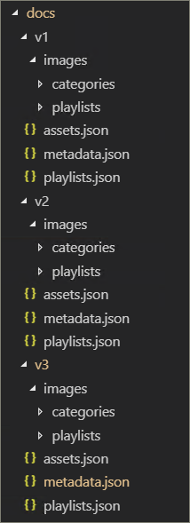

# Modèles d’intégration de partenairesPartner integration models
Bien qu’il soit impossible de compléter directement le contenu du parcours d’apprentissage Microsoft 365 à partir du service d’approvisionnement SharePoint Online, il existe plusieurs modèles d’intégration que les partenaires peuvent utiliser pour créer des offres de services de valeur ajoutée alignées.While it’s not possible to supplement the Microsoft 365 learning pathways content directly ‘out of the box’ from the SharePoint Online Provisioning service, there are several integration models that partners can leverage to create aligned value-add service offerings. Les modèles d’intégration des partenaires ci-dessus sont présentés par ordre croissant de complexité et de niveaux d’investissement.The partner integration models above are presented in order of ascending complexity and levels of investment. Par conséquent, nous vous aiderons à développer votre expertise et à aller à des niveaux plus avancés en fonction de vos modèles d’entreprise.Hence our guidance is to build your expertise and graduate to more advanced levels based on your business models.

 

## Comment dois-je commencer ?How should I get started? 
Pour commencer, voici quelques meilleures pratiques à suivre.To get started, here are some best practices to follow.     

### 1. Commencez par créer une expertise en tant qu’enableur.1. Begin with building expertise as an Enabler. 
Vous pouvez aider un pourcentage de votre base de clients immédiatement en activant son portail de formation de parcours d’apprentissage et en activant la curation de contenu Microsoft ciblée.You can help a percentage of your customer base right away by enabling their learning pathways training portal and performing targeted Microsoft content curation. Pour obtenir des instructions sur la mise en service des parcours d’apprentissage, voir https://docs.microsoft.com/office365/customlearning/custom_provision .For instructions on provisioning learning pathways, see https://docs.microsoft.com/office365/customlearning/custom_provision.  

### 2. Étendez ensuite vos services en tant qu’intégrateur2. Then extend your services as an Integrator
Effectuer une analyse de retour sur investissement d’automatisation, en fonction de la quantité de votre contenu et/ou des besoins d’intégration de services.Perform an automation return on investment analysis - depending on the quantity of your content and/or services integration needs. Par exemple, il peut ne pas être logique de prendre en compte les coûts de développement et d’exploitation par rapport à nos recommandations en matière d’intégration de contenu si vous pouvez créer manuellement une ou plusieurs playlists personnalisées ciblées pointant vers votre contenu payant ou référencer vos services.For example, it may not make sense to take on the development and operational costs with respect to our content integration guidelines if you can quickly manually create a targeted custom playlist(s) pointing to your for-pay content or reference your services.

### 3. Lorsque le retour sur investissement est logique , envisagez la redistribution3. When the return on investment makes sense – consider Redistribution 
Lorsque le retour sur investissement est logique , envisagez de redistribuer (ou de travailler avec des partenaires du parcours d’apprentissage associés) pour créer des solutions repackaged.When the return on investment makes sense – consider Redistribution (or working with related learning pathways partners) to build repackaged solutions. Ceux-ci sont basés sur l’infrastructure de pratiques et modèles SharePoint qui fournit des solutions pour extraire des sites personnalisés, puis les déployer dans les environnements clientsThese are based on the SharePoint Patterns and Practice framework which provides solutions to extract customized sites and then deploy into customer environments 

## Recommandations en matière d’intégration de contenu fournies par les partenairesPartner-provided content integration guidelines
Le contenu du parcours d’apprentissage de Microsoft 365 est piloté par un ensemble de fichiers JSON qui agissent comme des manifestes de contenu pour votre package d’apprentissage.Content for Microsoft 365 learning pathways is driven by a set of JSON files that act as content manifests for your learning package. Il existe trois fichiers : metadata.js, playlists.jset assets.js.There are three files: metadata.json, playlists.json, and assets.json. Ces fichiers doivent être structurés pour correspondre aux modèles reconnus par le partie Web Part, puis hébergés à partir d’un réseau de distribution de contenu (CDN) pour permettre au partie Web De les charger.These files need to be structured to match the models the web part recognizes and then hosted from a content delivery network (CDN) to allow the web part to load them. Microsoft fournit des modèles de démarrage de ces fichiers pour vous aider à démarrer.Microsoft will provide starter templates of these files to get you started.  

**Clause d’exclusion de responsabilité** : la structure de fichier JSON est sujette à modification en fonction du travail de solution à venir.**Disclaimer:** the JSON file structure is subject to change based on upcoming solution work. Le programme EAP (Early Adopter Program) du partenaire du parcours d’apprentissage Microsoft 365 sera informé des changements majeurs de cette nature.The Microsoft 365 learning pathways partner Early Adopter Program (EAP) will be informed of any impending changes of this nature. Ainsi que les conseils de transition et/ou de compatibilité ascendante des clients.Along with any customer backwards compatibility and/or transition guidance. 

### Télécharger la solution de parcours d’apprentissage Microsoft 365Download the Microsoft 365 learning pathways solution
Vous pouvez télécharger la solution de parcours d’apprentissage Microsoft 365, ainsi que les fichiers JSON, à partir du référentiel GitHub https://github.com/pnp/custom-learning-office-365 :You can download the Microsoft 365 learning pathways solution, along with the JSON files, from the GitHub repository: https://github.com/pnp/custom-learning-office-365. Notez qu’à ce jour, Microsoft ne prend pas de demande de pull GitHub sur la solution.Note that at this time, Microsoft is not taking GitHub pull request on the solution. Toutefois, vous pouvez utiliser les fichiers GitHub comme point de départ pour créer votre propre pack de contenu personnalisé.But you can use the GitHub files as a starting point for creating your own custom content pack. 

### Metadata.jsstructureMetadata.json Structure
Vous pouvez voir ce fichier comme le « brains » des menus et de la structure.You can think of this file as the brains of the menus and structure. Il contient toute la structure de navigation ainsi que les listes de sélection des données dans les deux autres fichiers.It contains all the navigation structure as well as pick lists for data in the other two files. 

|              NomName        |                     DescriptionDescription                                                               | 
|:-----------------------------|-------------------------------------------------------------------------------------------|
|**Technologies****Technologies**              |Le contenu est balisé et peut être masqué en fonction de la technologie qui lui est affectée.Content is tagged and can be hidden based on the Technology it’s assigned.                 |  
|&nbsp;&nbsp;ID&nbsp;&nbsp;Id                |GUID représentant la technologieGUID representing the technology                                                           |  
|&nbsp;&nbsp;Nom&nbsp;&nbsp;Name              |Nom complet de la technologieDisplay name of the technology                                                             |
|&nbsp;&nbsp;*Subjects[ ]*&nbsp;&nbsp;*Subjects[ ]*     |Tableau de sujets qui sont un sous-ensemble de la technologieAn array of subjects that are a subset of the technology                                   | 
|&nbsp;&nbsp;&nbsp;&nbsp;ID&nbsp;&nbsp;&nbsp;&nbsp;Id    |GUID représentant l’objetGUID representing the subject                                                              |
|&nbsp;&nbsp;&nbsp;&nbsp;Nom&nbsp;&nbsp;&nbsp;&nbsp;Name  |Nom complet de l’objetDisplay name of the subject                                                                |
|**Catégories [ ]****Categories [ ]**             |Les catégories informent la navigation du webpart.Categories inform the navigation of the webpart. Chaque catégorie représente un niveau supérieur de la navigationEach category represents a top level of the navigation                                                                                                                 |
|&nbsp;&nbsp;ID&nbsp;&nbsp;Id                |GUID représentant la catégorie/sous-catégorieGUID representing the category/subcategory                                                 |
|&nbsp;&nbsp;Nom&nbsp;&nbsp;Name              |Nom complet de la catégorie/sous-catégorieDisplay name for the category/subcategory                                                  |
|&nbsp;&nbsp;Image&nbsp;&nbsp;Image             |URL de l’image qui doit être affichée dans l’UX (par rapport à la base de CDN)URL for the image that should be displayed in the UX (relative to the CDN base)            |
|&nbsp;&nbsp;TechnologyId&nbsp;&nbsp;TechnologyId      |GUID de la technologie à qui ce contenu est lié (facultatif – chaîne vide)The GUID of the Technology this content is related to (optional – empty string)            |
|&nbsp;&nbsp;SubjectId&nbsp;&nbsp;SubjectId         |GUID de l’objet lié à ce contenu (facultatif – chaîne vide)The GUID of the Subject this content is related to (optional – empty string)               |
|&nbsp;&nbsp;Source&nbsp;&nbsp;Source            |À partir du tableau source, non spécifiquement utilisé dans l’expérience utilisateur autre que les données personnalisées ajoutées par l’utilisateur est marqué comme « client » et la zone d’administration de l’expérience utilisateur n’autorise pas la modification de tout ce qui n’est pas marqué « client ».From Source array, not specifically used in UX other than custom data added by the user is marked as “Tenant” and the UX admin area does not allow editing of anything not marked “Tenant”.                           |
|&nbsp;&nbsp;*Sous-catégories[ ]*&nbsp;&nbsp;*Subcategories[ ]*|Sub-Categories sont essentiellement le niveau de navigation du niveau 2 vers le bas.Sub-Categories are basically the nav level from level 2 down. La structure est identique à une catégorie imbrique.The structure is the same as a Category just nested.          |
|**Audiences [ ]****Audiences [ ]**             |Lorsque les playlists associées à une catégorie/sous-catégorie sont marquées par différentes audiences, un sélecteur est disponible pour afficher les audiences disponibles.When playlists associated with a category/subcategory are various audiences tagged, a selector will be available to show the available audiences. |         
|&nbsp;&nbsp;ID&nbsp;&nbsp;Id                |GUID de l’audienceGUID of the audience                                                                       |  
|&nbsp;&nbsp;Nom&nbsp;&nbsp;Name              |Nom d’affichage de l’audienceDisplay name of the audience                                                               |       
|**Sources [ ]****Sources [ ]**               |Le tableau de chaînes qui balisent le contenu avec sa source, non spécifiquement utilisé dans l’expérience utilisateur autre que les données personnalisées ajoutées par l’utilisateur est marqué comme « client » et la zone d’administration de l’expérience utilisateur n’autorise pas la modification de tout ce qui n’est pas marqué « Client ».Array of strings that tag content with its source, not specifically used in UX other than custom data added by the user is marked as “Tenant” and the UX admin area does not allow editing of anything not marked “Tenant”.                                                   |  
|**Niveaux [ ]****Levels  [ ]**               |Lorsque les playlists associées à une catégorie/sous-catégorie sont marquées à différents niveaux, un sélecteur est disponible pour afficher les niveaux disponibles.When playlists associated with a category/subcategory are various levels tagged, a selector will be available to show the available levels.             |  
|&nbsp;&nbsp;ID&nbsp;&nbsp;Id                |GUID du niveauGUID of the Level                                                                          |  
|&nbsp;&nbsp;Nom&nbsp;&nbsp;Name              |Nom complet du niveauDisplay name of the Level                                                                  | 
|**StatusTag [ ]****StatusTag  [ ]**           |La balise d’état consiste à identifier le contenu avec différents états qui seront exposés dans l’UX.Status tag is to identify content with various status that will be exposed in the UX. Certains de ces indicateurs s’afficheront pour le consommateur et d’autres uniquement pour l’administrateur.Some of these flags will be show to the consumer and some only to the admin.                                                   |  
|&nbsp;&nbsp;ID&nbsp;&nbsp;Id                |GUID de l’élément DontgTagGUID of the StatugTag                                                                      |  
|&nbsp;&nbsp;Nom&nbsp;&nbsp;Name              |Nom d’affichage du statustagDisplay name of the StatusTag                                                              | 
|**Télémétrie [ ]****Telemetry  [ ]**            |                                                                                           |  
|&nbsp;&nbsp;AppInsightsKey&nbsp;&nbsp;AppInsightsKey    |GUID de la clé d’informations de l’application que vous avez définie pour suivre le chargement du partie Web De la visionneuse.GUID of the app insights key that you have set up to track the loading of the viewer web part. Le suivi peut être désactivé par un administrateur pour l’ensemble du client, mais les informations envoyées sont des utilisateurs anonymisés avec l’ID de client. Pour plus d’informations, consultez cette section. https://github.com/pnp/custom-learning-office-365#disabling-telemetry-collectionTracking can be turned off by an administrator for the entire tenant, but the information sent is anonymized user with the tenant id. Please see this section for more information https://github.com/pnp/custom-learning-office-365#disabling-telemetry-collection               |  
|**Version****Version**                   |Les informations de version sont utilisées par la solution pour indiquer aux administrateurs que le webpart a été mis à jour et permettre également au webpart de mettre à jour le contenu personnalisé vers la dernière version du manifeste si des modifications importantes ont été apportées.Version information is used by the solution to indicate to administrators that the webpart has updated and also allow the webpart to self-update custom content to the latest version of the manifest if significant changes have been made.         | 
|&nbsp;&nbsp;Manifeste&nbsp;&nbsp;Manifest          |Version du manifesteThe version of the manifest                                               |
|&nbsp;&nbsp;ManifestMinWebPart&nbsp;&nbsp;ManifestMinWebPart|Version minimale du webpart qui fonctionne avec la version du manifesteThe minimum version of the webpart that works with the version of the manifest             |
|&nbsp;&nbsp;CurrentWebPart&nbsp;&nbsp;CurrentWebPart    |URL de l’image qui doit être affichée dans l’UX (par rapport à la base de CDN)URL for the image that should be displayed in the UX (relative to the CDN base)            |
|&nbsp;&nbsp;RepoURL&nbsp;&nbsp;RepoURL           |URL du référentiel dans lequel se trouve les instructions de mise à jour du site Web Part.The url of the repository where the updating web part instructions are.                    |
|**Packs de contenu****Content Packs**             |Pour l’instant, les packs de contenu pour les CDN supplémentaires ne sont pas pris en charge.At this time content packs for additional CDN’s is not supported. Les packs de contenu permettent à Microsoft de suggérer d’autres solutions créées par Microsoft qui peuvent être mis en service via le service d’approvisionnement qui exploitent M365LP pour fournir du contenu et qui se trouvent dans et par eux-mêmes des CDN personnalisés.Content packs allow Microsoft to suggest other Microsoft created solutions that can be provisioned via the Provisioning service that leverage M365LP to deliver content and are in and of themselves custom CDNs.       | 
|&nbsp;&nbsp;ID&nbsp;&nbsp;Id                |GUID du pack de contenu/CDNGUID of the content pack/CDN                                                              |
|&nbsp;&nbsp;Nom&nbsp;&nbsp;Name              |Nom complet du CDNDisplay name of the CDN                                                                   |
|&nbsp;&nbsp;Description&nbsp;&nbsp;Description       |Description à afficher dans l’interface utilisateur pour l’ajout d’un pack de contenuDescription to be displayed in UI for adding a content pack                               |
|&nbsp;&nbsp;Image&nbsp;&nbsp;Image             |Image à afficher dans l’interface utilisateur pour l’ajout d’un pack de contenuImage to be displayed in UI for adding a content pack                                     |
|&nbsp;&nbsp;ProvisionURL&nbsp;&nbsp;ProvisionURL      |URL du package de service d’approvisionnement pour créer la collection de sites du pack de contenuThe URL to the provisioning service package to create the content pack’s site collection  |
|&nbsp;&nbsp;CDNbase&nbsp;&nbsp;CDNbase           |URL de base pour les manifestes du pack de contenuThe Base URL for the manifests for the content pack                                       |
|AssetOriginsAssetOrigins                  |Tableau d’origine d’URL utilisé dans le assets.jsfichier décrit plus loin.An array of URL origin’s utilized in the assets.json file described later. Si l’URL d’origine la prend en charge, un message de publication est envoyé help_getClientHeight.If the origin URL supports it, a post message will be sent to help_getClientHeight. Une réponse dans la propriété de données de : « help_getClientHeight={height of content} » (par exemple « help_getClientHeight=5769 ») permet de re reserrer l’iFrame à la hauteur appropriée du contenu d’origine.A response in the data property of: "help_getClientHeight={height of content}" (for example "help_getClientHeight=5769") will allow the iFrame to be resized to the appropriate height of the framed content.         |

### Playlists.jsstructurePlaylists.json Structure
playlists.js- Le manifeste des playlists est un tableau d’objets qui décrivent les métadonnées sur une playlist et les ressources incluses dans la playlist.playlists.json – The playlists manifest is an array of objects that describe the metadata about a playlist and the assets that are included in the playlist.

|              NomName        |                     DescriptionDescription                                                               | 
|:-----------------------------|-------------------------------------------------------------------------------------------|
|IDId                            |GUID représentant la playlistGUID representing the playlist                                                             |  
|TitreTitle                         |Nom complet de la playlistDisplay name of the playlist                                                               |
|ImageImage                         |URL relative (à partir du CDN) vers une image pour visualiser la playlistRelative URL (from CDN) to an image to visualize the playlist                              |                      
|LevelIdLevelId                       |Niveau associéAssociated level                                                                           |
|AudienceIdAudienceId                   |Public associéAssociated audience                                                                        |
|TechnologyIdTechnologyId                 |Technologie associéeAssociated technology                                                                      |
|SubjectIdSubjectId                    |Nom complet de la catégorie/sous-catégorieDisplay name for the category/subcategory                                                  |
|SourceSource                        |À partir du tableau source, non spécifiquement utilisé dans l’expérience utilisateur autre que les données personnalisées ajoutées par l’utilisateur est marqué comme « client » et la zone d’administration de l’expérience utilisateur n’autorise pas la modification de tout ce qui n’est pas marqué « Client ».From the source array, not specifically used in UX other than custom data added by the user is marked as “Tenant” and the UX admin area does not allow editing of anything not marked “Tenant”.                                              |
|CatIdCatId                         |ID de catégorie ou de sous-catégorie qui représente le conteneur dans qui la playlist doit être affichée.The Category or SubCategory ID that represents the container the playlist should be shown in. Actuellement, le manifeste ne prend pas en charge la sélection d’une catégorie ou d’une sous-catégorie comme conteneur s’il a également des enfants de sous-catégorie.Currently the manifest does not support selecting a Category or SubCategory as the container if it also has SubCategory children.        |
|DescriptionDescription                   |Description de chaque sélection dans l’UXA description showed for each playlist in the UX                                           |
|StatusTagIdStatusTagId                   |Balise d’état associéeAssociated status tag                                                                      |
|StatusNoteStatusNote                    |Remarques sur le contenu affiché aux administrateursNotes about content displayed to administrators                                            |
|*Assets[]**Assets[]*                        |Tableau de GUID pour les ressources qui font partie de cette playlist, dans l’ordre d’affichage.An array of GUID’s for the assets that are part of this playlist, in display order.        |         

### Asset.jsstructureAsset.json Structure
playlists.js- Le manifeste des playlists est un tableau d’objets qui décrivent les métadonnées sur une playlist et les ressources incluses dans la playlist.playlists.json – The playlists manifest is an array of objects that describe the metadata about a playlist and the assets that are included in the playlist.

|              NomName        |                     DescriptionDescription                                                               | 
|:-----------------------------|-------------------------------------------------------------------------------------------|
|IDId                            |GUID représentant la playlistGUID representing the playlist                                                             |  
|TitreTitle                         |Nom complet de la playlistDisplay name of the playlist                                                               |
|DescriptionDescription                   |---                                                                                           |                      
|URLURL                           |URL source de la bien, à appliquer à l’iFrameThe source url for the asset, to be applied to the iFrame                                  |
|TechnologyIdTechnologyId                  |Technologie associéeAssociated technology                                                                      |
|SubjectIdSubjectId                     |Objet associéAssociated subject                                                                         |
|SourceSource                        |Nom complet de la catégorie/sous-catégorieDisplay name for the category/subcategory                                                  |
|StatusTagIdStatusTagId                   |Balise d’état associéeAssociated status tag                                                                      |
|StatusNoteStatusNote                    |Remarques sur le contenu affiché aux administrateurs.Notes about content displayed to administrators.                                           |

### Mise en cacheCaching
La version actuelle du volet Visionneuse utilise une version mise en cache des fichiers manifeste pendant 24 heures.The current version of the viewer web part utilizes a cached version of the manifest files for 24 hours. Au bout de 24 heures, le premier utilisateur qui a atteint le site webpart prend les performances pour actualiser le cache en téléchargeant les manifestes à partir du CDN source et en fusionnant ces informations avec les technologies et playlists masquées, ainsi que la fusion de sous-catégories, de playlists et de ressources personnalisées.After 24 hours, the first user that hit’s the webpart takes the performance hit to refresh the cache by downloading the manifests from the source CDN and merge that information with hidden technologies and playlists as well as merging in custom sub-categories, playlists, and assets. Sinon, le partie Web De l’administrateur télécharge toujours le contenu des manifestes, les fusionne et met à jour le cache.Alternately the admin web part always downloads the content from the manifests and merges them in and updates the cache.  En d’autres termes, l’administrateur peut forcer une mise à jour du cache à tout moment en chargeant le partie Web De l’administrateur, c’est-à-dire en allant sur la page Administration.So, in other words, the administrator can force a cache update at any time by loading the admin web part, aka going to the Administration page.

## Instructions relatives au pack de contenuContent Pack Guidelines
La fonctionnalité pack de contenu déverrouille les scénarios suivants :The Content Pack feature unlocks the following scenarios:
- Possibilité pour les partenaires de redistribuer du contenu d’apprentissage personnalisé à valeur ajoutée personnalisé personnalisé adapté à l’environnement des clientsThe ability for partners to redistribute value-added custom learning content custom tailored to customers’ environment
- Capacité pour les organisations avec une équipe de formation forte et un support informatique à créer du contenu d’apprentissage personnalisé dirigé vers leurs propres systèmes internes et gouvernanceThe ability for organizations with a strong training team and IT support to build custom learning content directed at their own internal systems and governance
- Possibilité pour Microsoft de fournir des parcours d’apprentissage supplémentaires à l’avenir que les clients peuvent choisirThe ability for Microsoft to deliver additional learning pathways in the future that customers can opt into

Cet ensemble de documentation actuel est intentionnellement ciblé pour les partenaires en raison de la complexité de la fonctionnalité.This current documentation set is intentionally targeted for Partners due to the feature’s complexity. L’équipe de service travaille activement pour mieux prendre en charge et activer les scénarios #2, à l’avenir.The service team is actively working to better support and enable scenario #2, in the future. 

### Fonctionnement des packs de contenuHow Content Packs work
Microsoft utilise les pages GitHub comme source de réseau de distribution de contenu (CDN) pour ses fichiers manifeste et ses images.Microsoft utilizes GitHub pages as a Content Delivery Network (CDN) source for its manifest files and images. Nous avons un dossier de documents à la racine de notre référentiel GitHub qui inclut des sous-dossiers pour chaque version des fichiers manifeste.We have a docs folder at the root of our GitHub repository that includes sub folders for each version of the manifest files. À l’intérieur de chaque dossier se trouve trois fichiers manifeste, ainsi qu’un dossier d’images pour stocker toutes les images de catégorie, de sous-catégorie et de playlist.Inside each folder there are three manifest files, plus an images folder to store all the category, subcategory, and playlist images. 

Il est important que vous maintenez la même structure de gestion des versions que Microsoft si vous choisissez d’étendre la solution de parcours d’apprentissage avec votre propre pack de contenu.It is important that you maintain the same versioning structure that Microsoft does should you choose to extend the learning pathways solution with your own content pack. Votre point de terminaison CDN ne doit pas inclure le dossier de version, car la version de manifeste que le site Web Part prend en charge y est intégré et est automatiquement ajouté à l’URL du CDN.Your CDN endpoint should not include the version folder, as the manifest version the web part supports is baked into it and is automatically appended to the CDN url. Nous vous laisserons évidemment le temps de créer de nouvelles instances de vos fichiers manifeste chaque fois que nous les réviserons.We will obviously give you time to create new instances of your manifest files any time we revision it.

 

Pour plus d’informations sur l’utilisation des pages GitHub comme source cdN, consultez la documentation d’aide suivante [https://help.github.com/en/articles/configuring-a-publishing-source-for-github-pages](https://help.github.com/en/articles/configuring-a-publishing-source-for-github-pages) :For more information about utilizing GitHub pages as your CDN source please see the following help documentation: [https://help.github.com/en/articles/configuring-a-publishing-source-for-github-pages](https://help.github.com/en/articles/configuring-a-publishing-source-for-github-pages).

La solution de Microsoft rend les informations sur les biens ouvertes au public, car il n’existe aucune sécurité quant aux personnes ayant accès à ces fichiers.Microsoft’s solution makes the information about the assets open to the public as there is no security around who has access to these files. Nous pensons qu’il devrait y avoir une couche gratuite de contenu pour un consommateur, qui dit que si vous avez besoin d’un mur de salaire pour tout ou partie de votre contenu, vous devrez implémenter cela différemment dans les limites techniques de la solution et l’utilisation de pages GitHub n’est en aucun cas une exigence.We believe that there should be a free layer of content for a consumer, that said if you have a need for pay wall for some or all of your content you will need to implement this differently within the technical limitations of the solution and using GitHub pages is by no means a requirement. Tout fournisseur de CDN que vous souhaitez utiliser est correct si vous conservez la structure de numérotage de version que nous avons décrite.Any CDN provider you would like to use is fine if you maintain the version numbering structure we’ve outlined. Comme indiqué précédemment, la version de la structure de manifeste que le partie Web Part prend en charge est intégré au code et est automatiquement ajouté à l’URL du CDN.As stated previously, the version of the manifest structure the web part supports is baked into the code and is automatically appended to the CDN URL. 

### Conseils sur l’intégration des packs de contenuContent Pack Integration Guidance 
Les composants Web Parts d’administrateur et de visionneuse ont été étendus pour permettre au consommateur de configurer des points de terminaison CDN supplémentaires dans son client, ce qui permettra ensuite au composant Web Part de la visionneuse de sélectionner le CDN à source des données qu’il affiche.The admin and viewer web parts have been extended to allow the consumer to configure additional CDN endpoints in their tenant which will then allow the viewer web part to select which CDN they should source the data they display. 

Cadrage de touches à garder à l’esprit pour cette fonctionnalité :Key framing to keep in mind for this feature: 
- Ceci est applicable en premier lieu pour les scénarios de redistribution des partenaires , où la configuration de la sélection manuelle est trop fastidieuseThis is primary applicable for partner redistribution scenarios – where manual playlist configuration is too cumbersome 
- Les packs de contenu personnalisés sont une fonctionnalité avancée qui ne doit être utilisée que par les partenaires ayant de l’expérience en matière d’administration de contenu web.Custom Content Packs are an advanced feature and should only be used by Partners with experience administrating web content. Les sources de contenu non fiables peuvent introduire du contenu non sécurisé dans votre site.Untrustworthy content sources may introduce unsafe content into your site. Vous devez ajouter uniquement les sources de confiance.You should only add sources that you trust.

> **IMPORTANT** Avant d’ajouter un pack de contenu personnalisé, vous devez avoir provisioné le parcours d’apprentissage Microsoft 365 3.0 ou ultérieur.**IMPORTANT** Before adding a Custom Content Pack, you must have provisioned Microsoft 365 learning pathways 3.0 or later. Pour obtenir des informations sur la mise en service du parcours d’apprentissage de Microsoft 365, voir Mettre en service les parcours d’apprentissage de [Microsoft 365.](./custom_provision.md)For informataion about provisioning Microsoft 365 learning pathways, see [Provision Microsoft 365 learning pathways](./custom_provision.md).

### Liste blanche de contenuContent Whitelisting
En tant que partenaire, il est de votre responsabilité d’aider vos clients à s’assurer que votre contenu est sur liste blanche dans leur environnement.As a partner it’s your responsibility to assist your consumers in making sure your content is whitelisted in their environment. Nous vous suggérons de créer un scénario de test dans leur environnement pour vérifier que votre contenu peut être iFrame’d dans une page SharePoint à l’intérieur de leur pare-feu.We suggest you create a test scenario in their environment to validate that your content can be iFrame’d into a SharePoint page inside of their firewall. Suivez les [instructions créer des pages SharePoint pour des playlists personnalisées](./custom_createnewpage.md) pour confirmer que c’est le cas.Follow the [Create SharePoint pages for Custom Playlists](./custom_createnewpage.md) instructions to confirm this is the case.

### Ajouter un pack de contenu aux parcours d’apprentissageAdd a Content Pack to Learning Pathways
Une fois que vous avez créé le JSON et défini votre CDN, vous pouvez ajouter le Contact Pack au parcours d’apprentissage.Once you've created modified the JSON and defined your CDN, you can add the Contact Pack to learning pathways. 

1. Dans la **page** d’accueil du site du parcours d’apprentissage, pointez sur **Accueil,** puis cliquez sur **Administration du parcours d’apprentissage.**From the learning pathways site **Home** page, point to **Home** and then click **Learning pathways administration**. 
2. Dans la page **Administration,** cliquez sur **... Ajoutez le Pack de** contenu dans le coin supérieur droit de la page.From the **Administration** page, click the **... Add Content Pack** in the upper-right corner of the page.
3. Cliquez sur Pack de contenu personnalisé, puis entrez le nom du pack de contenu, puis spécifiez le CDN où se trouvent les fichiers JSON.Click Custom Content Pack, and then enter a name of the Content Pack and then specify the CDN where the JSON files are located.

4. Cliquez sur **Enregistrer**.Click **Save**. Le contenu de votre pack de contenu personnalisé doit maintenant apparaître dans la page Administration.The content from your Custom Content Pack should now appear in the Administration page. Voici un exemple.Here is an example. 

### Filtrer vers le pack de contenu dans le partie Web PartFilter to the Content Pack in the web part
Avec les parcours d’apprentissage, vous pouvez ajouter le volet Web Des parcours d’apprentissage à une page, filtrer le partie Web Pour pointer vers la source du pack de contenu personnalisé, puis filtrer le partie Web Dans la catégorie, la sous-catégorie, la playlist et le bien que vous souhaitez.With learning pathways, you can add the learning pathways web part to a page, filter the web part to point to the Custom Content Pack source, and then filter the web part to the category, subcategory, playlist, and asset that you want. 

1. À partir du site du parcours d’apprentissage, cliquez **sur Nouveau,** puis **sur Page.**From the learning pathways site, click **New**, and then **Page**.
2. Cliquez **sur Vide,** puis **créez une page.**Click **Blank**, and then **Create Page**.
3. Nommez la page.Give the page a name. 
4. Cliquez **sur + Ajouter une nouvelle section** sur le côté gauche de la page.Click **+ Add a new section** on the left side of the page.
5. Cliquez en haut du milieu de la nouvelle section, puis ajoutez le volet Web du parcours d’apprentissage **+** **Microsoft 365.**Click **+** in the top-middle of the new section, and then add the **Microsoft 365 learning pathways** web part.
6. Cliquez sur le volet Web, puis sur **l’icône** Modifier.Click the Web part, and then click the **Edit** icon.
7. Dans la **zone Sélectionner la source** d’apprentissage, sélectionnez votre pack de contenu personnalisé, puis filtrez le contenu en sélectionnant le contenu de votre choix.In the **Select the Learning Source** box, select your Custom Content Pack, and and then filter the web part to the content you want. L’exemple suivant illustre le filtre de la sélection du web à partir d’un pack de contenu personnalisé.The following provides an example of the Web part filtered to a playlist from a Custom Content Pack.

