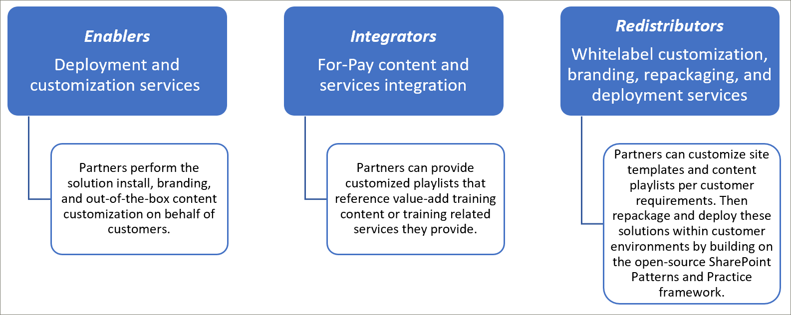

# Modèles d’intégration des partenairesPartner integration models
S’il n’est pas possible de compléter le contenu des chemins d’apprentissage Microsoft 365 directement à partir du service de mise en service SharePoint Online, il existe plusieurs modèles d’intégration que les partenaires peuvent utiliser pour créer des services à valeur ajoutée alignés. offres.While it’s not possible to supplement the Microsoft 365 learning pathways content directly ‘out of the box’ from the SharePoint Online Provisioning service, there are several integration models that partners can leverage to create aligned value-add service offerings. Les modèles d’intégration des partenaires ci-dessus sont présentés par ordre croissant de complexité et de niveaux d’investissement.The partner integration models above are presented in order of ascending complexity and levels of investment. Nos conseils sont donc de développer votre expertise et votre diplôme sur des niveaux plus avancés en fonction de vos modèles d’entreprise.Hence our guidance is to build your expertise and graduate to more advanced levels based on your business models.

 

## Comment dois-je commencer ?How should I get started? 
Pour commencer, voici quelques bonnes pratiques à suivre.To get started, here are some best practices to follow.     

### 1. Commencez par la création d’une expertise en tant qu’activateur.1. Begin with building expertise as an Enabler. 
Vous pouvez contribuer à un pourcentage de votre base de clients immédiatement en activant son portail de formation sur les voies d’apprentissage et en effectuant une organisée de contenu Microsoft ciblée.You can help a percentage of your customer base right away by enabling their learning pathways training portal and performing targeted Microsoft content curation. Pour obtenir des instructions sur la mise en service des voies https://docs.microsoft.com/en-us/office365/customlearning/custom_provisiond’apprentissage, voir.For instructions on provisioning learning pathways, see https://docs.microsoft.com/en-us/office365/customlearning/custom_provision.  

### 2. étendez vos services en tant qu’intégrateur.2. Then extend your services as an Integrator
Effectuer un retour d’automatisation sur l’analyse des investissements, en fonction de la quantité de votre contenu et/ou de vos besoins d’intégration de services.Perform an automation return on investment analysis - depending on the quantity of your content and/or services integration needs. Par exemple, il n’est pas judicieux de prendre les coûts de développement et d’exploitation en ce qui concerne nos directives d’intégration de contenu si vous pouvez rapidement créer manuellement une sélection personnalisée ciblée pointant vers votre contenu payant ou référencer vos services.For example, it may not make sense to take on the development and operational costs with respect to our content integration guidelines if you can quickly manually create a targeted custom playlist(s) pointing to your for-pay content or reference your services.

### 3. lorsque le retour sur investissement est pertinent, envisagez de redistribuer3. When the return on investment makes sense – consider Redistribution 
Lorsque le retour sur investissement est pertinent, envisagez de redistribuer (ou d’utiliser les partenaires de voies d’apprentissage associés) pour créer des solutions reconditionnées.When the return on investment makes sense – consider Redistribution (or working with related learning pathways partners) to build repackaged solutions. Celles-ci sont basées sur les modèles SharePoint et l’infrastructure pratique qui fournit des solutions pour extraire les sites personnalisés, puis les déployer dans les environnements clientThese are based on the SharePoint Patterns and Practice framework which provides solutions to extract customized sites and then deploy into customer environments 

## Instructions d’intégration de contenu fournies par un partenairePartner-provided content integration guidelines
Le contenu des chemins d’apprentissage Microsoft 365 est piloté par un ensemble de fichiers JSON qui agissent comme des manifestes de contenu pour votre package de formation.Content for Microsoft 365 learning pathways is driven by a set of JSON files that act as content manifests for your learning package. Il existe trois fichiers : Metadata. JSON, playlists. JSON et biens. JSON.There are three files: metadata.json, playlists.json, and assets.json. Ces fichiers doivent être structurés pour correspondre aux modèles que le composant WebPart reconnaît puis héberger à partir d’un réseau de distribution de contenu (CDN) pour autoriser le composant WebPart à le charger.These files need to be structured to match the models the web part recognizes and then hosted from a content delivery network (CDN) to allow the web part to load them. Microsoft fournira des modèles de démarrage de ces fichiers pour vous aider à démarrer.Microsoft will provide starter templates of these files to get you started.  

**Clause d’exclusion de responsabilité :** la structure de fichiers JSON est susceptible d’être modifiée en fonction du travail de la solution à venir.**Disclaimer:** the JSON file structure is subject to change based on upcoming solution work. Le programme d’adoption du partenaire des chemins d’apprentissage Microsoft 365 (EAP) est informé des modifications imminentes de cette nature.The Microsoft 365 learning pathways partner Early Adopter Program (EAP) will be informed of any impending changes of this nature. Ainsi que les instructions de compatibilité et/ou de transition des clients.Along with any customer backwards compatibility and/or transition guidance. 

### Téléchargement de la solution des chemins d’apprentissage Microsoft 365Download the Microsoft 365 learning pathways solution
Vous pouvez télécharger la solution des chemins d’apprentissage Microsoft 365, ainsi que les fichiers JSON, à partir du référentiel GitHub : https://github.com/pnp/custom-learning-office-365.You can download the Microsoft 365 learning pathways solution, along with the JSON files, from the GitHub repository: https://github.com/pnp/custom-learning-office-365. Notez que, pour l’instant, Microsoft ne prend pas en charge la requête de tirage GitHub sur la solution.Note that at this time, Microsoft is not taking GitHub pull request on the solution. Toutefois, vous pouvez utiliser les fichiers GitHub comme point de départ pour créer votre propre Pack de contenu personnalisé.But you can use the GitHub files as a starting point for creating your own custom content pack. 

### Structure Metadata. JSONMetadata.json Structure
Vous pouvez considérer ce fichier comme le cerveau des menus et de la structure.You can think of this file as the brains of the menus and structure. Elle contient toutes les structures de navigation, ainsi que les listes de sélection des données dans les deux autres fichiers.It contains all the navigation structure as well as pick lists for data in the other two files. 

|              NomName        |                     DescriptionDescription                                                               | 
|:-----------------------------|-------------------------------------------------------------------------------------------|
|**Technologie****Technologies**              |Le contenu est balisé et peut être masqué en fonction de la technologie qu’il a affectée.Content is tagged and can be hidden based on the Technology it’s assigned.                 |  
|&nbsp;&nbsp;Réf&nbsp;&nbsp;Id                |GUID représentant la technologieGUID representing the technology                                                           |  
|&nbsp;&nbsp;Nom&nbsp;&nbsp;Name              |Nom d’affichage de la technologieDisplay name of the technology                                                             |
|&nbsp;&nbsp;*Objets []*&nbsp;&nbsp;*Subjects[ ]*     |Tableau de sujets qui constituent un sous-ensemble de la technologieAn array of subjects that are a subset of the technology                                   | 
|&nbsp;&nbsp;&nbsp;&nbsp;Réf&nbsp;&nbsp;&nbsp;&nbsp;Id    |GUID représentant l’objetGUID representing the subject                                                              |
|&nbsp;&nbsp;&nbsp;&nbsp;Nom&nbsp;&nbsp;&nbsp;&nbsp;Name  |Nom d’affichage de l’objetDisplay name of the subject                                                                |
|**Catégories []****Categories [ ]**             |Les catégories informent la navigation du composant WebPart.Categories inform the navigation of the webpart. Chaque catégorie représente un niveau supérieur de la navigation.Each category represents a top level of the navigation                                                                                                                 |
|&nbsp;&nbsp;Réf&nbsp;&nbsp;Id                |GUID représentant la catégorie/sous-catégorieGUID representing the category/subcategory                                                 |
|&nbsp;&nbsp;Nom&nbsp;&nbsp;Name              |Nom d’affichage de la catégorie/sous-catégorieDisplay name for the category/subcategory                                                  |
|&nbsp;&nbsp;Photo&nbsp;&nbsp;Image             |URL de l’image qui doit être affichée dans l’expérience utilisateur (par rapport à la base du CDN)URL for the image that should be displayed in the UX (relative to the CDN base)            |
|&nbsp;&nbsp;TechnologyId&nbsp;&nbsp;TechnologyId      |GUID de la technologie à laquelle ce contenu est lié (facultatif – chaîne vide)The GUID of the Technology this content is related to (optional – empty string)            |
|&nbsp;&nbsp;SubjectId&nbsp;&nbsp;SubjectId         |GUID de l’objet auquel ce contenu est lié (facultatif – chaîne vide)The GUID of the Subject this content is related to (optional – empty string)               |
|&nbsp;&nbsp;Journal&nbsp;&nbsp;Source            |À partir d’une baie source, elle n’est pas spécifiquement utilisée dans une expérience utilisateur autre que les données personnalisées ajoutées par l’utilisateur est marquée comme « client » et la zone d’administration d’expérience utilisateur n’autorise pas la modification des éléments qui ne sont pas marqués « client ».From Source array, not specifically used in UX other than custom data added by the user is marked as “Tenant” and the UX admin area does not allow editing of anything not marked “Tenant”.                           |
|&nbsp;&nbsp;*Sous-catégories []*&nbsp;&nbsp;*Subcategories[ ]*|Les sous-catégories sont fondamentalement le niveau de navigation du niveau 2 vers le bas.Sub-Categories are basically the nav level from level 2 down. La structure est identique à celle d’une catégorie qui vient d’être imbriquée.The structure is the same as a Category just nested.          |
|**Audiences []****Audiences [ ]**             |Lorsque plusieurs audiences associées à une catégorie/sous-catégorie sont indiquées, un sélecteur est disponible pour afficher les audiences disponibles.When playlists associated with a category/subcategory are various audiences tagged, a selector will be available to show the available audiences. |         
|&nbsp;&nbsp;Réf&nbsp;&nbsp;Id                |GUID de l’audienceGUID of the audience                                                                       |  
|&nbsp;&nbsp;Nom&nbsp;&nbsp;Name              |Nom d’affichage de l’audienceDisplay name of the audience                                                               |       
|**Sources []****Sources [ ]**               |Tableau de chaînes qui balise le contenu avec sa source, non spécifiquement utilisées dans l’expérience utilisateur, à l’exception des données personnalisées ajoutées par l’utilisateur, sont marquées comme « locataire » et la zone admin UX n’autorise pas la modification des éléments qui ne sont pas marqués « client ».Array of strings that tag content with its source, not specifically used in UX other than custom data added by the user is marked as “Tenant” and the UX admin area does not allow editing of anything not marked “Tenant”.                                                   |  
|**Levels []****Levels  [ ]**               |Lorsque plusieurs niveaux de sélection associés à une catégorie/sous-catégorie sont marqués, un sélecteur est disponible pour afficher les niveaux disponibles.When playlists associated with a category/subcategory are various levels tagged, a selector will be available to show the available levels.             |  
|&nbsp;&nbsp;Réf&nbsp;&nbsp;Id                |GUID du niveauGUID of the Level                                                                          |  
|&nbsp;&nbsp;Nom&nbsp;&nbsp;Name              |Nom d’affichage du niveauDisplay name of the Level                                                                  | 
|**StatusTag [ ]****StatusTag  [ ]**           |La balise d’état permet d’identifier le contenu présentant différents statuts qui seront exposés dans l’expérience utilisateur.Status tag is to identify content with various status that will be exposed in the UX. Certains de ces indicateurs seront affichés pour le consommateur et d’autres seulement pour l’administrateur.Some of these flags will be show to the consumer and some only to the admin.                                                   |  
|&nbsp;&nbsp;Réf&nbsp;&nbsp;Id                |GUID du StatugTagGUID of the StatugTag                                                                      |  
|&nbsp;&nbsp;Nom&nbsp;&nbsp;Name              |Nom d’affichage du StatusTagDisplay name of the StatusTag                                                              | 
|**Télémétrie []****Telemetry  [ ]**            |                                                                                           |  
|&nbsp;&nbsp;AppInsightsKey&nbsp;&nbsp;AppInsightsKey    |GUID de la clé Insights de l’application que vous avez configuré pour effectuer le suivi du chargement du composant WebPart Visionneuse.GUID of the app insights key that you have set up to track the loading of the viewer web part. Le suivi peut être désactivé par un administrateur pour l’ensemble du client, mais les informations envoyées sont des utilisateurs anonymes avec l’ID de client. Pour plus d’informations, reportez-vous à cette section.https://github.com/pnp/custom-learning-office-365#disabling-telemetry-collectionTracking can be turned off by an administrator for the entire tenant, but the information sent is anonymized user with the tenant id. Please see this section for more information https://github.com/pnp/custom-learning-office-365#disabling-telemetry-collection               |  
|**Version****Version**                   |Les informations de version sont utilisées par la solution pour indiquer aux administrateurs que le composant WebPart a été mis à jour et permettre au composant WebPart de mettre à jour automatiquement le contenu personnalisé vers la dernière version du manifeste si des modifications importantes ont été apportées.Version information is used by the solution to indicate to administrators that the webpart has updated and also allow the webpart to self-update custom content to the latest version of the manifest if significant changes have been made.         | 
|&nbsp;&nbsp;Manifeste&nbsp;&nbsp;Manifest          |Version du manifesteThe version of the manifest                                               |
|&nbsp;&nbsp;ManifestMinWebPart&nbsp;&nbsp;ManifestMinWebPart|Version minimale du composant WebPart qui fonctionne avec la version du manifesteThe minimum version of the webpart that works with the version of the manifest             |
|&nbsp;&nbsp;CurrentWebPart&nbsp;&nbsp;CurrentWebPart    |URL de l’image qui doit être affichée dans l’expérience utilisateur (par rapport à la base du CDN)URL for the image that should be displayed in the UX (relative to the CDN base)            |
|&nbsp;&nbsp;Reversion&nbsp;&nbsp;RepoURL           |URL du référentiel où se trouvent les instructions de mise à jour du composant WebPart.The url of the repository where the updating web part instructions are.                    |
|**Packs de contenu****Content Packs**             |À ce stade, les packs de contenu pour les CDN supplémentaires ne sont pas pris en charge.At this time content packs for additional CDN’s is not supported. Les packs de contenu permettent à Microsoft de suggérer d’autres solutions Microsoft créées qui peuvent être configurées via le service de mise en service qui exploite M365LP pour fournir du contenu et qui se trouvent dans et de lui-même CDN personnalisé.Content packs allow Microsoft to suggest other Microsoft created solutions that can be provisioned via the Provisioning service that leverage M365LP to deliver content and are in and of themselves custom CDNs.       | 
|&nbsp;&nbsp;Réf&nbsp;&nbsp;Id                |GUID du Pack de contenu/CDNGUID of the content pack/CDN                                                              |
|&nbsp;&nbsp;Nom&nbsp;&nbsp;Name              |Nom d’affichage du CDNDisplay name of the CDN                                                                   |
|&nbsp;&nbsp;Description&nbsp;&nbsp;Description       |Description à afficher dans l’interface utilisateur pour l’ajout d’un pack de contenuDescription to be displayed in UI for adding a content pack                               |
|&nbsp;&nbsp;Photo&nbsp;&nbsp;Image             |Image à afficher dans l’interface utilisateur pour l’ajout d’un pack de contenuImage to be displayed in UI for adding a content pack                                     |
|&nbsp;&nbsp;ProvisionURL&nbsp;&nbsp;ProvisionURL      |L’URL du package de service de mise en service pour créer la collection de sites du Pack de contenuThe URL to the provisioning service package to create the content pack’s site collection  |
|&nbsp;&nbsp;CDNbase&nbsp;&nbsp;CDNbase           |L’URL de base pour les manifestes du Pack de contenuThe Base URL for the manifests for the content pack                                       |
|AssetOriginsAssetOrigins                  |Tableau d’origine de l’URL utilisé dans le fichier immobilisations. JSON décrit plus loin.An array of URL origin’s utilized in the assets.json file described later. Si l’URL d’origine la prend en charge, un message post est envoyé à help_getClientHeight.If the origin URL supports it, a post message will be sent to help_getClientHeight. Une réponse dans la propriété Data de : « help_getClientHeight = {height of content} » (par exemple, « help_getClientHeight = 5769 ») permettra de redimensionner l’iFrame à la hauteur appropriée du contenu de cadres.A response in the data property of: "help_getClientHeight={height of content}" (for example "help_getClientHeight=5769") will allow the iFrame to be resized to the appropriate height of the framed content.         |

### Structure playlists. JSONPlaylists.json Structure
playlists. JSON : le manifeste de sélections est un tableau d’objets qui décrivent les métadonnées d’une sélection et les biens inclus dans la sélection.playlists.json – The playlists manifest is an array of objects that describe the metadata about a playlist and the assets that are included in the playlist.

|              NomName        |                     DescriptionDescription                                                               | 
|:-----------------------------|-------------------------------------------------------------------------------------------|
|IDId                            |GUID représentant la playlistGUID representing the playlist                                                             |  
|TitreTitle                         |Nom d’affichage de la playlistDisplay name of the playlist                                                               |
|ImageImage                         |URL relative (du CDN) vers une image pour visualiser la playlistRelative URL (from CDN) to an image to visualize the playlist                              |                      
|LevelIdLevelId                       |Niveau associéAssociated level                                                                           |
|AudienceIdAudienceId                   |Audience associéeAssociated audience                                                                        |
|TechnologyIdTechnologyId                 |Technologie associéeAssociated technology                                                                      |
|SubjectIdSubjectId                    |Nom d’affichage de la catégorie/sous-catégorieDisplay name for the category/subcategory                                                  |
|SourceSource                        |À partir du tableau source, il n’est pas utilisé spécifiquement dans une expérience utilisateur autre que les données personnalisées ajoutées par l’utilisateur est marqué comme « client » et la zone admin UX n’autorise pas la modification des éléments qui ne sont pas marqués « client ».From the source array, not specifically used in UX other than custom data added by the user is marked as “Tenant” and the UX admin area does not allow editing of anything not marked “Tenant”.                                              |
|CatIdCatId                         |ID de catégorie ou de sous-catégorie qui représente le conteneur dans lequel la playlist doit s’afficher.The Category or SubCategory ID that represents the container the playlist should be shown in. Actuellement, le manifeste ne prend pas en charge la sélection d’une catégorie ou sous-catégorie comme conteneur si elle comporte également des enfants de sous-catégorie.Currently the manifest does not support selecting a Category or SubCategory as the container if it also has SubCategory children.        |
|DescriptionDescription                   |Une description A été montrée pour chaque liste de lecture dans l’expérience utilisateurA description showed for each playlist in the UX                                           |
|StatusTagIdStatusTagId                   |Balise d’État associéeAssociated status tag                                                                      |
|StatusNoteStatusNote                    |Remarques sur le contenu affiché aux administrateursNotes about content displayed to administrators                                            |
|*Ressources []**Assets[]*                        |Un tableau de GUID pour les éléments qui font partie de cette playlist, dans l’ordre d’affichage.An array of GUID’s for the assets that are part of this playlist, in display order.        |         

### Structure Asset. JSONAsset.json Structure
playlists. JSON : le manifeste de sélections est un tableau d’objets qui décrivent les métadonnées d’une sélection et les biens inclus dans la sélection.playlists.json – The playlists manifest is an array of objects that describe the metadata about a playlist and the assets that are included in the playlist.

|              NomName        |                     DescriptionDescription                                                               | 
|:-----------------------------|-------------------------------------------------------------------------------------------|
|IDId                            |GUID représentant la playlistGUID representing the playlist                                                             |  
|TitreTitle                         |Nom d’affichage de la playlistDisplay name of the playlist                                                               |
|DescriptionDescription                   |---                                                                                           |                      
|URLURL                           |URL source de l’élément à appliquer à l’iFrameThe source url for the asset, to be applied to the iFrame                                  |
|TechnologyIdTechnologyId                  |Technologie associéeAssociated technology                                                                      |
|SubjectIdSubjectId                     |Objet associéAssociated subject                                                                         |
|SourceSource                        |Nom d’affichage de la catégorie/sous-catégorieDisplay name for the category/subcategory                                                  |
|StatusTagIdStatusTagId                   |Balise d’État associéeAssociated status tag                                                                      |
|StatusNoteStatusNote                    |Remarques sur le contenu affiché aux administrateurs.Notes about content displayed to administrators.                                           |

### Mise en cacheCaching
La version actuelle du composant WebPart Visionneuse utilise une version mise en cache des fichiers manifeste pendant 24 heures.The current version of the viewer web part utilizes a cached version of the manifest files for 24 hours. Au bout de 24 heures, le premier utilisateur qui a atteint le composant WebPart a atteint le gain de performances pour actualiser le cache en téléchargeant les manifestes à partir du CDN source et fusionne ces informations avec les technologies et les playlists masquées, ainsi que la fusion dans des sous-catégories personnalisées, playlists et biens.After 24 hours, the first user that hit’s the webpart takes the performance hit to refresh the cache by downloading the manifests from the source CDN and merge that information with hidden technologies and playlists as well as merging in custom sub-categories, playlists, and assets. Le composant WebPart admin télécharge toujours le contenu des manifestes et les fusionne et met à jour le cache.Alternately the admin web part always downloads the content from the manifests and merges them in and updates the cache.  En d’autres termes, l’administrateur peut forcer une mise à jour du cache à tout moment en chargeant le composant WebPart d’administration, puis en accédant à la page d’administration.So, in other words, the administrator can force a cache update at any time by loading the admin web part, aka going to the Administration page.

## Instructions pour le Pack de contenuContent Pack Guidelines
La fonctionnalité du Pack de contenu déverrouille les scénarios suivants :The Content Pack feature unlocks the following scenarios:
- Possibilité pour les partenaires de redistribuer un contenu d’apprentissage personnalisé à valeur ajoutée personnalisé adapté à l’environnement des clientsThe ability for partners to redistribute value-added custom learning content custom tailored to customers’ environment
- Possibilité pour les organisations disposant d’une équipe de formation solide et d’un support informatique de créer un contenu d’apprentissage personnalisé dirigé vers ses systèmes internes et sa gouvernanceThe ability for organizations with a strong training team and IT support to build custom learning content directed at their own internal systems and governance
- Possibilité pour Microsoft de fournir des voies de formation supplémentaires à l’avenir auxquelles les clients peuvent s’abonnerThe ability for Microsoft to deliver additional learning pathways in the future that customers can opt into

Ce jeu de documentation actuel est intentionnellement ciblé pour les partenaires en raison de la complexité de la fonctionnalité.This current documentation set is intentionally targeted for Partners due to the feature’s complexity. L’équipe de service travaille activement à mieux prendre en charge et à activer le scénario #2, à l’avenir.The service team is actively working to better support and enable scenario #2, in the future. 

### Fonctionnement des modules de contenuHow Content Packs work
Microsoft utilise des pages GitHub en tant que source de réseau de distribution de contenu (CDN) pour ses fichiers manifeste et ses images.Microsoft utilizes GitHub pages as a Content Delivery Network (CDN) source for its manifest files and images. Nous disposons d’un dossier docs à la racine de notre référentiel GitHub qui inclut des sous-dossiers pour chaque version des fichiers manifeste.We have a docs folder at the root of our GitHub repository that includes sub folders for each version of the manifest files. Dans chaque dossier, il existe trois fichiers Manifest, ainsi qu’un dossier images pour stocker toutes les images de catégorie, de sous-catégorie et de playlist.Inside each folder there are three manifest files, plus an images folder to store all the category, subcategory, and playlist images. 

Il est important que vous mainteniez la même structure de contrôle de version que celle que Microsoft doit utiliser pour étendre la solution de voies d’apprentissage avec votre propre Pack de contenu.It is important that you maintain the same versioning structure that Microsoft does should you choose to extend the learning pathways solution with your own content pack. Votre point de terminaison CDN ne doit pas inclure le dossier version, car la version de manifeste prise en charge par le composant WebPart est intégrée automatiquement à l’URL du CDN.Your CDN endpoint should not include the version folder, as the manifest version the web part supports is baked into it and is automatically appended to the CDN url. Nous allons évidemment vous laisser le temps de créer de nouvelles instances de vos fichiers manifeste à tout moment.We will obviously give you time to create new instances of your manifest files any time we revision it.

 

Pour plus d’informations sur l’utilisation des pages GitHub comme source de CDN, consultez la documentation d' [https://help.github.com/en/articles/configuring-a-publishing-source-for-github-pages](https://help.github.com/en/articles/configuring-a-publishing-source-for-github-pages)aide suivante :.For more information about utilizing GitHub pages as your CDN source please see the following help documentation: [https://help.github.com/en/articles/configuring-a-publishing-source-for-github-pages](https://help.github.com/en/articles/configuring-a-publishing-source-for-github-pages).

La solution de Microsoft rend les informations relatives aux ressources ouvertes au public, car il n’existe aucune sécurité pour les personnes qui ont accès à ces fichiers.Microsoft’s solution makes the information about the assets open to the public as there is no security around who has access to these files. Nous pensons qu’il doit y avoir une couche de contenu gratuite pour un consommateur, ceci dit, si vous avez besoin de payer le mur pour tout ou partie de votre contenu, vous devrez l’implémenter différemment dans les limites techniques de la solution et l’utilisation de pages GitHub n’est pas une moyenne s une exigence.We believe that there should be a free layer of content for a consumer, that said if you have a need for pay wall for some or all of your content you will need to implement this differently within the technical limitations of the solution and using GitHub pages is by no means a requirement. Tout fournisseur de CDN que vous souhaitez utiliser est parfait si vous conservez la structure de numérotation des versions que nous avons décrite.Any CDN provider you would like to use is fine if you maintain the version numbering structure we’ve outlined. Comme indiqué précédemment, la version de la structure de manifeste prise en charge par le composant WebPart est intégrée dans le code et est automatiquement ajoutée à l’URL du CDN.As stated previously, the version of the manifest structure the web part supports is baked into the code and is automatically appended to the CDN URL. 

### Guide d’intégration du Pack de contenuContent Pack Integration Guidance 
Les composants WebPart de l’administrateur et de la visionneuse ont été étendus pour permettre à l’utilisateur de configurer des points de terminaison CDN supplémentaires dans leur client, ce qui permettra au composant WebPart Visionneuse de sélectionner le CDN qui doit sourceiser les données qu’ils affichent.The admin and viewer web parts have been extended to allow the consumer to configure additional CDN endpoints in their tenant which will then allow the viewer web part to select which CDN they should source the data they display. 

Trames clés à garder à l’esprit pour cette fonctionnalité :Key framing to keep in mind for this feature: 
- Il s’agit du principal applicable aux scénarios de redistribution des partenaires : la configuration de la playlist manuelle est trop lourdeThis is primary applicable for partner redistribution scenarios – where manual playlist configuration is too cumbersome 
- Les packs de contenu personnalisés sont une fonctionnalité avancée qui doit être utilisé uniquement par les partenaires ayant une expérience d’administration de contenu Web.Custom Content Packs are an advanced feature and should only be used by Partners with experience administrating web content. Les sources de contenu non fiables peuvent introduire du contenu non sécurisé dans votre site.Untrustworthy content sources may introduce unsafe content into your site. Vous devez uniquement ajouter des sources approuvées.You should only add sources that you trust.

> **Important** Avant d’ajouter un pack de contenu personnalisé, vous devez disposer des chemins d’apprentissage Microsoft 365 3,0 ou version ultérieure.**IMPORTANT** Before adding a Custom Content Pack, you must have provisioned Microsoft 365 learning pathways 3.0 or later. Pour informataion sur la mise en service des chemins d’apprentissage Microsoft 365, voir [provisionner les chemins d’apprentissage microsoft 365](https://docs.microsoft.com/en-us/office365/customlearning/custom_provision).For informataion about provisioning Microsoft 365 learning pathways, see [Provision Microsoft 365 learning pathways](https://docs.microsoft.com/en-us/office365/customlearning/custom_provision).

### Liste d’interliste de contenuContent Whitelisting
En tant que partenaire, il est de votre responsabilité pour aider vos clients à s’assurer que votre contenu est la liste d’autorisation dans leur environnement.As a partner it’s your responsibility to assist your consumers in making sure your content is whitelisted in their environment. Nous vous suggérons de créer un scénario de test dans son environnement afin de vérifier que votre contenu peut être iFrame dans une page SharePoint à l’intérieur de son pare-feu.We suggest you create a test scenario in their environment to validate that your content can be iFrame’d into a SharePoint page inside of their firewall. Suivez les instructions [créer des pages SharePoint pour les playlists personnalisées](https://docs.microsoft.com/en-us/office365/customlearning/custom_createnewpage) pour confirmer que c’est le cas.Follow the [Create SharePoint pages for Custom Playlists](https://docs.microsoft.com/en-us/office365/customlearning/custom_createnewpage) instructions to confirm this is the case.

### Ajouter un pack de contenu aux voies d’apprentissageAdd a Content Pack to Learning Pathways
Une fois que vous avez modifié le JSON et défini votre CDN, vous pouvez ajouter le Pack de contacts aux voies d’apprentissage.Once you've created modified the JSON and defined your CDN, you can add the Contact Pack to learning pathways. 

1. Sur la page d' **Accueil** du site des voies d’apprentissage, pointez sur **Accueil** , puis cliquez sur **administration des chemins d’apprentissage**.From the learning pathways site **Home** page, point to **Home** and then click **Learning pathways administration**. 
2. Dans la page **administration** , cliquez sur **... Ajoutez le Pack de contenu** dans le coin supérieur droit de la page.From the **Administration** page, click the **... Add Content Pack** in the upper-right corner of the page.
3. Cliquez sur Pack de contenu personnalisé, puis entrez un nom pour le Pack de contenu, puis spécifiez le CDN dans lequel se trouvent les fichiers JSON.Click Custom Content Pack, and then enter a name of the Content Pack and then specify the CDN where the JSON files are located.

4. Cliquez sur **Enregistrer**.Click **Save**. Le contenu de votre pack de contenu personnalisé doit maintenant apparaître dans la page Administration.The content from your Custom Content Pack should now appear in the Administration page. Voici un exemple.Here is an example. 

### Filtrer sur le Pack de contenu dans le composant WebPartFilter to the Content Pack in the web part
Les voies de formation vous permettent d’ajouter le composant WebPart voies d’apprentissage à une page, de filtrer le composant WebPart de sorte qu’il pointe vers la source du Pack de contenu personnalisé, puis de filtrer le composant WebPart sur la catégorie, la sous-catégorie, la liste de choix et l’élément de votre choix.With learning pathways, you can add the learning pathways web part to a page, filter the web part to point to the Custom Content Pack source, and then filter the web part to the category, subcategory, playlist, and asset that you want. 

1. Sur le site des voies d’apprentissage, cliquez sur **nouveau**, puis sur **page**.From the learning pathways site, click **New**, and then **Page**.
2. Cliquez sur **vide**, puis sur **créer une page**.Click **Blank**, and then **Create Page**.
3. Donnez un nom à la page.Give the page a name. 
4. Cliquez sur **+ Ajouter une nouvelle section** sur le côté gauche de la page.Click **+ Add a new section** on the left side of the page.
5. Cliquez **+** en haut au milieu de la nouvelle section, puis ajoutez le composant WebPart des **chemins d’apprentissage Microsoft 365** .Click **+** in the top-middle of the new section, and then add the **Microsoft 365 learning pathways** web part.
6. Cliquez sur le composant WebPart, puis cliquez sur l’icône **modifier** .Click the Web part, and then click the **Edit** icon.
7. Dans la zone **Sélectionnez la source d’apprentissage** , sélectionnez votre pack de contenu personnalisé, puis filtrez le composant WebPart pour le contenu de votre choix.In the **Select the Learning Source** box, select your Custom Content Pack, and and then filter the web part to the content you want. Vous trouverez ci-dessous un exemple de composant WebPart filtré sur une sélection à partir d’un pack de contenu personnalisé.The following provides an example of the Web part filtered to a playlist from a Custom Content Pack.

  

