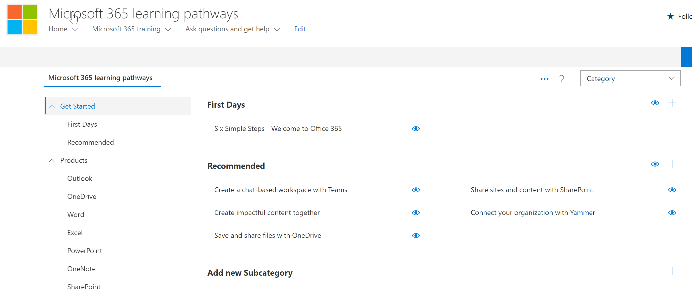

# Planifier le contenu de votre parcours d'apprentissage
Avant de vous plonger dans le déploiement du parcours d'apprentissage de Microsoft 365, il est bon de prendre un certain temps pour sondé le contenu d'apprentissage, les outils et les fonctionnalités disponibles. Notre objectif est de vous aider à rendre les utilisateurs de votre organisation à la vitesse et à la productivité, aussi rapidement et efficacement que possible. En matière de planification des parcours d'apprentissage, nous vous recommandons un processus en trois étapes :

1. **Examinez les ressources disponibles ,** à la fois les ressources fournies par le biais du parcours d'apprentissage et les ressources disponibles dans votre organisation. Les meilleurs plans d'apprentissage combinent à la fois les ressources Microsoft et les ressources de votre organisation.
2. **Apprenez à connaître les fonctionnalités de** l'outil Parcours d'apprentissage. Nous vous fournirons une visite guidée rapide. 
3. **Créez un plan de** contenu : examinez les guides d'adoption disponibles pour vous aider à créer un plan global.

## Passer en revue les ressources disponibles
Avant de créer un plan de contenu pour le parcours d'apprentissage de Microsoft 365, prenez le temps de découvrir toutes les ressources disponibles.  

### Passer en revue le site SharePoint du parcours d'apprentissage
La solution de parcours d'apprentissage De Microsoft 365 fournit un site de communication SharePoint avec un partie Web Qui est connecté à un catalogue en ligne. Le site SharePoint est entièrement personnalisable, y compris le nom du site, le logo, les pages, les éléments de menu, les thèmes et les vignettes. Prenez le temps de cliquer sur les vignettes et les éléments de menu pour découvrir ce qui est disponible avec le site du parcours d'apprentissage.

### Passer en revue le contenu du catalogue en ligne avec le partie Web
Par défaut, le volet Web Est ajouté à une série de pages dans le site de communication SharePoint. L'ensemble complet du contenu est fourni sur la page de formation Microsoft 365. La page de formation Microsoft 365 héberge le volet Web du parcours d'apprentissage configuré pour afficher toutes les formations disponibles pour les parcours d'apprentissage. 

**Pour afficher la page Formation Microsoft 365**
1. Cliquez sur l'élément de menu de formation Microsoft 365. 
1. Faites défiler la page vers le bas pour afficher toutes les catégories et sous-catégories.
2. Lancez un peu le projet. Cliquez sur quelques sous-catégories, puis sur quelques sélections pour avoir une bonne expérience de l'organisation du contenu des parcours d'apprentissage. 

### Afficher la page Administration
La page Administration fournit une liste du contenu à votre disposition. C'est là que vous pouvez masquer le contenu, créer de nouvelles playlists et ajouter, modifier et supprimer une playlist. Cliquez sur les différentes catégories et playlists pour voir l'ensemble du contenu disponible. 

**Pour afficher la page Administration.**
1. À partir du site du parcours d'apprentissage, pointez sur la flèche déroulante du menu Accueil, puis cliquez sur Administration du parcours d'apprentissage.  
2. Cliquez ensuite sur les différentes catégories, sous-catégories et playlists pour avoir une bonne impression du contenu à votre disposition. 

   

### Apprendre à connaître les fonctionnalités du parcours d'apprentissage de Microsoft 365
Avec le parcours d'apprentissage De Microsoft 365, vous pouvez faire entre du contenu fourni par Microsoft avec du contenu que vous créez pour cibler des stratégies et procédures spécifiques propres à votre organisation. En tant que meilleure pratique, essayez de tirer le plus possible parti du contenu fourni par Microsoft. Microsoft met à jour les biens individuels régulièrement et met à jour l'inventaire complet du contenu tous les trimestres. En règle générale, une organisation crée 10 à 20 % de contenu unique, puis laisse les 80 % restants à Microsoft pour rester à jour. Les listes suivantes décrivent comment le contenu des parcours d'apprentissage est organisé, ainsi que des instructions pour le contenu qui peut être modifié ou créé. Des instructions pour la personnalisation du contenu sont fournies dans la section Personnalisation des parcours d'apprentissage du Centre de réussite de l'administrateur.

- **Catégories** : sont des conteneurs pour les sous-catégories. Les catégories sont fournies par Microsoft et ne peuvent pas être créées ou modifiées.
- **Sous-catégories :** sont des conteneurs pour les playlists. Microsoft fournit des sous-catégories que vous ne pouvez pas modifier, mais vous pouvez créer vos propres sous-catégories. 
- **Playlist** : sont des conteneurs pour les biens. Microsoft fournit des playlists que vous ne pouvez pas modifier, mais vous pouvez créer vos propres playlists.  
- **Ressources :** sont les pages d'apprentissage dans la playlist. Microsoft fournit des ressources dans les playlists que vous ne pouvez pas modifier, mais vous pouvez créer vos propres ressources et les ajouter à playlists.est

### Consulter les ressources supplémentaires de Microsoft
Microsoft fournit des ressources d'aide et de formation que vous pouvez utiliser lors de la planification de contenu pour le parcours d'apprentissage.  

-  [Aide et formation Office](https://support.office.com)
-  [Centre de formation Office 365](https://support.office.com/office-training-center)

### Passer en revue les ressources d'apprentissage de votre organisation
Faites le point sur le contenu d'apprentissage déjà disponible dans votre organisation.
Par exemple, votre organisation a peut-être déjà des guides de démarrage rapide personnalisés, des feuilles de tri ou des pages SharePoint dédiées à la préparation de Microsoft 365, au HelpDesk, à l'intégration ou à la formation. Les ressources SharePoint existantes peuvent être incorporées dans les playlists du portail Microsoft 365 ou mixtes avec du contenu Microsoft dans une playlist pour créer une playlist ciblée pour votre organisation. Pour plus d'informations sur la combinaison du contenu de votre organisation avec le contenu de Microsoft, voir le [parcours d'apprentissage de personnalisation.](custom_overview.md) Personnalisation de la section parcours d'apprentissage du Centre de réussite de l'administrateur.

### Tirer parti des ressources d'adoption
Notez que vous pouvez commencer à utiliser le parcours d'apprentissage en quelques jours, mais il est préférable d'exécuter une planification avant d'exécuter une stratégie de campagne d'apprentissage pour intégrer une nouvelle technologie ou un ensemble de services. Le développement d'un plan de contenu et l'utilisation des parcours d'apprentissage font vraiment partie d'un effort plus important dans la planification d'une stratégie globale de gestion des changements. Nous fournissons donc des supports d'adoption que vous pouvez utiliser pour planifier votre stratégie globale. Dans le cadre de votre effort de planification, consultez ressources [d'adoption.](https://resources.techcommunity.microsoft.com/adoption/)

### Créer un plan d'apprentissage et itérer 
De nombreuses entreprises qui ont correctement déployé le parcours d'apprentissage ont adopté des campagnes d'apprentissage axées sur des scénarios ou technologies spécifiques. Par exemple, « Soyez plus collaboratif , à l'aide de Teams » ou « Être plus mobile avec Outlook Mobile ». Vous pouvez voir des exemples de campagnes d'apprentissage potentielles à l'aide du [Kit d'adoption téléchargeable.](https://teamworktools.azurewebsites.net/m365lp/m365lpadoptionkit.zip)

 
