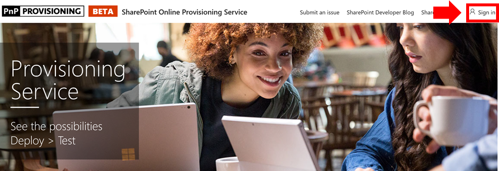
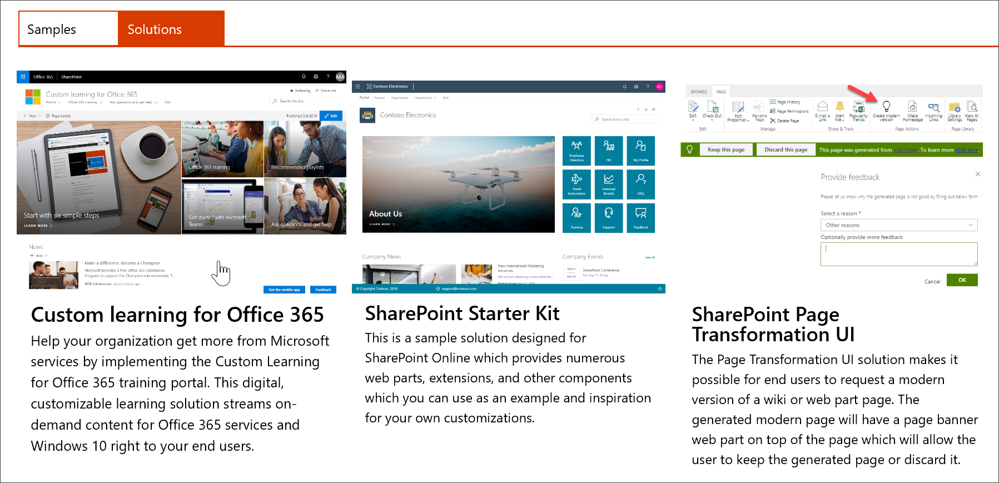

# Mettre en service une formation personnaliséeProvision Custom Learning

Avec le service de mise en service SharePoint Online, un administrateur client Office 365 peut démarrer le processus de mise en service avec quelques clics simples.With the SharePoint Online Provisioning Service, an Office 365 Tenant Administrator can start the provisioning process with a few simple clicks. Le service de mise en service est la méthode recommandée pour mettre en service l'apprentissage personnalisé.The Provisioning Service is the recommended way to provision Custom Learning. Il est rapide, facile et ne prend que quelques minutes pour démarrer le processus.It's fast, easy, and takes only a few minutes to start the process. Avant de commencer à utiliser le service de mise en service, assurez-vous que vous avez rempli les conditions préalables pour la mise en service.Before getting started with the Provisioning Service, however, make sure you've met the prerequisites for provisioning.

## Conditions requisesPrerequisites
 
Pour configurer correctement l'apprentissage personnalisé avec le [service de mise en service SharePoint Online](https://provisioning.sharepointpnp.com)du service de mise en service, la personne qui effectue la mise en service doit répondre aux conditions préalables suivantes:To successfully set up Custom Learning with the Provisioning Service [SharePoint Online Provisioning Service](https://provisioning.sharepointpnp.com), the person doing the provisioning must meet the following pre-requisites: 
 
- La personne chargée de mettre en service l'apprentissage personnalisé doit être un client Administratorof le client où l'apprentissage personnalisé sera mis en service.The person provisioning Custom Learning must be a Tenant Administratorof the tenant where Custom Learning will be provisioned.  
- Un catalogue d'applications client doit être disponible dans l'option apps du centre d'administration SharePoint.A tenant App Catalog must be available within the Apps option of the SharePoint Admin Center. Si votre organisation ne dispose pas d'un catalogue d'applications client SharePoint, reportez-vous à la [documentation SharePoint Online](https://docs.microsoft.com/en-us/sharepoint/use-app-catalog) pour en créer une.If your organization does not have an SharePoint tenant App catalog, refer to the [SharePoint Online documentation](https://docs.microsoft.com/en-us/sharepoint/use-app-catalog) to create one.  
- La personne chargée de mettre en service l'apprentissage personnalisé doit être un propriétaire de collection de sites du catalogue d'applications client.The person provisioning Custom Learning must be a Site Collection Owner of the Tenant App Catalog. Si la personne chargée de la mise en service de l'apprentissage personnalisé n'est pas un propriétaire de collection de sites du catalogue d'applications, [suivez ces instructions](addappadmin.md) et continuez.If the person provisioning Custom Learning is not a Site Collection Owner of the App Catalog [complete these instructions](addappadmin.md) and continue. 

### Pour configurer l'apprentissage personnaliséTo provision Custom Learning

1. Accédez à http://provisioning.sharepointpnp.com et **Connectez-vous** à partir du coin supérieur droit de la page d'accueil.Go to http://provisioning.sharepointpnp.com and **sign in** from the upper right hand corner of the home page.  Connectez-vous avec les informations d'identification du client ciblé dans lequel vous prévoyez d'installer le modèle de site.Sign in with the  credentials for the targeted tenant where you plan to install the site template.

2. Effacez le **consentement au nom de votre organisation** et sélectionnez **accepter**.Clear the **Consent on behalf of your organization** and select **Accept**.

3. Sélectionnez **Custom Learning for Office 365** dans la Galerie de solutions.Select **Custom Learning for Office 365** from the solution gallery.

4. Dans la page d'accueil de la solution, sélectionnez **Ajouter à votre client** .From the solution home page select **Add to your Tenant**

5. Renseignez les champs de la page informations de mise en service en fonction de votre installation.Complete the fields on the provisioning information page as appropriate for your installation. Au minimum entrez l'adresse de messagerie à laquelle vous souhaitez obtenir des notifications sur le processus de mise en service et l'URL de destination de votre site à mettre en service.At a minimum enter the email address where you wish to get notifications about the provisioning process and the destination URL for your site to be provisioned to.  
> [!NOTE]
> Faites en sorte que l'URL de destination de votre site soit conviviale pour vos employés, par exemple «/sites/MyTraining» ou «/teams/LearnOffice365».Make the destination URL for your site something friendly to your employees such as "/sites/MyTraining" or "/teams/LearnOffice365".

6. Sélectionnez **configuration** lorsque vous êtes prêt à installer l'apprentissage personnalisé dans votre environnement de client.Select **Provision** when ready to install Custom Learning into your tenant environment.  Le processus de mise en service prendra jusqu'à 15 minutes.The provisioning process will take up to 15 minutes. Vous serez averti par e-mail (à l'adresse e-mail de notification que vous avez entrée sur la page de mise en service) lorsque le site est prêt pour l'accès.You will be notified via email (to the notification email address you entered on the Provisioning page) when the site is ready for access. 

> [!IMPORTANT]
> L'administrateur client qui met en service le site d'apprentissage personnalisé doit accéder au site, puis ouvrir CustomLearningAdmin. aspx pour initialiser les propriétés personnalisées de l'administrateur pédagogique.The Tenant Admin who provisions the Custom Learning site must go to the site, and then open CustomLearningAdmin.aspx to initialize Custom Learning Admin properties. Pour l'instant, l'administrateur client doit également affecter des propriétaires au site.At this time, the Tenant Admin should also assign Owners to the site. 

## Valider la réussite de la mise en serviceValidate Provisioning Success

Lorsque la mise en service est terminée, l'administrateur de client reçoit un courrier électronique du service de mise en service PnP.When provisioning is complete, the Tenant Admin receives an email from the PnP Provisioning Service. L'administrateur peut copier le lien vers le site fourni dans le courrier électronique, puis suivre les instructions pour accéder au site.The admin can copy the link to the site provided in the email, and then follow the instructions to go to the site. L'administrateur client peut également accéder à <YOUR-SITE-COLLECTION-URL>/SitePages/CustomLearningAdmin. aspx.Alternately, the tenant admin can navigate to <YOUR-SITE-COLLECTION-URL>/SitePages/CustomLearningAdmin.aspx. Cela initialise l'élément de liste CustomConfig qui configure la formation personnalisée pour sa première utilisation.This initializes the CustomConfig list item that sets up Custom Learning for its first use. La personne qui ouvre cette page pour la première fois doit être administrateur client, administrateur de collection de sites ou propriétaire du site.The person who first opens this page must be a Tenant Admin,Site Collection Admin, or Owner of the site. Vous devriez voir une page semblable à celle-ci:You should see a page that looks like this: 

## Ajouter des propriétaires au siteAdd Owners to Site
En tant qu'administrateur client, il est peu probable que vous soyez la personne qui personnalise le site; vous devez donc attribuer des propriétaires au site.As the Tenant Admin, it's unlikely you'll be the person customizing the site, so you'll need to assign Owners to the site. Les propriétaires disposent de privilèges d'administrateur sur le site afin qu'ils puissent modifier les pages du site et repersonnaliser le site.Owners have administrative privileges on the site so they can modify site pages and rebrand the site. Ils ont également la possibilité de masquer et d'afficher le contenu fourni par le biais du composant WebPart formation personnalisée.They also have the ability to hide and show content delivered through the Custom Learning Web part. Ils ont également la possibilité de créer une playlist personnalisée et de les affecter à des sous-catégories personnalisées.They'll also have the ability to build custom playlist and assign them to custom subcategories.  

1. Dans le menu **paramètres** SharePoint, cliquez sur **autorisations de site**.From the SharePoint **Settings** menu, click **Site Permissions**.
2. Cliquez sur **paramètres d'autorisation avancés**.Click **Advanced Permission Settings**.
3. Cliquez sur **formation personnalisée pour les propriétaires Office 365**.Click **Custom learning for Office 365 Owners**.
4. Cliquez sur **nouveau** > **Ajouter des utilisateurs à ce groupe**, ajoutez les personnes voulues, puis cliquez sur **partager**.Click **New** > **Add Users to this group**, add the people you want to be Owners, and then click **Share**.

8. Cliquez sur l'option **suivante** dans le coin supérieur droit de la page pour suivre le site.Click the **Following** option in the upper right hand corner of the page to follow the site.  

### Étapes suivantesNext Steps
- Explorez le [contenu par défaut](sitecontent.md) inclus dans le composant WebPart.Explore the [default content](sitecontent.md) included in the webpart.
