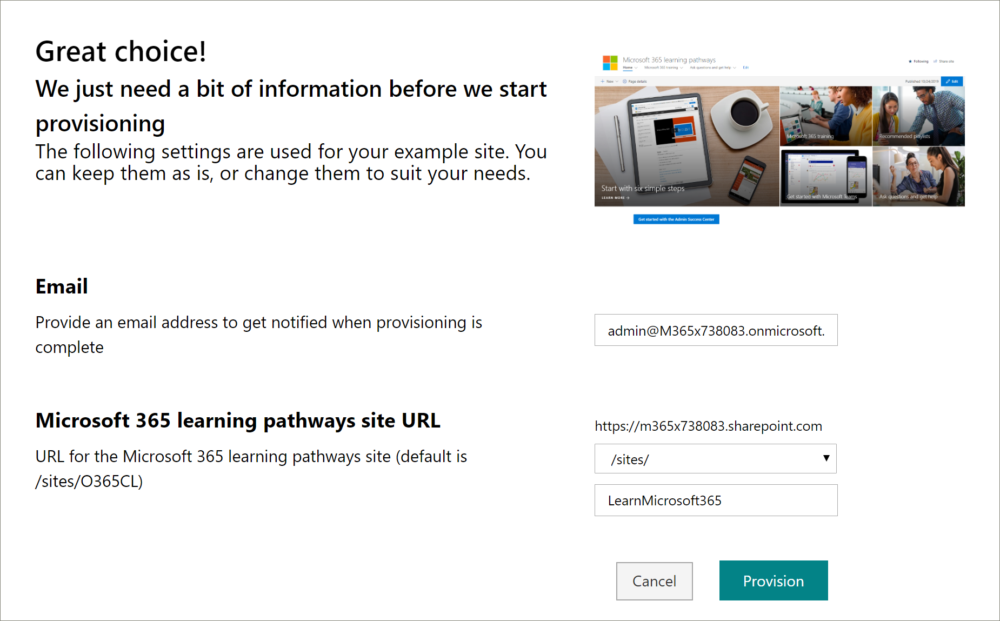

# Mise en service d’une nouvelle solution de parcours d’apprentissage 
Les organisations qui n’ont pas de parcours d’apprentissage mise en service dans leur client peuvent utiliser le service de carnet d’informations SharePoint pour ajouter la solution de parcours d’apprentissage multilingue. Avec cette option, le modèle SharePoint du parcours d’apprentissage est traduit en neuf langues et peut être utilisé avec un minimum de modification. 

> [!IMPORTANT]
> Si vous avez déjà mis en service des parcours d’apprentissage dans votre client, il est recommandé de mettre à jour les parcours  d’apprentissage. Si vous installez une nouvelle instance de parcours d’apprentissage, vous devrez transférer manuellement toutes les personnalisations du site existant vers le nouveau site. 

## Conditions préalables à la prise en charge multilingue
 
Pour configurer correctement le parcours d’apprentissage Microsoft 365 avec le service de carnet de recherche, la personne qui a mis en service doit respecter les conditions préalables suivantes :   
 
- Le parcours d’apprentissage de mise en service des personnes doit être un administrateur client du client dans lequel le parcours d’apprentissage sera provisioné.  
- Un catalogue d’applications client doit être disponible dans l’option Applications du Centre d’administration SharePoint. Si votre organisation n’a pas de catalogue d’applications client SharePoint, reportez-vous à la [documentation SharePoint Online](/sharepoint/use-app-catalog) pour en créer un. Vous devez patienter au moins deux heures après la création du catalogue d’applications avant de mettre en service le parcours d’apprentissage.  
- Le parcours d’apprentissage de mise en service des personnes doit être propriétaire de la collection de sites du catalogue d’applications client. Si le parcours d’apprentissage de mise en service de la personne n’est pas propriétaire de collection de sites du catalogue d’applications, complétent ces [instructions](addappadmin.md) et poursuivez. 

## S’assurer que le compte d’administrateur client n’a pas de langue sélectionnée
Avant de fournir le parcours d’apprentissage, assurez-vous que le compte d’administrateur du client n’a pas de langue sélectionnée. Voici comment vérifier si une langue n’est pas sélectionnée pour le compte Administrateur. 
1.  Avec votre profil d’administrateur Edge, office.com.
2.  Entrez les informations d’identification de l’utilisateur (si nécessaire).
3.  Dans Microsoft 365, cliquez sur **Toutes les applications >** Delve. 
4.  Cliquez **sur Moi mettre** à jour le  >  **profil**.
5.  Faites défiler la page vers le bas et cliquez sur **Comment puis-je modifier la langue et les paramètres régionaux**.
6.  Cliquez **ici,** puis cliquez sur les ellipses... . 
7.  Sous **Mes langues d’affichage,** aucune langue n’est **sélectionnée.** Si une langue est sélectionnée, désélectionne-la.

### Pour mettre en service le parcours d’apprentissage

1. Go to the [Microsoft 365 learning pathways solution page](https://lookbook.microsoft.com/details/3df8bd55-b872-4c9d-88e3-6b2f05344239).
2. Cliquez **sur Ajouter à votre client.** Si vous n’êtes pas connexion à votre client, le service d’approvisionnement vous demandera vos informations d’identification d’administrateur client. 
3. Dans la boîte de dialogue Autorisations demandées, sélectionnez **Consentement** au nom de votre organisation, puis **sélectionnez Accepter.**

Le service de carnet d’applications requiert ces autorisations pour créer le catalogue d’applications client, installer l’application dans le catalogue d’applications client et mettre en service le modèle de site. Il n’y a pas d’impact global sur votre client. Ces autorisations sont explicitement utilisées dans le but de l’installation de la solution. Vous devez accepter ces autorisations pour poursuivre l’installation.

4. Renseignez les champs de la page informations de configuration en fonction de votre installation. Au minimum, entrez l’adresse de messagerie à laquelle vous voulez recevoir des notifications sur le processus de mise en service et l’URL de destination de votre site.  
> [!NOTE]
> Faites en sorte que l’URL de destination de votre site soit conviviale pour vos employés, par exemple, « /sites/MonApprentissage » ou « /équipes/DécouvrirMicrosoft365 ».

6. Cliquez sur **Provision** lorsque vous êtes prêt à installer les parcours d’apprentissage dans votre environnement client.  Le processus de mise en service peut prendre jusqu’à 15 minutes. Vous recevez une notification par courrier électronique lorsque le site est prêt. 

> [!IMPORTANT]
> L’administrateur client qui propose le site du parcours d’apprentissage doit se rendre sur le site, puis ouvrir **CustomLearningAdmin.aspx** pour initialiser les propriétés d’administration du parcours d’apprentissage. Pour le moment, l’administrateur client doit également affecter des propriétaires au site. 

## Valider la réussite de l’approvisionnement et initialiser la liste CustomConfig

Une fois la mise en service terminée, l’administrateur client qui a provisioné le site reçoit un courrier électronique du service de carnet d’adresses. Le message électronique contient un lien vers le site. À ce stade, l’administrateur client doit se rendre sur le site à l’aide du lien fourni dans le courrier électronique et configurer le site pour la première utilisation :

- Accédez à `<YOUR-SITE-COLLECTION-URL>sites/<YOUR-SITE-NAME>/SitePages/CustomLearningAdmin.aspx`. L’ouverture de **CustomLearningAdmin.aspx** initialise l'élément de liste **CustomConfig** qui configure le parcours d’apprentissage pour la première utilisation. Vous devriez voir une page qui ressemble à ceci :

## Ajouter des propriétaires au site
En tant qu’administrateur client, il est peu probable que vous soyez la personne qui personnalisant le site, vous devrez donc affecter quelques propriétaires au site. Les propriétaires ont des privilèges d’administration sur le site pour pouvoir modifier les pages du site et renommer le site. Ils ont également la possibilité de masquer et d’afficher du contenu et de créer des playlists et sous-catégories personnalisées.  

1. Dans le menu **Paramètres** SharePoint, cliquez sur **Autorisations de site.**
2. Cliquez **sur Paramètres d’autorisation avancés.**
3. Cliquez **sur Propriétaires du parcours d’apprentissage Microsoft 365.**
4. Cliquez **sur**  >  **Ajouter des utilisateurs à ce groupe,** puis ajoutez les personnes que vous souhaitez être propriétaires. 
5. Ajoutez un lien [vers Explorer le site](custom_exploresite.md) dans le message de partage, puis cliquez sur **Partager.**

## Ajouter des traducteurs au site
Si vous utilisez des traducteurs pour le site, vous pouvez leur attribuer des autorisations. Les traducteurs requièrent des autorisations de membre ou des autorisations supérieures. 

## Choisir les options d’utilisation de plusieurs langues sur le site
Le service de carnet d’informations SharePoint crée le site Parcours d’apprentissage dans neuf langues. Les recommandations suivantes s’appliquent :
- Désactiver les langues que vous ne souhaitez pas prendre en charge
- Si vous ne prisez pas en charge un site multilingue, désactiver la fonctionnalité multilingue. Consultez la section « Désactiver la prise en charge multilingue » plus loin dans cette rubrique.

### Supprimer les langues que vous ne souhaitez pas prendre en charge
Pour les organisations qui choisissent de prendre en charge une seule langue, en plus de la langue anglaise par défaut, nous vous recommandons de supprimer les langues qui ne sont pas pris en charge. 
1. Dans le site Parcours d’apprentissage, sélectionnez **Paramètres** dans le haut à droite de la page, puis sélectionnez **Informations sur le site.**
2. En bas du volet d’informations du site, sélectionnez **Afficher tous les paramètres du site.**
3. Sous **Administration du site,** sélectionnez **Paramètres de langue.**
4. Under **Enable pages and news to be translated into multiple languages**, slide the toggle to **On**. Il doit être sur par défaut.
5. Sous Ajouter ou supprimer des langues de site, cliquez sur **Supprimer** pour supprimer les langues dont vous n’avez pas besoin pour le site. L’exemple suivant montre un exemple de la page Paramètres de langue pour afficher l’italien pris en charge pour le site, en plus de la langue anglaise par défaut.

> [!NOTE]
> Lorsque vous supprimez des langues, vous ne pouvez pas supprimer l’anglais par défaut. 

### Affecter des traducteurs
Si vous souhaitez traduire des pages, vous pouvez éventuellement affecter un ou plusieurs traducteurs pour chaque langue (à l’exception de la langue par défaut du site). 
- Dans la **colonne Traducteur,** commencez à taper le nom d’une personne que vous souhaitez être traducteur, puis sélectionnez le nom dans la liste. 

> [!NOTE]
> N’importe qui dans Active Directory de votre organisation peut être affecté en tant que traducteur. Les personnes affectées en tant que traducteurs ne se voit pas automatiquement attribuer les autorisations appropriées. Lorsqu’une personne sans autorisation de modification sur un site tente d’accéder au site, elle est dirigé vers une page web où elle peut demander l’accès.

## Désactiver la prise en charge multilingue
Si vous ne souhaitez pas de site multilingue, par exemple, vous souhaitez un site en anglais uniquement, il est recommandé de désactiver la fonctionnalité multilingue. 

1. Dans le site Parcours d’apprentissage, sélectionnez **Paramètres** dans le haut à droite de la page, puis sélectionnez **Informations sur le site.**
2. En bas du volet d’informations du site, sélectionnez **Afficher tous les paramètres du site.**
3. Sous **Administration du site,** sélectionnez **Paramètres de langue.**
4. Under **Enable pages and news to be translated into multiple languages**, slide the toggle to **On**. Il doit être sur par défaut.
- Sous **Activer les pages et les actualités à traduire,** sélectionnez **Off**. 

### Ajouter des langues
Le parcours d’apprentissage prend en charge 9 langues, mais il est recommandé d’ajouter uniquement les langues dont vous avez besoin pour le site de parcours d’apprentissage. Vous pouvez ajouter des langauges à tout moment. 
- Sous **Ajouter ou supprimer des langues de site,** commencez à taper un nom de langue dans Sélectionner ou **taper** une langue, ou choisissez une langue dans ladown. Vous pouvez répéter cette étape pour ajouter plusieurs langues. Vous pouvez ajouter ou supprimer des langues de votre site à tout moment en revenir à cette page.