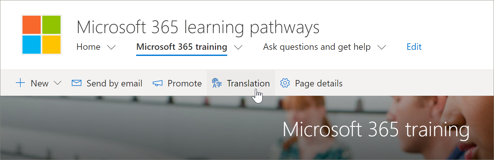

# Traduire des pages de siteTranslate site pages
Que vous avez mis à jour une version existante des voies d’apprentissage vers la version 4,0 ou que vous avez configuré un nouveau site, le processus de traduction des pages du site est le même.Whether you've updated an existing version of learning pathways to version 4.0 or you've provisioned a new site, the process for translating site pages is the same. Toutefois, certains éléments doivent être pris en compte.However, there are a few things to be aware of. 
- Lorsqu’une nouvelle version 4,0 multilingue est mise en service, les pages du site sont traduites en 9 langues.When a new learning pathways multilingual 4.0 version is provisioned, the site pages are translated for you into 9 languages. 
- Lorsque la solution de voies d’apprentissage est mise à jour vers la version multilingue 4,0, les pages de site SharePoint des chemins d’apprentissage demeurent inchangées.When the learning pathways solution is updated to the multilingual 4.0 version, the learning pathways SharePoint site pages remain unchanged. Les traductions doivent être réalisées manuellement.Translations must be done manually. 

Le site des voies d’apprentissage, par défaut, fournit les pages suivantes :The learning pathways site, by default, provides the following pages:

- Home. aspxHome.aspx
- Start-with-Six-Simple-Steps. aspxStart-with-Six-Simple-Steps.aspx
- Get-started-with-Microsoft-365. aspxGet-started-with-Microsoft-365.aspx
- Get-started-with-Microsoft-Teams. aspxGet-started-with-Microsoft-Teams.aspx
- Get-started-with-SharePoint. aspxGet-started-with-SharePoint.aspx
- Get-started-with-OneDriive. aspxGet-started-with-OneDriive.aspx
- Ask-Questions-and-Get-Help. aspxAsk-questions-and-get-help.aspx
- Événements de formation Calendar. aspxTraining events calendar.aspx
- Become-a-Champion. aspxBecome-a-Champion.aspx
- Recommended-Playlists. aspxRecommended-Playlists.aspx
- Centre de réussite d’administration des voies d’apprentissageLearning pathways Admin Success Center

## Créer des pages pour les langues souhaitéesCreate pages for the languages you want
Une fois que vous avez activé votre site pour les fonctionnalités multilingues et que vous avez choisi les langues que vous souhaitez mettre à disposition, vous pouvez créer les pages de traduction de votre choix.Once you've enabled your site for multilingual features and you've chosen the languages you want to make available, you can create the translation pages you want. Pour vous aider à illustrer certains concepts importants, nous allons utiliser la page de formation Microsoft 365 en guise d’exemple.To help demonstrate some important concepts, we'll use the Microsoft 365 training page as an example. Pour ce faire :To do this:

1.  Sur la page d' **Accueil** des chemins d’apprentissage, cliquez sur **formation Microsoft 365**.From the learning pathways **Home** page, click **Microsoft 365 training**.  
2.  Dans la barre supérieure, sélectionnez **traduction**.On the top bar, select **Translation**.

3. Si vous souhaitez créer une page pour la traduction dans toutes les langues disponibles pour votre site, sélectionnez **créer pour toutes les langues**.If you want to create a page for translation in each of all languages available for your site, select **Create for all languages**. Dans le cas contraire, sélectionnez **créer** uniquement pour les langues de votre choix.Otherwise, select **Create** only for the languages you want. Dans cet exemple, nous allons sélectionner italien.In this example, we'll select Italian.
4.  Cliquez sur **Affichage**.Click **View**. La page est maintenant prête pour la traduction.The page is now ready for translation. 

### Un concept important à comprendreAn important concept to know
Notez que dans l’exemple suivant, la page a été traduite en italien.Notice that in the following example, the page has been translated to Italian. Toutefois, le titre du site, la navigation et le composant WebPart, apparaissent toujours en anglais.But the Site title, navigation, and web part, still appear in English. 

 Une fois le site configuré en anglais, un utilisateur avec espagnol, par exemple, comme langue personnelle préférée, modifie et traduit le titre, la navigation et le contenu du pied de page en espagnol.After the site is set up in English, a user with Spanish, for example, as their preferred personal language, manually edits and translates the title, navigation, and footer content into Spanish. Un utilisateur dont la langue personnelle préférée est l’allemand effectue la même opération pour l’allemand.A user with German as their preferred personal language does the same for German. Une fois le contenu traduit, il s’affichera pour tous les utilisateurs de ces langues préférées.Once the content is translated, it will display for all users of those preferred languages. Le composant WebPart sélectionne la langue préférée de l’utilisateur et affiche le contenu traduit dans cette langue.The Web part picks up the user's preferred language and shows the content translated in that language. 

> [!IMPORTANT]
> Important : une fois que vous avez créé les pages de traduction, vous devez publier (ou republier) la page par défaut de langue anglaise pour vous assurer que :Important: After you create the translation pages, you must publish (or republish) the default English-language page to ensure that:
- Les pages de traduction s’affichent dans le site de langue correspondant.Translation pages are shown in the corresponding language site
- Les pages de traduction s’affichent correctement dans le composant WebPart d’actualité et les composants WebPart de contenu mis en surbrillanceTranslation pages display correctly in the News web part and the Highlighted content web parts
- La liste déroulante de langue en haut du site inclut toutes les langues que vous avez activées.The language dropdown at the top of the site includes all of the languages you've enabled
- Les traducteurs sont avertis de la demande de traduction.Translators are notified of the translation request.

## Qu’est-ce qu’un traducteur fait ?What does a translator do?
Les traducteurs traduisent manuellement les copies de la page de langue par défaut dans la ou les langues spécifiées.Translators manually translate the copies of the default language page into the language(s) specified. Lorsque les copies de la (des) page (s) sont créées, les traducteurs sont avertis par courrier électronique.When the copies of the page(s) are created, translators are notified in email. Le courrier électronique inclut un lien vers la page langue par défaut et la page traduction nouvellement créée.The email includes a link to the default language page and the newly created translation page. Le traducteur effectuera les opérations suivantes :The translator will:
1. Sélectionnez le bouton **lancer la traduction** dans le message électronique.Select the **Start translating** button in the email.
2. Sélectionnez **modifier** dans la partie supérieure droite de la page, puis traduisez le contenu.Select **Edit** on the top right of the page, and translate the content.
3. Lorsque vous avez terminé, sélectionnez **enregistrer en tant que brouillon** (si vous n’êtes pas prêt à le faire apparaître pour les lecteurs) ou, si la page est prête à être visible par tous les utilisateurs de cette langue sur le site, sélectionnez **publier** ou publier des **News**.When done, select **Save as draft** (if you're not ready to make it visible to readers)or, if the page is ready to be visible to everyone who is using that language on the site, select **Publish** or **Post news**.

Pour plus d’informations sur le processus de traduction, consultez la rubrique [créer des sites de communication multilingues, des pages et des actualités](https://support.office.com/en-us/article/2bb7d610-5453-41c6-a0e8-6f40b3ed750c).For more information about the translation process, see [Create multilingual communication sites, pages, and news](https://support.office.com/en-us/article/2bb7d610-5453-41c6-a0e8-6f40b3ed750c). 

## Mise à jour de la page de langue par défautUpdating the default language page
Lorsque la page langue par défaut est mise à jour, la page doit être republiée.When the default language page is updated, the page must be republished. Ensuite, le ou les traducteurs pour les pages de traduction sont avertis par e-mail qu’une mise à jour a été effectuée afin que les mises à jour soient effectuées sur les pages de traduction individuelles.Then, the translator(s) for the translation pages are notified in email that an update has been made so updates can be made to the individual translation pages.

## Étapes suivantesNext Steps
- [Traduire des playlists personnaliséesTranslate custom playlists](custom_translate_pl_ml.md)
- [Masquer et afficher le contenu multiligualHide and show multiligual content](custom_translate_pl_ml.md)
