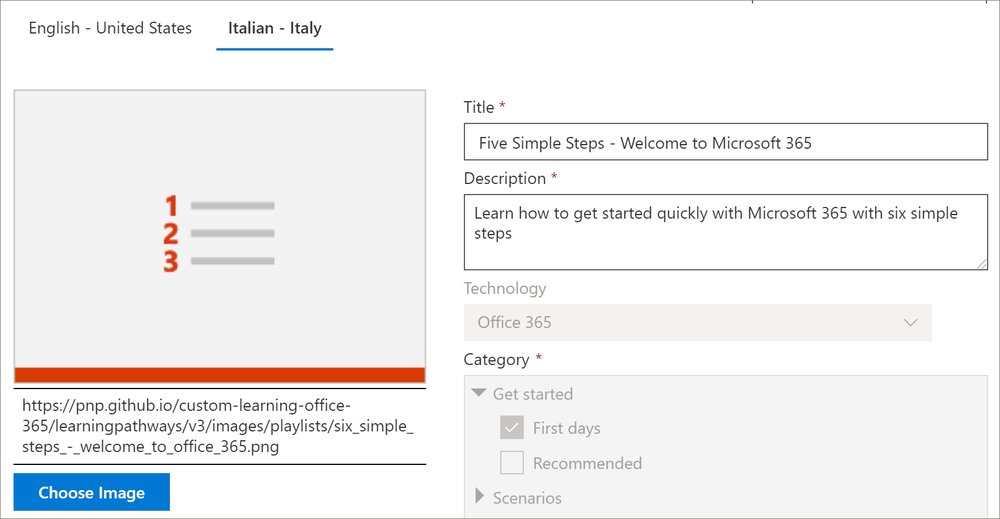
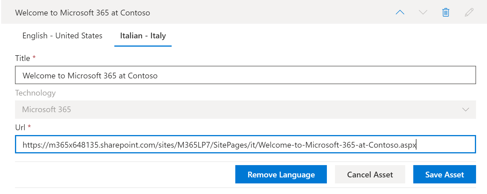

# Traduire les sélections personnalisées des voies d’apprentissage
Les voies de formation vous permettent d’utiliser des listes de lecture personnalisées en fonction de la configuration des voies de formation.  

- Si vous avez configuré un nouveau site de voies d’apprentissage multilingues, vous pouvez copier ou créer une nouvelle liste de lecture et la convertir en langues prises en charge par le site.
- Si vous avez mis à niveau un site de voies d’apprentissage existant qui comporte des sélections personnalisées préexistantes, vous pouvez traduire les playlists existantes dans les langues prises en charge par votre site. Vous pouvez également copier et créer de nouvelles sélections. 

> [!IMPORTANT]
> - Les playlists fournies par Microsoft sont déjà traduites et ne peuvent pas être modifiées sauf si vous créez une copie de la playlist. 

## Créer ou copier une sélection et la traduire
Si vous avez configuré un nouveau site de voies d’apprentissage multilingues ou que vous avez mis à niveau le site avec le composant WebPart multilingue, vous pouvez copier ou créer une playlist personnalisée et la convertir en langues prises en charge par votre site. 

### Copier une playlist et la faire traduire
Pour montrer comment créer une nouvelle playlist personnalisée et la faire traduire, nous allons utiliser la fonctionnalité de sélection de copie des chemins d’apprentissage.

1.  Dans le menu **Accueil** des chemins d’apprentissage, cliquez sur **administration des chemins**d’apprentissage. 
2.  Sous **chemins d’apprentissage Microsoft 365**, sélectionnez **premiers jours**, puis **six étapes simples-Bienvenue dans Microsoft 365**. 
3. Cliquez sur **copier la sélection**, faites défiler la page vers le bas et cliquez sur modifier le **détail**.   
4. Modifiez le titre de la playlist. Dans cet exemple, nous allons remplacer le titre de la playlist par **cinq étapes simples**. Les langues disponibles dépendent des langues prises en charge par le site. Pour ajouter des langues supplémentaires, vous devez ajouter des langues prises en charge supplémentaires au site.   
5. Cliquez sur **enregistrer les détails**. 
6. Cliquez sur une langue à droite de la langue par défaut (dans ce cas, anglais) pour afficher les détails de la playlist copiée. Les détails de la nouvelle langue reflètent la playlist copiée d’origine et nécessitent une traduction.
7. Prenez note pour informer le traducteur des détails de la playlist à être traduit.  

> [!IMPORTANT]
> Les notifications du traducteur ne sont pas intégrées dans les playlists personnalisées. Les traducteurs devront être avertis manuellement. Les traducteurs traduisent manuellement les copies des détails de langue par défaut dans la ou les langues spécifiées. Vous devrez informer le traducteur des traductions requises pour les détails de la playlist. Il est recommandé de terminer toutes les modifications de sélection, y compris l’ajout, la modification ou la suppression des éléments de sélection, puis d’informer le traducteur des traductions requises pour les détails et les biens de la playlist.

## Créer des ressources multilingues dans une playlist personnalisée
Les composants d’une liste de lecture fournis par Microsoft ne sont pas modifiables et ne nécessitent pas de traduction. Les ressources fournies par Microsoft seront disponibles dans les langues prises en charge par le site. Pour les ressources personnalisées que vous créez ou les ressources personnalisées existantes, vous pouvez ajouter les langues prises en charge par le site.  Examinons la procédure d’ajout de langues pour les ressources personnalisées nouvelles et existantes dans une sélection. 

### Créer une ressource multilingue pour une playlist
Ces instructions supposent que vous utilisez la sélection de cinq étapes simples dans l’exemple de cette rubrique. 

**Pour créer l’élément**
1. Pour la sélection de cinq étapes simples, sous **ressources**, sélectionnez **+ nouvelle ressource** , puis renseignez les détails du bien. 
- Pour **titre**, entrez « Bienvenue dans Microsoft 365 chez contoso ». 
- Pour la **technologie**, sélectionnez **Microsoft 365**.

2. Sélectionnez **créer une ressource**, puis **enregistrer l’élément**.

**Pour ouvrir l’élément**
1. Sélectionnez l’élément que vous avez créé, puis cliquez sur **ouvrir**.  
2. Effectuez les modifications souhaitées sur la page. Pour le moment, vous pouvez modifier le titre de la page et ajouter du texte à la page comme illustré dans l’exemple suivant, puis cliquez sur **publier**. 
3. Cliquez sur **traduction**.
4. Sélectionnez **créer** pour la ou les langues souhaitées. Pour cet exemple, nous allons sélectionner italien.
5. Sélectionnez **affichage**. Vous devez maintenant voir une page semblable à l’exemple suivant en fonction de vos langues prises en charge.

6. Cliquez sur **Publier**.
7. Pour la page de traduction que vous avez créée, copiez l’URL à partir du navigateur et revenez à la page d’administration des voies d’apprentissage.

**Pour ajouter une langue pour la ressource de traduction que vous avez créée** 
1. Revenez à la page d’administration des chemins d’apprentissage et sélectionnez l’icône modifier (crayon) pour l’élément « cinq étapes simples » que vous avez ouvert. 
2. Cliquez sur **Ajouter une langue**, puis sélectionnez une langue. Dans cet exemple, nous avons sélectionné italien. 
3. Entrez l’URL de la page traduite que vous avez créée. Vous devriez voir une page semblable à l’exemple suivant. 

4. Cliquez sur **enregistrer l’élément**.

## Ajouter des langues pour les éléments de sélection et les biens personnalisés existants
Si vous disposez de voies d’apprentissage mises à niveau pour la prise en charge multilingue et que vous disposez de sélections et de ressources personnalisées existantes, vous pouvez ajouter des langues prises en charge pour les sélections et les biens. Ces instructions supposent que vous disposez d’une sélection personnalisée à laquelle vous pouvez ajouter des langues. Si vous n’avez pas de playlist personnalisée, consultez la section « créer ou copier une sélection » plus haut dans cette rubrique. 

> [!IMPORTANT]
> - Les playlists fournies par Microsoft sont déjà traduites et ne peuvent pas être modifiées sauf si vous créez une copie de la playlist. Vous pouvez uniquement ajouter des langues pour les playlists personnalisées. 
> - Pour ajouter des langues pour des sélections et des biens personnalisés, la prise en charge multilingue et les langues doivent être activées. Pour plus d’informations, reportez-vous à la rubrique [définir les paramètres de langue](https://docs.microsoft.com/office365/customlearning/custom_update_ml#set-language-settings). 

### Pour ajouter des langues pour une playlist existante
1.  Dans le menu **Accueil** des chemins d’apprentissage, cliquez sur **administration des chemins**d’apprentissage. 
2.  Sélectionnez une playlist personnalisée. Une sélection personnalisée est identifiée par l’icône personnes avec la coche, comme illustré dans l’exemple suivant.
 
3. Sélectionnez **modifier le détail**. Vous devrez peut-être faire défiler la liste pour trouver le bouton **modifier les détails** .   
4. Sélectionnez **Ajouter une langue** , puis sélectionnez une langue.  
5. Sélectionnez **enregistrer les détails**.
 Les langues disponibles dépendent des langues prises en charge par le site. Pour ajouter des langues supplémentaires, vous devez ajouter des langues prises en charge supplémentaires au site.   
5. Cliquez sur une langue à droite de la langue par défaut (dans ce cas, anglais) pour afficher les détails de la playlist copiée. Les détails de la nouvelle langue reflètent la playlist copiée d’origine et nécessitent une traduction.
 
7. Prenez note pour informer le traducteur des détails de la playlist à être traduit.  

**Pour ouvrir l’élément**
1. Sélectionnez l’élément que vous avez créé, puis cliquez sur **ouvrir**.  
2. Effectuez les modifications souhaitées sur la page. Pour le moment, vous pouvez modifier le titre de la page et ajouter du texte à la page comme illustré dans l’exemple suivant, puis cliquez sur **publier**. 
3. Cliquez sur **traduction**.
4. Sélectionnez **créer** pour la ou les langues souhaitées. Pour cet exemple, nous allons sélectionner italien.
5. Sélectionnez **affichage**. Vous devez maintenant voir une page semblable à l’exemple suivant en fonction de vos langues prises en charge.

6. Cliquez sur **Publier**.
7. Pour la page de traduction que vous avez créée, copiez l’URL à partir du navigateur et revenez à la page d’administration des voies d’apprentissage.

## Informer le traducteur
Lorsque vous avez terminé de créer des ressources de traduction, informez le traducteur des traductions requises. Le traducteur effectuera les opérations suivantes :
- Traduire les détails de la playlist.
- Convertit les détails des biens.
- Traduire des pages de langue ajoutées pour un élément.
- Informer le demandeur des traductions que les traductions sont prêtes à passer en revue

## Ajouter des langues pour une playlist personnalisée existante
Si vous disposez de voies d’apprentissage mises à niveau pour la prise en charge multilingue et que vous disposez de sélections et de ressources personnalisées existantes, vous pouvez ajouter des langues prises en charge pour les sélections et les biens. 

> [!IMPORTANT]
> - Les playlists fournies par Microsoft sont déjà traduites et ne peuvent pas être modifiées sauf si vous créez une copie de la playlist. Vous pouvez uniquement ajouter des langues pour les playlists personnalisées. 
> - Pour ajouter des langues pour des sélections et des biens personnalisés, la prise en charge multilingue et les langues doivent être activées. Pour plus d’informations sur l’activation de la prise en charge multilingue et des options, consultez la rubrique [Set Language settings](https://docs.microsoft.com/office365/customlearning/custom_update_ml#set-language-settings). 

## Instructions pour le traducteur
Lorsque vous ajoutez des langues à des sélections, vous devez en informer le traducteur. Vous pouvez faire pointer le traducteur vers les éléments suivants 

### Traduire les détails de la playlist
Dans le menu **Accueil** des chemins d’apprentissage, cliquez sur **administration des chemins**d’apprentissage. 
1. Cliquez sur la sélection personnalisée qui nécessite une traduction, puis cliquez sur les langues. 
2. Cliquez sur **modifier le détail**, effectuez les traductions de la sélection, puis cliquez sur 
3. Cliquez sur **enregistrer les détails**. 
4. Signalez au demandeur de traduction que la traduction est terminée. 

### Traduire les détails des biens
Dans le menu **Accueil** des chemins d’apprentissage, cliquez sur **administration des chemins**d’apprentissage. 
1. Cliquez sur la sélection personnalisée qui nécessite une traduction. 
2. Faites défiler la page vers le bas, puis sous composants, sélectionnez Modifier pour l’immobilisation à modifier, puis sélectionnez la langue. 
3. Effectuez les traductions de l’élément, puis cliquez sur **enregistrer l’actif**.  

### Traduire la page de langue ajoutée pour l’élément
Dans le menu **Accueil** des chemins d’apprentissage, cliquez sur **administration des chemins**d’apprentissage. 
1. Cliquez sur la sélection personnalisée qui nécessite une traduction. 
2. Faites défiler la page vers le bas, puis sous composants, sélectionnez l’immobilisation, sélectionnez la langue, puis cliquez sur Ouvrir. 
3. Effectuez les traductions de la page, puis cliquez sur **publier**.   

## Pour plus d'informations
- Pour plus d’informations sur la personnalisation des voies de formation, voir [Customize Learning voies](custom_overview.md). 

