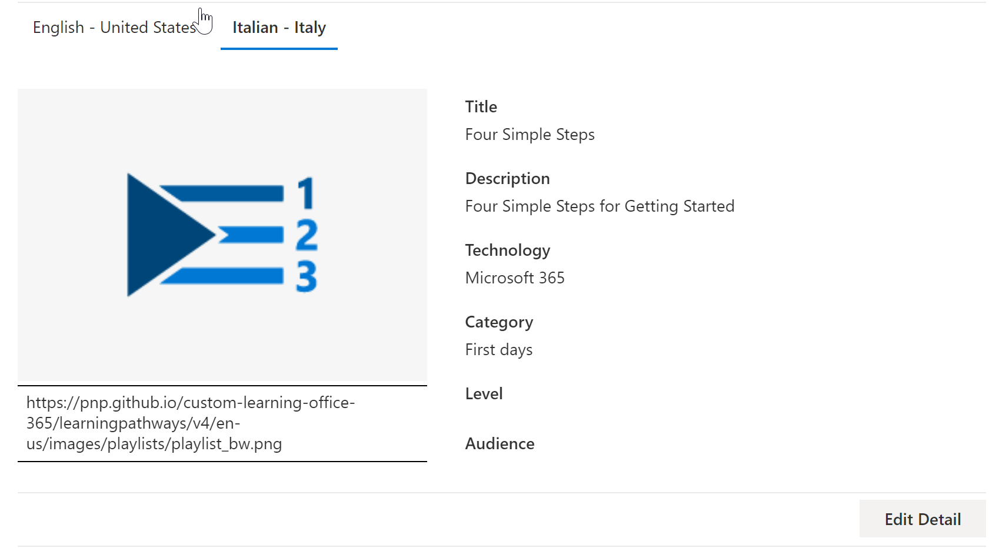

# Traduire les sélections personnalisées des parcours d’apprentissageTranslate learning pathways custom playlists
Avec le parcours d’apprentissage, la façon dont vous travaillez avec des sélections personnalisées dépend de la façon dont vous définissez les parcours d’apprentissage.With Learning Pathways, the way you work with custom playlists depends on how you set up learning pathways.  

- Si vous avez mis en service un nouveau site multilingue de parcours d’apprentissage, vous pouvez copier ou créer une nouvelle playlist et la traduire dans les langues que le site prend en charge.If you provisioned a new learning pathways multilingual site, you can copy or create a new playlist and translate the playlist into the languages that the site supports.
- Si vous avez mis à niveau un site de parcours d’apprentissage existant qui contient des sélections personnalisées pré-existantes, vous pouvez traduire les sélections existantes dans les langues que votre site prend en charge.If you upgraded an existing learning pathways site that has pre-existing custom playlists, you can translate the existing playlists into the languages that your site supports. Vous pouvez également copier et créer de nouvelles playlists.You can also copy and create new playlists. 

> [!IMPORTANT]
> - Les playlists fournies par Microsoft sont déjà traduites et ne peuvent pas être modifiées, sauf si vous créez une copie de la playlist.Microsoft-supplied playlists are already translated and can't be modified unless you create a copy of the playlist. 

## Créer ou copier une playlist et la traduireCreate or copy a playlist and have it translated
Si vous avez mis en service un nouveau site multilingue de parcours d’apprentissage ou mis à niveau le site avec le site web multilingue, vous pouvez copier ou créer une playlist personnalisée et traduire les ressources de playlist et de playlist dans les langues pris en charge par votre site.If you've provisioned a new learning pathways multilingual site or upgraded the site with the multilingual web part, you can copy or a create custom playlist and translate the playlist and playlist assets into the languages supported by your site. 

### Copier une playlist et la traduireCopy a playlist and have it translated
Pour montrer comment créer une playlist personnalisée et la traduire, nous allons utiliser la fonctionnalité Copier la playlist du parcours d’apprentissage.To demonstrate how to create a new custom playlist and have it translated, we'll use the Copy playlist feature of learning pathways.

1.  Dans le **menu** Accueil du parcours d’apprentissage, cliquez sur Administration du parcours **d’apprentissage.**From the learning pathways **Home** menu, click **Learning pathways administration**. 
2.  Sous **microsoft 365 parcours** d’apprentissage, sélectionnez Premiers jours, puis sélectionnez Six étapes simples - Bienvenue dans Microsoft **365**. Under **Microsoft 365 learning pathways**, select **First Days**, then select **Six Simple Steps - Welcome to Microsoft 365**. 
3. Cliquez **sur Copier la sélection,** faites défiler la page vers le bas et cliquez sur Modifier les **détails.**Click **Copy Playlist**, scroll down the page and click **Edit Detail**.   
4. Modifiez le titre de la playlist.Change the title of the playlist. Dans cet exemple, nous allons modifier le titre de la playlist en **cinq étapes simples.**In this example, we'll change the playlist title to to **Five Simple Steps**. Les langues disponibles dépendent des langues prise en charge sélectionnées pour le site.The languages available will depend on the supported languages selected for the site. Pour ajouter des langues supplémentaires, vous devez ajouter d’autres langues prise en charge au site.To add additional languages, you need to add additional supported languages to the site.   
5. Cliquez **sur Enregistrer les détails.**Click **Save Detail**. 
6. Cliquez sur une langue à droite de la langue par défaut (dans ce cas, l’anglais) pour afficher les détails de la sélection copiée.Click a language to the right of the default language (in this case English) to view the copied playlist details. Les détails de la nouvelle langue reflètent la playlist copiée d’origine et nécessitent une traduction.The details for the new language reflect the original copied playlist and require translation.
7. Prenez note pour informer le traducteur des détails de la playlist à traduire.Make a note to notify the translator of the playlist details to be translated.  

> [!IMPORTANT]
> Les notifications du traducteur ne sont pas intégrées dans des playlists personnalisées.Translator notifications are not built into custom playlists. Les traducteurs doivent être avertis manuellement.Translators will need to be notified manually. Les traducteurs traduisent manuellement les copies des détails de langue par défaut dans la ou les langues spécifiées.Translators manually translate the copies of the default language details into the language(s) specified. Vous devez informer le traducteur des traductions requises pour les détails de la sélection.You'll need to notify the translator of the translations required for playlist details. Il est recommandé de terminer toutes les modifications de playlist, y compris l’ajout, la modification ou la suppression de ressources de sélection, puis d’informer le traducteur des traductions requises pour les détails et les ressources de la sélection.It's recommended that you finish all playlist changes,including adding, editing, or deleting playlist assets, then notify the translator of the required translations for playlist details and assets.

## Créer des ressources multilingues dans une playlist personnaliséeCreate multilingual assets in a custom playlist
Les ressources d’une playlist fournies par Microsoft ne sont pas modifiables et ne nécessitent pas de traduction.Any assets in a playlist that are supplied by Microsoft are not editable and do not require translation. Les ressources fournies par Microsoft seront disponibles dans les langues pris en charge par le site.Microsoft-supplied assets will be available in the languages supported by the site. Pour les ressources personnalisées que vous créez ou les ressources personnalisées existantes, vous pouvez ajouter les langues pris en charge par le site.For custom assets that you create, or existing custom assets, you can add the languages supported by the site.  Examinons comment ajouter des langues pour les ressources personnalisées nouvelles et existantes dans une playlist.Let's take a look at how to add languages for new and existing custom assets in a playlist. 

### Créer une nouvelle fonctionnalité multilingue pour une playlistCreate a new multilingual asset for a playlist
Ces instructions supposent que vous utilisez la playlist Cinq étapes simples dans l’exemple de cette rubrique.These instructions assume you're using the Five Simple Steps playlist in the example in this topic. 

**Pour créer le bien****To create the asset**
1. Pour la playlist Cinq **étapes** simples, sous Ressources, sélectionnez **+ Nouveau** bien, puis remplissez les détails du bien.For the Five Simple Steps playlist, under **Assets**, select **+ New Asset** and then fill out the details for the asset. 
- Pour **titre,** entrez « Bienvenue dans Microsoft 365 chez Contoso ».For **Title**, enter "Welcome to Microsoft 365 at Contoso". 
- Pour **la** technologie, **sélectionnez Microsoft 365**.For **Technology**, select **Microsoft 365**.

2. Sélectionnez **Créer un bien,** puis **sélectionnez Enregistrer le bien.**Select **Create Asset**, and then select **Save Asset**.

**Pour ouvrir le bien****To open the asset**
1. Sélectionnez le bien que vous avez créé, puis cliquez sur **Ouvrir.**Select the asset you created, and then click **Open**.  
2. A apporté les modifications à la page comme vous le souhaitez.Make the changes to the page as desired. Pour l’instant, vous pouvez modifier le titre de la page et ajouter du texte à la page, comme illustré dans l’exemple suivant, puis cliquer sur **Publier**.For now, you can change the title of the page and add some text to the page as shown in the following example, and then click **Publish**. 
3. Cliquez **sur Traduction.**Click **Translation**.
4. Sélectionnez **Créer** pour la ou les langues de votre choix.Select **Create** for the language(s) you want. Pour cet exemple, nous allons sélectionner l’italien.For this example, we'll select Italian.
5. Sélectionnez **Afficher**.Select **View**. Vous devez maintenant voir une page semblable à l’exemple suivant en fonction de vos langues pris en charge.You should now see a page similar to the following example depending on your supported languages.

6. Cliquez sur **Publier**.Click **Publish**.
7. Pour la page de traduction que vous avez créée, copiez l’URL à partir du navigateur et revenir à la page d’administration du parcours d’apprentissage.For the translation page you created, copy the URL from the browser and return to the learning pathways Administration page.

**Pour ajouter une langue pour le bien de traduction que vous avez créé****To add a language for the translation asset you created** 
1. Revenir à la page Administration du parcours d’apprentissage et sélectionnez l’icône Modifier (crayon) pour le bien « Cinq étapes simples » que vous avez ouvert.Return to the learning pathways Administration page and select the Edit icon (pencil) for the "Five Simple Steps" asset you opened. 
2. Cliquez **sur Ajouter** une langue, puis sélectionnez une langue.Click **Add language**, and then select a language. Dans cet exemple, nous avons sélectionné l’italien.In this example, we've selected Italian. 
3. Entrez l’URL de la page traduite que vous avez créée.Enter the URL of the translated page you created. Vous devriez voir une page semblable à l’exemple suivant.You should see a page similar to the following example. 

4. Cliquez **sur Enregistrer le bien.**Click **Save Asset**.

## Ajouter des langues pour les sélections et les ressources personnalisées existantesAdd languages for existing custom playlists and assets
Si vous avez mis à niveau les parcours d’apprentissage pour la prise en charge multilingue et que vous avez des playlists et des ressources personnalisées existantes, vous pouvez ajouter des langues prise en charge pour les playlists et les ressources.If you have upgraded learning pathways for multilingual support and have existing custom playlists and assets, you can add supported languages for the playlists and assets. Ces instructions supposent que vous avez une playlist personnalisée à laquelle vous pouvez ajouter des langues.These instructions assume you have a custom playlist to which you can add languages. Si vous n’avez pas de playlist personnalisée, voir « Créer ou copier une playlist » plus tôt dans cette rubrique.If you don't have a custom playlist, see "Create or Copy a Playlist" earlier in this topic. 

> [!IMPORTANT]
> - Les playlists fournies par Microsoft sont déjà traduites et ne peuvent pas être modifiées, sauf si vous créez une copie de la playlist.Microsoft-supplied playlists are already translated and can't be modified unless you create a copy of the playlist. Vous ne pouvez ajouter des langues que pour les playlists personnalisées.You can only add languages for custom playlists. 
> - Pour ajouter des langues pour des playlists et des ressources personnalisées, la prise en charge et les langues multilingues doivent être activées.To add languages for custom playlists and assets, multilingual support and languages must be enabled. Pour plus d’informations, voir [Définir les paramètres de langue.](./custom_update_ml.md#set-language-settings)For more information, see [Set Language Settings](./custom_update_ml.md#set-language-settings). 

### Pour ajouter des langues pour une playlist existanteTo add languages for an existing playlist
1.  Dans le **menu** Accueil du parcours d’apprentissage, cliquez sur Administration du parcours **d’apprentissage.**From the learning pathways **Home** menu, click **Learning pathways administration**. 
2.  Sélectionnez une playlist personnalisée.Select a custom playlist. Une playlist personnalisée est identifiée par l’icône personnes avec la coche, comme illustré dans l’exemple suivant.A custom playlist is identified by the people icon with the checkmark, as shown in the following example.
 
3. Sélectionnez **Modifier les détails.**Select **Edit Detail**. Vous devrez peut-être faire défiler vers le bas pour trouver **le bouton Modifier les détails.**You may need to scroll down to find the **Edit Detail** button.   
4. Sélectionnez **Ajouter une** langue, puis sélectionnez une langue.Select **Add language** and then select a language.  
5. Sélectionnez **Enregistrer les détails.**Select **Save Detail**.
 Les langues disponibles dépendent des langues prise en charge sélectionnées pour le site.The languages available will depend on the supported languages selected for the site. Pour ajouter des langues supplémentaires, vous devez ajouter d’autres langues prise en charge au site.To add additional languages, you need to add additional supported languages to the site.   
5. Cliquez sur une langue à droite de la langue par défaut (dans ce cas, l’anglais) pour afficher les détails de la sélection copiée.Click a language to the right of the default language (in this case English) to view the copied playlist details. Les détails de la nouvelle langue reflètent la playlist copiée d’origine et nécessitent une traduction.The details for the new language reflect the original copied playlist and require translation.
 
7. Prenez note pour informer le traducteur des détails de la playlist à traduire.Make a note to notify the translator of the playlist details to be translated.  

**Pour ouvrir le bien****To open the asset**
1. Sélectionnez le bien que vous avez créé, puis cliquez sur **Ouvrir.**Select the asset you created, and then click **Open**.  
2. A apporté les modifications à la page comme vous le souhaitez.Make the changes to the page as desired. Pour l’instant, vous pouvez modifier le titre de la page et ajouter du texte à la page, comme illustré dans l’exemple suivant, puis cliquer sur **Publier**.For now, you can change the title of the page and add some text to the page as shown in the following example, and then click **Publish**. 
3. Cliquez **sur Traduction.**Click **Translation**.
4. Sélectionnez **Créer** pour la ou les langues de votre choix.Select **Create** for the language(s) you want. Pour cet exemple, nous allons sélectionner l’italien.For this example, we'll select Italian.
5. Sélectionnez **Afficher**.Select **View**. Vous devez maintenant voir une page semblable à l’exemple suivant en fonction de vos langues pris en charge.You should now see a page similar to the following example depending on your supported languages.

6. Cliquez sur **Publier**.Click **Publish**.
7. Pour la page de traduction que vous avez créée, copiez l’URL à partir du navigateur et revenir à la page d’administration du parcours d’apprentissage.For the translation page you created, copy the URL from the browser and return to the learning pathways Administration page.

## Avertir le traducteurNotify the translator
Lorsque vous avez terminé de créer des ressources de traduction, informez le traducteur des traductions requises.When you've finished creating translation assets, notify the translator of the required translations. Le traducteur :The translator will:
- Traduire les détails de la playlist.Translate playlist details.
- Traduire les détails des biens.Translate asset details.
- Traduire les pages de langue ajoutées pour un bien.Translate added language pages for an asset.
- Informer le demandeur des traductions que les traductions sont prêtes pour révisionNotify the requestor of the translations that the translations are ready for review

## Ajouter des langues pour une playlist personnalisée existanteAdd languages for an existing custom playlist
Si vous avez mis à niveau les parcours d’apprentissage pour la prise en charge multilingue et que vous avez des playlists et des ressources personnalisées existantes, vous pouvez ajouter des langues prise en charge pour les playlists et les ressources.If you have upgraded learning pathways for multilingual support and have existing custom playlists and assets, you can add supported languages for the playlists and assets. 

> [!IMPORTANT]
> - Les playlists fournies par Microsoft sont déjà traduites et ne peuvent pas être modifiées, sauf si vous créez une copie de la playlist.Microsoft-supplied playlists are already translated and can't be modified unless you create a copy of the playlist. Vous ne pouvez ajouter des langues que pour les playlists personnalisées.You can only add languages for custom playlists. 
> - Pour ajouter des langues pour des playlists et des ressources personnalisées, la prise en charge et les langues multilingues doivent être activées.To add languages for custom playlists and assets, multilingual support and languages must be enabled. Pour plus d’informations sur l’activation de la prise en charge et des options multilingues, voir [Définir les paramètres de langue.](./custom_update_ml.md#set-language-settings)For more details on enabling multilingual support and options, see [Set Language Settings](./custom_update_ml.md#set-language-settings). 

## Instructions pour le traducteurInstructions for the translator
Lorsque vous ajoutez des langues aux playlists, vous devez informer le traducteur des modifications.When you add languages to playlists, you need to notify the translator of the changes. Vous pouvez pointer le traducteur vers les points suivants :You can point the translator to the following 

### Traduire les détails de la playlistTranslate playlist details
Dans le **menu** Accueil du parcours d’apprentissage, cliquez sur Administration du parcours **d’apprentissage.**From the Learning Pathways **Home** menu, click **Learning pathways administration**. 
1. Cliquez sur la playlist personnalisée qui nécessite une traduction, puis cliquez sur les langues.Click the custom playlist that requires translation, then click the languages. 
2. Cliquez **sur Modifier les détails,** effectuer les traductions de la playlist, puis cliquez surClick **Edit Detail**, make the translations for the playlist, then click 
3. Cliquez **sur Enregistrer les détails.**Click **Save Detail**. 
4. Informez le demandeur de traduction que la traduction est terminée.Notify the translation requestor that the translation is complete. 

### Traduire les détails des biensTranslate asset details
Dans le **menu** Accueil du parcours d’apprentissage, cliquez sur Administration du parcours **d’apprentissage.**From the Learning Pathways **Home** menu, click **Learning pathways administration**. 
1. Cliquez sur la playlist personnalisée qui nécessite une traduction.Click the custom playlist that requires translation. 
2. Faites défiler la page vers le bas, puis sous Ressources, sélectionnez Modifier la valeur de l’actif à modifier, puis sélectionnez la langue.Scroll down the page, then under Assets, select edit for the asset you want to edit, then select the language. 
3. Faites les traductions de la bien, puis cliquez sur **Enregistrer le bien.**Make the translations for the asset, and then click **Save Asset**.  

### Traduire la page de langue ajoutée pour le bienTranslate the added language page for the asset
Dans le **menu** Accueil du parcours d’apprentissage, cliquez sur Administration du parcours **d’apprentissage.**From the Learning Pathways **Home** menu, click **Learning pathways administration**. 
1. Cliquez sur la playlist personnalisée qui nécessite une traduction.Click the custom playlist that requires translation. 
2. Faites défiler la page vers le bas, puis sous Ressources, sélectionnez l’actif, sélectionnez la langue, puis cliquez sur Ouvrir.Scroll down the page, then under Assets, select the asset, select the language, and then click Open. 
3. Faites les traductions de la page, puis cliquez sur **Publier.**Make the translations for the page, and then click **Publish**.   

## Pour plus d’informationsFor more information
- Pour plus d’informations sur la personnalisation des parcours d’apprentissage, voir [Personnaliser les parcours d’apprentissage.](custom_overview.md)For more information about customizing learning pathways, see [Customize Learning Pathways](custom_overview.md).