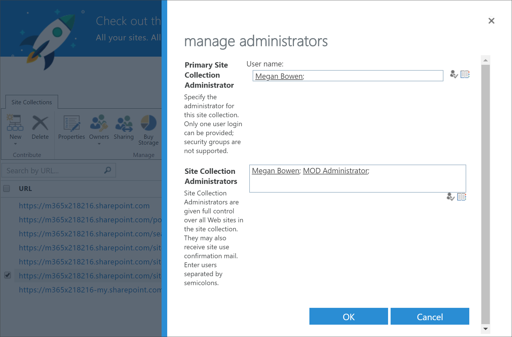

# Dépannage des chemins d’apprentissage Microsoft 365

Vous trouverez ci-dessous des conseils pour résoudre les problèmes qui peuvent se produire avec les voies d’apprentissage de Microsoft 365 ou le service de mise en service SharePoint Online.

## Savoir si vous disposez d’autorisations d’administrateur client

Connectez-vous au service de mise en service SharePoint Online et l’apprentissage personnalisé de mise en service requiert des autorisations d’administrateur client. Si vous rencontrez des problèmes de connexion au service de mise en service SharePoint Online, vérifiez que vous disposez du rôle d’administrateur général. La solution d’apprentissage personnalisée requiert des autorisations d’administrateur client, également appelées rôle d’administrateur général Office 365. Voici comment déterminer si vous avez été affecté au rôle administrateur général.

1.  Connectez-vous à Office.com.
2.  Cliquez sur **administrateur**
3.  Sous **utilisateurs**, sélectionnez **utilisateurs actifs** .
4.  Rechercher votre nom
5.  Cliquez sur votre nom dans les résultats de la recherche. Vous devriez voir administrateur général pour votre rôle.

### Si vous n’avez pas le rôle d’administrateur général
- Recherchez un administrateur global dans votre organisation et demandez-lui de se connecter au service ou de lui attribuer le rôle d’administrateur général.

## Résolution des problèmes liés au catalogue d’applications client
L’apprentissage personnalisé nécessite le provisionnement d’un catalogue d’applications dans le client cible. La création d’un catalogue d’applications requiert des autorisations d’administrateur général. Voici les étapes de résolution des problèmes courants liés au catalogue d’applications:

### Savoir si vous avez un catalogue d’applications client 
Pour commencer, vérifiez que vous disposez des autorisations d’administrateur général. Voir la procédure pour les autorisations d’administrateur client ci-dessus.

1. À partir d’Office 365, cliquez sur **administrateur**, cliquez sur la flèche de développement >, puis sur **Afficher tous les** > **centres** > d’administration**SharePoint**.
2. Cliquez sur**catalogue**d'**applications** >  **SharePoint Centre** > SharePoint.
3. Sous **applications**, vous devriez voir une vignette intitulée **distribuer des applications pour SharePoint**. Si vous voyez la vignette, vous disposez d’un catalogue d’applications client. Consultez la section **Comment s’assurer que votre site est un colllection...** ci-dessous. Si vous ne voyez pas la vignette, vous devrez créer un catalogue d’applications client pour votre client. Consultez la section **procédure de création d’un catalogue d’applications client** ci-dessous.

### Comment s’assurer que vous êtes propriétaire d’une collection de sites sur le catalogue d’applications client 
Pour mettre en service les chemins d’apprentissage Microsoft 365, vous devrez être propriétaire de la collection de sites sur le catalogue d’applications client. Voici comment déterminer si vous êtes un propriétaire.

1. À partir d’Office 365, cliquez sur **administrateur**, cliquez sur la flèche de développement >, puis sur **Afficher tous les** > **centres** > d’administration**SharePoint**.
2. Cliquez sur **Centre SharePoint classique**, puis sélectionnez le **catalogue d’applications**.
3. Sélectionnez **propriétaire**, puis assurez-vous que vous êtes propriétaire de la collection de sites. Il doit ressembler à ce qui suit.
 

### Procédure de création d’un catalogue d’applications client s’il n’en existe pas 
1. Connectez-vous à Office 365 avec votre compte d’administrateur SharePoint Online.
2. Cliquez sur **Admin**.
3. Sous **centres d’administration**, cliquez sur **SharePoint**. 
4. Cliquez sur le**catalogue**d' **applications des applications** > .
5. Cliquez sur **créer un site de catalogue d’applications**, puis cliquez sur **OK**. 
6.  Entrez les informations pour le catalogue d’applications. Vous pouvez inclure plusieurs administrateurs. Voici un exemple.  

7.  C’est fait. Vous avez fini. Toutefois, avant de passer à l’apprentissage personnalisé de mise en service, vous devez attendre au moins 30 minutes pour vous assurer que la création du catalogue d’applications est terminée. 

> [!IMPORTANT]
> Patientez au moins 30 minutes après avoir créé le catalogue d’applications client avant de mettre en service l’apprentissage personnalisé. Cela permet de s’assurer que le processus de mise en service du catalogue d’applications est terminé au sein de SharePoint. 