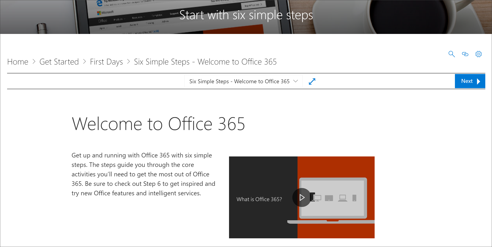
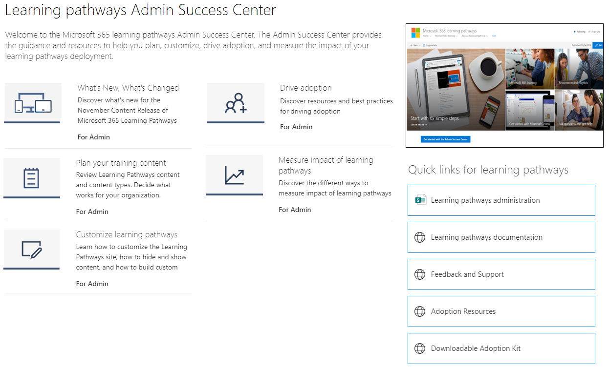

# Où se trouve le composant WebPart des chemins d’apprentissage Microsoft 365 ?Where's the Microsoft 365 learning pathways web part? 

Lorsque les voies d’apprentissage sont configurées dans votre organisation, le site des voies d’apprentissage et le composant WebPart sont ajoutés au client SharePoint de votre organisation.When learning pathways is provisioned in your organization, the learning pathways site and web part are added to your organization’s SharePoint tenant. Dans le cadre de la mise en service, le composant WebPart formation Microsoft 365 est ajouté aux pages suivantes du site des chemins d’apprentissage Microsoft 365 :As part of the provisioning, the Microsoft 365 learning web part is added to the following pages of the Microsoft 365 learning pathways site:

- Start-with-Six-Simple-Steps. aspxStart-with-Six-Simple-Steps.aspx 
- Recommended-Playlists. aspxRecommended-Playlists.aspx
- Prise en main avec-Office 365. aspxGet-started with-Office 365.aspx
- Get-started-with-Microsoft-Teams. aspxGet-started-with-Microsoft-Teams.aspx
- Get-started-with-OneDrive. aspxGet-started-with-OneDrive.aspx
- Get-started-with-SharePoint. aspxGet-started-with-SharePoint.aspx
- Chemins d’apprentissage Centre de réussite de l’administrateur. aspxLearning pathways Admin Success Center.aspx

Pour chaque page, le composant WebPart est configuré différemment pour afficher les catégories, sous-catégories, playlists ou biens conçus pour prendre en charge l’objectif de la page.For each page, the Web part is configured differently to show the categories, subcategories, playlists or asset designed to support the intent of the page. Le composant WebPart voies d’apprentissage, comme nous allons l’afficher dans les sections suivantes, peut être ajouté à quasiment n’importe quelle page SharePoint et filtré pour afficher des catégories spécifiques, des sous-catégories, des playlists ou seulement des biens.The learning pathways web part, as we’ll show you in later sections, can be added to just about any SharePoint page and filtered to show specific categories, subcategories, playlists, or just assets. Jetons un œil.Let's take a look. 

## Afficher les playlists Microsoft teamsView Microsoft Teams playlists

Voici un exemple de la page **prise en main de Microsoft teams** avec le composant WebPart filtré pour afficher les playlists d’apprentissage de teams.Here’s an example of the **Get Started with Microsoft Teams** page with the Web part filtered to show the learning playlists for Teams. 

- À partir de la page d’accueil des chemins d’apprentissage, sélectionnez **prise en main de Microsoft teams**.From the learning pathways Home page, select **Get started with Microsoft Teams**.

- Pour revenir à la page d’accueil du site, cliquez sur le menu **Accueil** du menu site des chemins d’apprentissage.Click the **Home** menu on the learning pathways site menu to return to the site Home page.

## Afficher la liste des six étapes simplesView the Six Simple Steps playlist

Le composant WebPart de la page **Start-with-six-simple-Steps. aspx** est configuré pour afficher le premier élément de la liste des six étapes simples.The web part on the **Start-with-Six-Simple-Steps.aspx** page is configured to show the first asset in the Six Simple Steps playlist. 

- À partir de la page d’accueil des chemins d’apprentissage, cliquez sur **Démarrer avec six étapes simples**.From the learning pathways Home page,  click **Start with six simple steps**. 

## Afficher toutes les formations Microsoft 365View all Microsoft 365 training

Le composant WebPart de la page **formation Microsoft 365** est configuré pour afficher toutes les catégories et sous-catégories disponibles dans le catalogue des voies d’apprentissage.The Web part on the **Microsoft 365 training** page is configured to show all the categories and subcategories available from the learning pathways catalog. Cela inclut des sous-catégories de Microsoft, ainsi que toutes les sous-catégories que vous créez pour votre organisation.This includes subcategories from Microsoft along with any subcategories that you create for your organization.

- Sur la page d’accueil des chemins d’apprentissage, cliquez sur **formation Microsoft 365**.From the learning pathways Home page, click **Microsoft 365 training**. La page s’affiche avec le composant WebPart configuré pour afficher toutes les catégories et sous-catégories disponibles à partir du catalogue de formation personnalisé.The page appears appears with the Web part configured to show all the categories and subcategories available from the Custom Learning catalog.

- Pour revenir à la page d’accueil du site, cliquez sur le menu **Accueil** du menu site des chemins d’apprentissage.Click the **Home** menu on the learning pathways site menu to return to the site Home page.

## Afficher le composant WebPart sur la page Centre de réussite de l’administrateurView the Web part on the Admin Success Center page

Le composant WebPart de la page **Centre de réussite** de l’administrateur est configuré pour filtrer toutes les sélections disponibles pour le centre de réussite de l’administrateur.The Web part on the **Admin Success Center** page is configured to filter all the playlists available for the Admin Success Center. Comme le montre l’exemple suivant, le composant WebPart est ajouté à une page qui contient également des liens rapides vers des ressources d’administration.As shown in the following example, the Web part is added to a page that also contains Quick Links to Admin resources. 

- À partir de la page d’accueil des chemins d’apprentissage, cliquez sur **prise en main du centre de réussite des administrateurs**.From the learning pathways Home page, click **Get started with the Admin Success Center**. .button. 

- Pour revenir à la page d’accueil du site, cliquez sur le menu **Accueil** du menu site des chemins d’apprentissage.Click the **Home** menu on the learning pathways site menu to return to the site Home page.

