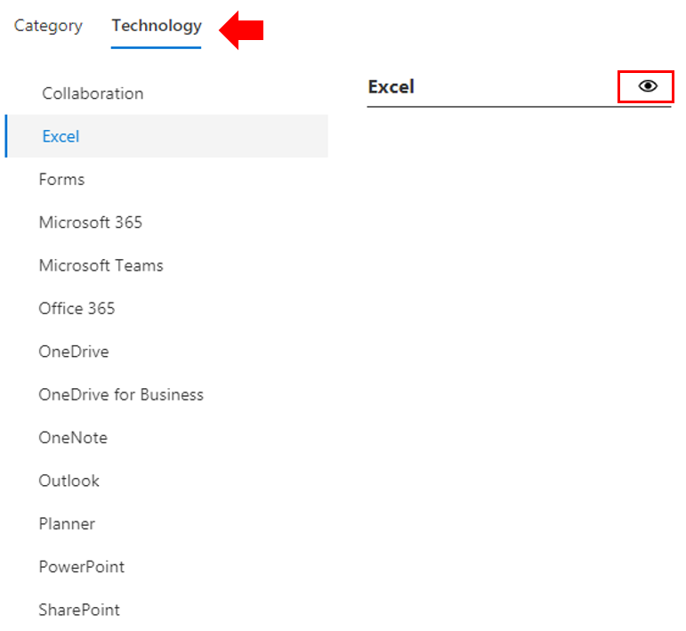

# Personnaliser l’expérience de formation

Il s’agit d’un test quatre. Par défaut, l’expérience de site et le composant WebPart incluent du contenu pour tous les services Office 365 et Windows 10.  Si seuls certains de ces services ou certains de ces services sont disponibles dans votre entreprise, vous pouvez ajuster le contenu disponible pour vos utilisateurs.  

Il existe plusieurs types de personnalisations qui sont disponibles pour les propriétaires de ce site. 

- [Personnaliser des pages Web](#customizing-web-pages)
- [Personnaliser les services disponibles](#customize-available-services)
- [Personnaliser et partager des sélections](customplaylist.md)

Vous pouvez effectuer une partie ou la totalité de ces personnalisations avant de lancer le site pour votre communauté d’utilisateurs.  

> [!TIP]
> Recueillez les commentaires de vos employés et effectuez régulièrement des personnalisations supplémentaires.  Ajouter des sélections, cibler des pages Web vers des rôles spécifiques ou activer le nouveau contenu de formation lors du lancement de nouveaux services. 

## Personnalisation des pages Web

Vous pouvez personnaliser entièrement le site Web de formation personnalisé. Si vous n’êtes pas familiarisé avec la création de pages dans des sites SharePoint Online modernes, nous vous suggérons de consulter [Customize Your SharePoint site](https://support.office.com/article/customize-your-sharepoint-site-320b43e5-b047-4fda-8381-f61e8ac7f59b) article on support.Office.com. 

### Personnaliser la page **poser des questions et obtenir de l’aide**

Comme point de départ pour la personnalisation du site, sélectionnez poser des questions et obtenir de l’aide dans la barre de menus, puis cliquez sur le bouton modifier SharePoint et modifiez les images et les liens. 

## Personnaliser les services disponibles

1.  Accédez à la page Administration de formation personnalisée dans le site Web 
1. Sélectionnez **technologie** pour afficher la liste complète des services inclus dans la solution.
1. Sélectionnez une technologie et **cliquez sur le symbole représentant un oeil** pour masquer ce contenu.  Cliquez de nouveau sur le symbole de l’oeil pour afficher le contenu dans l’expérience. 

Le même processus peut être répété pour les catégories de sélections dans l’expérience.  Il suffit de sélectionner l’option catégorie pour afficher/masquer les playlists. 

### Étapes suivantes

- [Personnaliser et partager des sélections](customplaylist.md)
- [Favoriser l’adoption](driveadoption.md) 