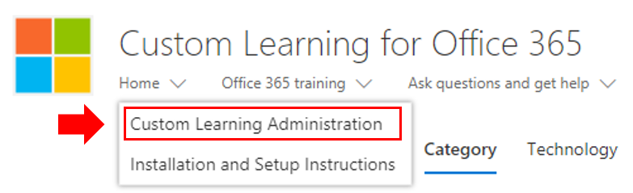

# Personnaliser l'expérience de formationCustomize the Training Experience

Il s'agit d'un test quatre. Par défaut, l'expérience de site et le composant WebPart incluent du contenu pour tous les services Office 365 et Windows 10.  Si seuls certains de ces services ou certains de ces services sont disponibles dans votre entreprise, vous pouvez ajuster le contenu disponible pour vos utilisateurs.This is a test four. By default both the site experience and the webpart include content for all Office 365 and Windows 10 services.  If only all or some of these services are available in your company you can adjust what content is available to your users.  

Il existe plusieurs types de personnalisations qui sont disponibles pour les propriétaires de ce site.There are several kinds of customizations that are available to the owners of this site. 

- [Personnaliser des pages WebCustomize web pages](#customizing-web-pages)
- [Personnaliser les services disponiblesCustomize available services](#customize-available-services)
- [Personnaliser et partager des sélectionsCustomize and share playlists](customplaylist.md)

Vous pouvez effectuer une partie ou la totalité de ces personnalisations avant de lancer le site pour votre communauté d'utilisateurs.Some or all of these customizations can be completed before you launch the site to your user community.  

> [!TIP]
> Recueillez les commentaires de vos employés et effectuez régulièrement des personnalisations supplémentaires.  Ajouter des sélections, cibler des pages Web vers des rôles spécifiques ou activer le nouveau contenu de formation lors du lancement de nouveaux services.Gather feedback from your employees and periodically complete additional customizations.  Add playlists, target webpages to specific roles or turn on new training content when launching new services. 

## Personnalisation des pages WebCustomizing web pages

Vous pouvez personnaliser entièrement le site Web de formation personnalisé. Si vous n'êtes pas familiarisé avec la création de pages dans des sites SharePoint Online modernes, nous vous suggérons de consulter [Customize Your SharePoint site](https://support.office.com/en-us/article/customize-your-sharepoint-site-320b43e5-b047-4fda-8381-f61e8ac7f59b) article on support.Office.com.You can fully customize the Custom Learning web site. If you are not familiar with creating pages within modern SharePoint Online sites we suggest you review [Customize your SharePoint site](https://support.office.com/en-us/article/customize-your-sharepoint-site-320b43e5-b047-4fda-8381-f61e8ac7f59b) article on support.office.com. 

### Personnaliser la page **poser des questions et obtenir de l'aide**Customize the **Ask Questions and Get Help** page

Comme point de départ pour la personnalisation du site, sélectionnez poser des questions et obtenir de l'aide dans la barre de menus, puis cliquez sur le bouton modifier SharePoint et modifiez les images et les liens.As a starting point for customizing the site, select Ask questions and get help from the menu bar, then click the SharePoint Edit button and change the images and the links. 

## Personnaliser les services disponiblesCustomize available services

1.  Accéder à la page Administration de formation personnalisée dans le Navigate to the Custom Learning Administration page within the website 
1. Sélectionnez **technologie** pour afficher la liste complète des services inclus dans la solution.Select **Technology** to see the full list of services that are included in the solution
1. Sélectionnez une technologie et **cliquez sur le symbole représentant un oeil** pour masquer ce contenu.  Cliquez de nouveau sur le symbole de l'oeil pour afficher le contenu dans l'expérience. Select a technology and **click the eye symbol** to hide this content.  Click the eye symbol again to show the content within the experience. 

Le même processus peut être répété pour les catégories de sélections dans l'expérience.  Il suffit de sélectionner l'option catégorie pour afficher/masquer les playlists.The same process can be repeated for categories of playlists within the experience.  Simply select the Category option to show/hide playlists. 

### Étapes suivantesNext Steps

- [Personnaliser et partager des sélectionsCustomize and Share Playlists](customplaylist.md)
- [Adoption des lecteursDrive Adoption](driveadoption.md) 