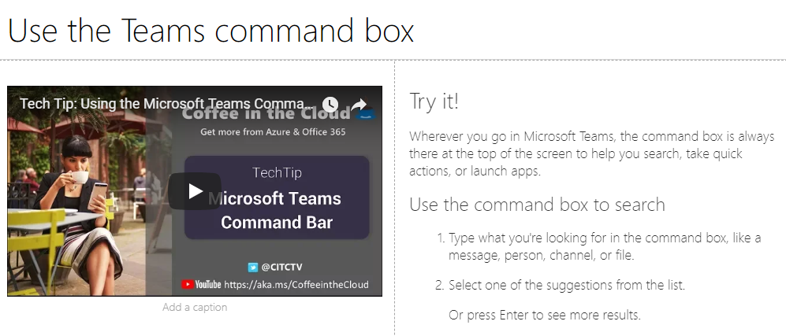
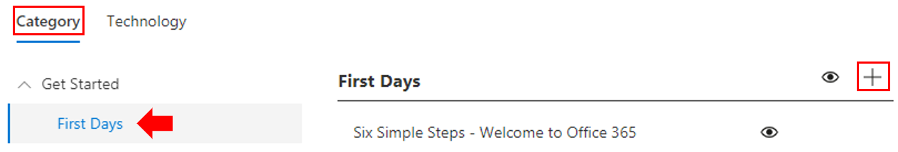
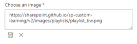

# Personnaliser et partager des sélections

## Créer une playlist

Une playlist est une sélection de « biens ». Une « ressource » est une page SharePoint ou un élément de contenu de formation Microsoft existant. Lorsque vous créez une liste de sélection, vous sélectionnez des biens qui se regroupent pour créer un cursus pour votre utilisateur.  

L’avantage de l’ajout de pages SharePoint est que vous pouvez créer des pages SharePoint avec une vidéo YouTube ou des vidéos hébergées dans votre organisation. Vous pouvez également créer des pages avec des formulaires ou d’autres contenus Office 365.  

#### Étape 1 : créer une page SharePoint pour votre playlist
Dans cet exemple, nous allons d’abord créer une page SharePoint à ajouter à la liste de lecture. Nous allons créer une page avec un composant WebPart de vidéo YouTube et un composant WebPart texte.  Ces instructions supposent que vous utilisez le service SharePoint Online. 

#### Créez une page.
1.  Sélectionnez le menu paramètres > contenu du site > pages de site > page nouveau site >.
2.  Dans la zone de titre, tapez utiliser la boîte de commandes teams
3.  Sélectionnez la section Ajouter une nouvelle section, puis sélectionnez deux colonnes.

4.  Dans la zone de gauche, sélectionnez Ajouter un nouveau composant WebPart, puis sélectionnez incorporer. 
5.  Dans un navigateur Web, accédez à cette URL https://youtu.be/wYrRCRphrp0 et obtenez le code d’intégration pour la vidéo. 
6.  Dans le composant WebPart SharePoint, sélectionnez Ajouter un code incorporé, puis collez-le dans la zone incorporer. 
7.  Dans la zone de droite, sélectionnez Ajouter un nouveau composant WebPart, puis texte. 
8.  Dans un navigateur Web, accédez à l’URL suivante : https://support.office.com/article/13c4e429-7324-4886-b377-5dbed539193b et copiez le bloc try ! Instructions de la page et collez-les dans le composant WebPart texte. Votre page doit ressembler à ce qui suit. 

9.  Cliquez sur **publier**, puis copiez l’URL de la page et collez-la dans le bloc-notes.

#### Étape 2 : créer la playlist

1. Accédez à la page **administration de formation personnalisée** dans votre expérience de site.

1. Vérifier que la **catégorie** est sélectionnée 
1. Cliquez sur la catégorie dans laquelle vous souhaitez que votre nouvelle playlist apparaisse.
1. En regard du nom de la catégorie, cliquez sur le symbole plus 

1. Renseignez les valeurs comme indiqué dans l’exemple ci-dessous, puis sélectionnez **créer**. 

- **Title** -nom d’affichage de la playlist
- **Description** : informations sur les éléments qui seront appris
- **Catégorie** -présélectionnée en fonction de votre sélection initiale
- **Sous-catégorie** -présélectionnée en fonction de votre sélection initiale
- **Technologie** : sélectionnez si nécessaire
- **Niveau** -débutant, Intermidate ou avancé
- **Audience** : permet de cibler du contenu sur la base d’une liste prédéfinie de rôles fournis par Microsoft.

6. Cliquez sur **enregistrer les détails**

> [!TIP]
> Vous pouvez personnaliser l’image de l’icône pour votre sélection.  Cliquez sur l’icône de l’image et insérez une URL d’une image précédemment chargée.  Assurez-vous que l’image se trouve dans la collection de sites d’apprentissage personnalisée ou dans un autre emplacement où tous les utilisateurs auront accès au fichier.  

#### Étape 3 : ajouter des ressources à la liste de lecture
Dans cette étape, vous allez ajouter des biens existants de Microsoft et la page SharePoint que vous avez créée dans la liste de lecture. 

1. Une fois que vous avez enregistré les détails de votre playlist, vous pouvez utiliser la recherche pour les ressources existantes.
1. **Entrez un terme de recherche** pour afficher la liste des biens prédéfinis disponibles dans d’autres playlists. **Cliquez sur le nom** d’un élément pour l’inclure dans votre nouvelle playlist.

Vous pouvez également ajouter la page SharePoint que vous avez créée précédemment ou en créer une de toutes pièces dans l’expérience.

1. Cliquez sur l’option **nouvel élément** dans la boîte de dialogue Liste des éléments de sélection.
1. Donnez un **titre**à votre ressource. Une fois entrés, des options supplémentaires s’affichent 
1. Vous pouvez désormais créer une page de ressource dans SharePoint Online ou entrer l’URL d’une page existante pour l’ajouter à votre sélection personnalisée. 
1. Les champs **catégorie**, **sous-catégorie** et **technologie** seront pré-remplis en fonction de vos sélections précédentes pour cette playlist.
1. Effectuez les sélections appropriées pour le niveau et l’audience de cet élément individuel.  
1. Cliquez sur **enregistrer l’élément** pour l’ajouter à la playlist personnalisée.
1. Répétez ces étapes, que vous recherchiez ou ajoutiez des pages, jusqu’à ce que votre playlist soit terminée. 
1. Cliquez sur **Fermer la playlist** pour enregistrer

Votre playlist avec ce contenu sera désormais disponible partout où vous avez installé/intégré le composant WebPart formation personnalisée. 

> [!NOTE]
> Si vous avez commis une erreur après avoir fermé la sélection, vous pouvez la supprimer de la catégorie en cliquant sur X en regard du nom de la playlist.  

#### Points à considérer

Les playlists personnalisées peuvent être utilisées pour aider vos utilisateurs finaux à effectuer diverses tâches.  Disposez-vous d’un formulaire de demande de délai d’expiration ?  Un formulaire pour demander de l’équipement matériel ?  Tous les composants de formation existants peuvent être programmés dans l’expérience.  

## Partager des sélections

1. Accéder à une playlist dans l’expérience de composant WebPart ou de site
1. Dans le coin supérieur gauche, vous verrez trois icônes.
1. Cliquer sur l’icône représentant un lien
1. Copier l’URL vers la playlist

 cette URL peut maintenant être insérée dans la navigation de votre site ou dans d’autres communications pour mettre vos employés directement dans cette playlist. 

### Étapes suivantes- [adoption du lecteur](driveadoption.md)
