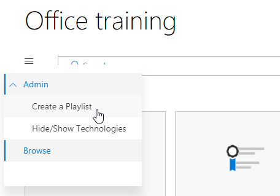

# Personnaliser les Services et les listes de diffusion

Par défaut à la fois l’expérience de site et le composant webpart incluent le contenu de tous les services Office 365.  Si une seule tout ou partie de ces services sont disponibles dans votre société, vous pouvez ajuster le contenu est disponible pour vos utilisateurs.  Dans cet article, nous personnaliser le contenu du composant webpart.  

## Personnaliser le contenu du composant webpart

Le composant webpart personnalisé Learning fournit deux fonctionnalités principales :
- Masquer les Technologies
- Créer une sélection

### Masquer ou afficher les catégories de technologies

Pour masquer et afficher le contenu dans le composant WebPart : 
1.  Cliquez sur le menu déroulant du composant webpart, puis cliquez sur Afficher/masquer les Technologies

2. Sélectionnez un checkox pour masquer ou afficher une technologie et sélectionnez **Appliquer**.

### Créer une sélection

Une sélection est une compliation de « ressources ». Un « actif » est une page SharePoint ou un élément existant du contenu de formation Microsoft. Lorsque vous créez une sélection vous sélectionnez actifs qui vont ensemble pour créer un chemin d’accès de formation pour vos utilisateurs.  

L’avantage de l’ajout de pages SharePoint est que vous pouvez créer des pages SharePoint avec un YouTube vidéos ou vidéos hébergées dans votre organisation. Vous pouvez également créer des pages avec des formulaires ou tout autre contenu Office 365.  

#### Étape 1 : Créer une page SharePoint pour votre sélection.
Dans cet exemple, nous allons d’abord créer une page SharePoint à ajouter à la sélection. Nous allons créer une page avec un composant WebPart vidéo YouTube et un composant WebPart de texte.  Ces instructions supposent que vous utilisez le service SharePoint Online. 

#### Créer une nouvelle page
1.  Sélectionnez les paramètres du menu > contenu du Site > Pages du Site > nouveau > Page du Site.
2.  Dans la zone Titre, tapez utiliser la zone de commande d’équipes
3.  Sélectionnez Ajouter une nouvelle section, puis sélectionnez deux colonnes.

4.  Dans la zone de gauche, sélectionnez Ajouter un nouveau composant WebPart, puis sélectionnez incorporer. 
5.  Dans un navigateur Web, accédez à cette URL https://youtu.be/wYrRCRphrp0 et obtenir le code intégré pour la vidéo. 
6.  Dans le composant WebPart de SharePoint, sélectionnez Ajouter incorporer le code et collez-le dans la zone incorporer. 
7.  Dans la zone de droite, sélectionnez Ajouter un nouveau composant WebPart, puis sélectionnez texte. 
8.  Dans un navigateur Web, accédez à cette URL : https://support.office.com/en-us/article/13c4e429-7324-4886-b377-5dbed539193b et copier le bloc Try il ! Instructions de la page et collez-les dans le composant WebPart de texte. Votre page doit se présenter comme suit. 

9.  Cliquez sur Publier, puis copiez l’URL de la page et collez-le dans le bloc-notes

#### Étape 2 : Créer la sélection
1.  Accédez à où vous avez installé le composant webpart personnalisé apprentissage. Dans l’expérience de site complète, il est hébergé sur la page de formation Office 365. 
2.  Dans le menu déroulant, sélectionnez Créer une nouvelle sélection. 

3.  Renseignez les valeurs comme indiqué dans l’exemple ci-dessous, sélectionnez **créer**. 

#### Étape 3 : Ajouter des ressources à la sélection
Dans cette étape, vous allez ajouter des ressources existantes de Microsoft et de la page SharePoint que vous avez créé à la sélection. 

1.  Cliquez sur le bouton menu, puis cliquez sur Ajouter un élément existant.

2.  Filtre pour la formation des équipes de Microsoft Office 365 applications >
3.  Ajouter Bienvenue à Microsoft Teams, que votre équipe en cours d’exécution et démarrer des conversations et émettre des appels.
4.  Sélectionnez le > du bouton menu Créer actif.
5.  Type, utilisez la zone de commande d’équipes dans la zone de titre actif. 
6.  Coller l’utilisation de SharePoint à l’URL de page boîte équipes commande vous avez copié dans le champ de contenu actif. 
7.  Accédez maintenant à la > de sélections personnalisé > Page d’accueil de votre première jours avec des équipes > utilisent la zone de commande d’équipes. Votre page doit se présenter comme suit. 

Votre sélection avec ce contenu sera désormais disponible n’importe où vous avez installé / incorporée du composant webpart personnalisé apprentissage. 

#### Choses à envisager

Sélections personnalisées peuvent servir à aider vos utilisateurs finaux dans un vareity des tâches.  Avez-vous besoin d’un formulaire de demande de congés ?  Un formulaire pour demander le matériel ?  Les ressources de formation existantes peuvent être programmées dans l’environnement.  
