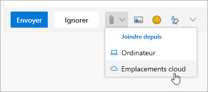

# Collaborer avec des collègues

Il est 14h00 et le temps de collaborer avec vos collègues. Office 365 offre les opportunités les plus performantes en matière de collaboration, ce qui permet aux équipes de collaborer de plusieurs manières. 

## Outils
- Microsoft Teams
- Office Online
- OneNote
- SharePoint et OneDrive
- 
## Liste de contrôle pour collaborer avec des collègues
- Créer ou rejoindre une équipe Microsoft pour collaborer
- Créer et partager des fichiers à partir de OneDrive 
- Co-créer dans Office 365 
- Utiliser le pièces jointes dans le cloud :

## Créer ou rejoindre une équipe Microsoft pour la collaboration

Microsoft Teams et les canaux sont des emplacements où les utilisateurs peuvent collaborer en partageant des fichiers, en suivi des éléments d’action d’équipe et bien plus encore. Chaque Microsoft Teams a une intégration à un site SharePoint, un bloc-notes OneNote et d’autres ressources. Ce service Office 365 est idéal pour les personnes qui travaillent fréquemment ensemble sur des projets partagés ou des résultats. 

## Partager des fichiers à partir de votre OneDrive
Les fichiers enregistrés sur OneDrive Entreprise peuvent être partagés avec tout le monde à partir du navigateur ou des applications de bureau Office 365 telles que Word ou Excel. Il est possible de partager avec des personnes à l’aide de leur nom, alias ou adresse de messagerie d’entreprise. 

## Co-créer dans Office 365
La co-création est activée lorsque nous travaillons simultanément avec des collègues sur le même fichier. Cette fonctionnalité est possible dans les versions web des principales applications Office 365 et dans les versions de bureau de ces applications à partir d’Office 2016.  Gagnez du temps et travaillez en collaboration sur le même document. Office synchronise ces modifications pour vous, même si vous êtes en mode hors connexion. 

## Utiliser les pièces jointes cloud : arrêter la messagerie de cette feuille de calcul !
Combien de fois avez-vous dû chercher la version appropriée d’un document lorsque celui-ci était joint à un message électronique ? Désormais, dans Office 365, vous pouvez partager un lien vers le fichier, appelé une pièce jointe dans le cloud, afin que tout le monde modifie la même version.  Vous pouvez choisir d’envoyer un lien et de choisir si les utilisateurs peuvent afficher ou modifier le fichier. 

