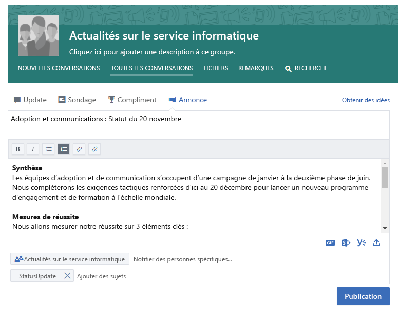
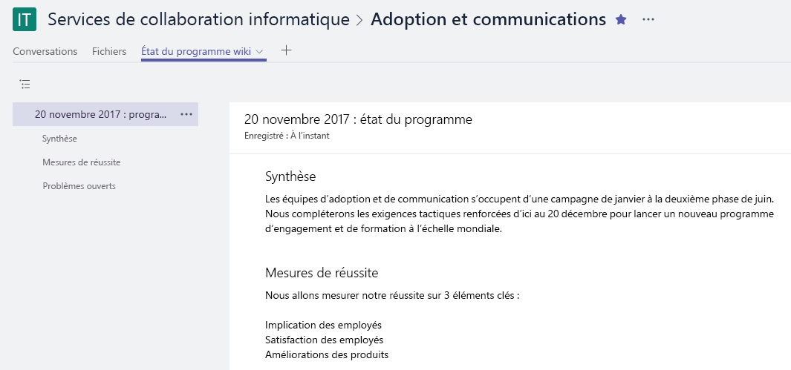

# La connexion dans l’entrepriseConnecting Across the Company

La journée de travail est chargée, mais avant de quitter le bureau, vous voulez vous assurer que toutes les personnes ayant un intérêt dans votre travail sont informées sur ce qui se passe.It's been a busy day, but before you leave the office you want to ensure that all the people interested in your work are informed about what is happening. Assurez-vous que toutes les parties prenantes, à l’intérieur et à l’extérieur de votre équipe, comprennent vos objectifs, progrès et résultats qui constituent une part importante de ce que vous faites.Making sure that all your stakeholders -- inside and outside of your team -- understand your goals, progress, and results is an important part of what you do.  

## OutilsTools
- SharePointSharePoint
- YammerYammer
- OutlookOutlook
- Microsoft TeamsMicrosoft Teams 

## Liste de contrôle pour la communication dans l’entrepriseChecklist for communicating across the company
- Comprendre votre audience et leurs méthodes de communication actuellesUnderstand your audience and their existing communication methods
- Cibler vos messages clés par personnage, par exemple, les parties prenantes d'un projet, un membre de l’équipe ou un employéTarget your key messages by persona, for example, project stakeholder, team member, or employee
- Sélectionnez les outils de communication qui se complètent, par exemple, créez un billet sur votre communauté Yammer et envoyez une alerte par courrier électroniqueSelect communication tools that compliment each other, for example, author a post on your Yammer community and send an alert via e-mail 
- Co-écrire vos informations avec d’autres membres de votre équipeCo-author your information with others on your team
- Publier vos informations et envoyer une notification à toutes les parties intéresséesPublish your information and send a notification to all of your interested parties 
 
## Sélectionnez votre moyen de communicationSelect your communication method
Utilisez les informations ci-dessous pour déterminer le meilleur moyen pour communiquer avec votre équipe.Use the information below to decide the best way to communicate with your team. Équilibrez en utilisant des nouvelles technologies avec des annonces de messagerie classiques, alors que les personnes passent à de nouvelles méthodes de communication.Balance using new technology with traditional email announcements while people transition to new communications methods. Une approche de communication cohérente est une méthode efficace pour sensibiliser et changer les organisations.Having a consistent communication approach is an effective way to drive awareness and organizational change. 

**Yammer** : vous pouvez engager une conversation au sein d’un grand groupe de personnes à l’aide de Yammer pour partager vos mises à jour.**Yammer**: You can drive conversation across a broad group of people by using Yammer to share your updates. Publiez une mise à jour standard ou utilisez la fonctionnalité Annonce pour s’assurer qu’une copie de votre mise à jour est dirigée vers la boîte aux lettres de chaque membre.Post a standard update or use the Announcement feature to ensure a copy of your update goes to each member's mailbox. 

**SharePoint** : si vous voulez atteindre des personnes extérieures à votre groupe de travail, envisagez de rédiger un bref article d'actualités sur votre charte et votre avancement, qui sont facilement disponibles et conservés pendant toute la durée de vie de votre projet dans SharePoint Online.**SharePoint**: If you want to reach people outside of your  working group, consider writing a brief news article on your charter and progress that is readily available and kept for the life of your project in SharePoint online. Utilisez une page moderne dans un site d’équipe SharePoint, ou pour un programme plus important, songez à créer un site de communication SharePoint.Use a modern page in a SharePoint team site, or for a larger programs, consider creating a SharePoint communication site. 

Les sites de communication SharePoint fournissent des articles d'actualités visuels et flexibles qui vous permettent d’incorporer des images, des tableaux de bord et du texte ensemble.SharePoint communication sites provide visual and flexible news articles that allow you to embed images, dashboards, and text together. Les informations sont ensuite disponibles via n’importe quel navigateur ou via l’application mobile SharePoint.Information is then available via any browser or through the SharePoint mobile app. Cette vidéo vous permet d’obtenir un aperçu rapide sur les fonctionnalités de ces sites performants.This video provides a quick overview of what these powerful sites can do. Pour garantir une visibilité optimale, épinglez le site de communication en tant qu’un onglet pour votre groupe de travail dans Microsoft Teams.To ensure the best visibility pin the communication site as a tab for your working group in Microsoft Teams.

**Microsoft Teams** : si ce grand groupe de personnes fait déjà partie de votre groupe de travail dans Microsoft Teams, pourquoi pas publier une note dans votre canal général avec des éléments clés et un lien vers une page Wiki pour votre mise à jour plus longue.**Microsoft Teams**:  If this broad group of people is already a part of your working group in Microsoft Teams why not post a note in your General channel with key facts and a link to a Wiki page for your longer update.  Les pages Wiki peuvent être co-écrites par plusieurs personnes et se prolonger au-delà de la durée de vie de l'équipe.Wiki pages can be co-authored by multiple people and persist over the life of that team. 

## Conseil pour moderniser votre communicationTip to Modernize Your Communication

**Pour vos collègues centrés sur les courriers électroniques** : abonnez-les aux alertes provenant de votre groupe Yammer ou de votre flux d’actualités SharePoint.**For your email centric colleagues**: Subscribe them to alerts from either your Yammer group or your SharePoint news feed.  Ils recevront ainsi une notification dans leur message électronique les informant que vous avez publié de nouvelles informations, et pourront ensuite consulter vos informations de source sans avoir à créer de courrier séparé.This way they will get a notification in their email that you've published new information and can then click through to your source information without you having to create a separate email.  Vous voulez obtenir quelque chose de spécial ?Want to get snazzy?  Personnalisez la notification avec Microsoft Flow ou PowerApps.Customize the notification with Microsoft Flow or PowerApps. Nous vous conseillons d’avoir un déjeuner de travail pour montrer à ces utilisateurs comment utiliser Microsoft Teams, SharePoint ou Yammer sur leurs appareils mobiles.Consider having a brownbag to show these users how to use Microsoft Teams, SharePoint or Yammer on their mobile devices. 

**Faites parler les autres****Get people talking!** Encouragez l’implication en activant les commentaires pour les pages de votre site de communication SharePoint.Encourage engagement by turning on comments for your SharePoint communication site pages.  Si vous utilisez Yammer, assurez-vous que les personnes participent à votre communauté en la suivant régulièrement pour afficher les questions auxquelles vous pouvez répondre.If you are using Yammer ensure that people participate in your community by monitoring it regularly for questions that you can answer. 

**Partagez en externe** : Microsoft Teams, SharePoint et Yammer prennent en charge le partage externe, si votre administrateur le permet, dans votre instance Office 365.**Share externally**:  Microsoft Teams, SharePoint and Yammer all support external sharing if your administrator allows that in your instance of Office 365.  L’utilisation du partage externe vous permet de partager vos mises à jour avec des personnes qui travaillent pour des partenaires, des fournisseurs et bien évidemment, vos clients.By using external sharing you can share your updates with people who work for partners, suppliers and of course, your customers.