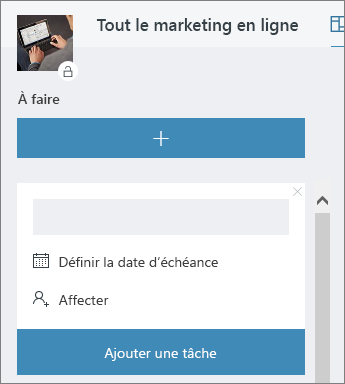

# Réunion chez Office

Il est 10h00 et c’est l’heure de votre réunion. Dans cette section, nous allons vous montrer comment rendre vos réunions plus productives.  Cela comprend les pratiques recommandées pour la préparation des réunions et des outils Office 365.  

## Outils
- Outlook
- Microsoft Teams
- Skype Entreprise
- OneNote

## Liste de contrôle pour une réunion
- Planifier et réserver une réunion
- Rejoindre une réunion
- Présenter les informations pendant une réunion
- Utiliser OneNote pendant une réunion pour la co-création et les notes
- Utiliser le Planificateur pendant une réunion pour effectuer le suivi des éléments d’action pour ce projet
- Terminer une réunion
 
## Planifier et réserver une réunion
Vous pouvez effectuer les actions suivantes pour assurer la productivité de votre réunion :

1. **Avez-vous besoin d’une réunion ?** Pensez à partager un fichier dans le chat avec les approbateurs nécessaires en premier.  
1. **Avoir un ordre du jour clair.**  Mettez l’ordre du jour de la réunion dans la section des notes de votre invitation à la réunion en ligne afin que les participants puissent être préparés.
1. **Enregistrer la réunion**  Utilisez les fonctions d'enregistrement de réunion dans Microsoft Teams pour partager la réunion avec des personnes qui n'ont pas pu y assister ou pour transcrire des notes ultérieurement.  

Vous êtes maintenant prêt à réserver cette réunion : réservez la réunion avec Microsoft Teams ou les détails de Skype Entreprise dans Outlook. Cela vous permet d'inclure les membres de l'équipe de n’importe quel endroit, d'enregistrer la réunion et d'utiliser la vidéo (lorsqu'elle est disponible) pour améliorer la communication. 

## Rejoindre une réunion
Rejoindre une réunion où que vous soyez. Vous pouvez participer à une réunion Microsoft Teams ou Skype Entreprise où que vous soyez à l’aide d’un appareil mobile, soit en appelant le numéro de connexion dans les détails de la réunion, soit en utilisant les applications mobiles. Lorsque vous utilisez les applications mobiles, soyez attentif aux limites d’utilisation des données mobiles qui s’appliquent à vous ou votre pays.

> [!TIP]
> **Utiliser un casque.** Si vous vous connectez depuis votre ordinateur à votre bureau, utilisez un casque plutôt que le microphone et les haut-parleurs intégrés de votre ordinateur pour assurer une meilleure qualité d'appel.

> [!TIP]
> Activer la vidéo Lorsque des caméras sont disponibles, il est recommandé de les utiliser, car la communication en face à face fournit des indices non verbaux qui peuvent être manqués lorsque vous utilisez uniquement la voix. Ne vous inquiétez pas, vos cheveux sont parfaits. 

## Présenter les informations pendant une réunion
Le partage de contenu depuis votre appareil est un excellent moyen de guider votre réunion et de fournir un contexte à la discussion. En général, partager l’intégralité de votre écran n’est pas recommandé. Cela signifie que tout ce qui apparaît sur votre écran apparaîtra sur les écrans de tous les participants à la réunion. Pour éviter cela, il vous suffit de sélectionner le contenu que vous souhaitez partager dans Microsoft Teams. 

## Utiliser OneNote pendant une réunion
OneNote peut permettre une collaboration et une co-création en temps réel, ce qui en fait un outil idéal pour le brainstorming et la prise de notes lors des réunions. Dans la mesure où tout le monde a accès à l’emplacement de partage de OneNote, vous pouvez publier un lien vers le bloc-notes et commencer immédiatement le brainstorming.

Vous pouvez créer une section spécifique pour les notes de réunion dans le bloc-note. Vous pouvez également utiliser la fonctionnalité « détails de la réunion » dans OneNote pour créer des pages avec un résumé des détails de la réunion.

## Utiliser le Planificateur dans une réunion
L'ajout direct d'éléments d'action dans un plan pour votre projet vous évite de les transcrire après coup. Il est recommandé d’affecter une personne au suivi des actions et à la prise de notes lors des grandes réunions de projet. Il s’agit généralement d’une personne différente de celle qui dirige la réunion. Les rappels d'élément d'action sont envoyés directement à la personne à laquelle ils sont attribués, tout comme les rappels si l'élément dépasse sa date d'échéance. 

## Terminer une réunion
Lorsque tout l'ordre du jour a été abordé, mettez fin à la réunion, quelle que soit l'heure. Attribuer et envoyer les éléments d’action à tous les participants. Si vous collaborez dans Microsoft Teams, vous pouvez facilement partager les éléments d’action dans le canal approprié. Les éléments d'action peuvent également être saisis et attribués dans le Planificateur pendant la réunion, offrant ainsi un moyen rapide de suivre leur réalisation, également [accessible dans Microsoft Teams](https://support.office.com/article/use-planner-in-microsoft-teams-62798a9f-e8f7-4722-a700-27dd28a06ee0). 
