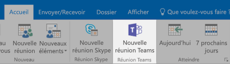

# Réunion au bureau

Il est de 10:00:00 et l’heure de la réunion. Dans cette section, nous allons vous montrer comment rendre vos réunions plus rapidement.  Cela implique les meilleures pratiques pour la préparation de la réunion et outils Office 365.  

## Outils
- Outlook
- Microsoft Teams
- Skype Entreprise
- OneNote

## Liste de vérification pour votre réunion
- Planifier et planifier votre réunion
- Rejoindre une réunion
- Présenter des informations dans une réunion
- Utiliser une réunion pour la création et les notes OneNote
- Utiliser le planificateur dans une réunion pour effectuer le suivi des éléments d’action pour ce projet
- Mettre fin à une réunion
 
## Planifier et planifier votre réunion
Il existent quelques points que vous pouvez faire pour vérifier que votre réunion est aussi productif que possible :

1. **Avez-vous besoin d’une réunion ?** Envisagez de partage d’un fichier dans la conversation avec les approbateurs nécessaires tout d’abord.  
1. **Ont un agenda clair.**  Inclure l’ordre du jour de réunion dans la section notes de votre invitation à la réunion en ligne afin que les participants peuvent être préparées.
1. **Enregistrement de votre réunion**  Utilisez fonctions d’enregistrement de la réunion dans Microsoft Teams pour partager la réunion avec des personnes qui ne peuvent pas participer ou transcrire notes ultérieurement.  

Maintenant vous êtes prêt à cette réunion de livre : planifier la réunion avec Microsoft Teams ou Skype pour les entreprises décrit en détail dans Outlook. Cette opération vous permet à inclure les membres d’équipe à partir de différents emplacements, enregistrer la réunion et utiliser la vidéo (le cas échéant) pour améliorer la communication. 

## Rejoindre une réunion
Participer depuis n’importe où. Il est possible de joindre Skype de Microsoft Teams pour une réunion d’affaires à partir de n’importe où à l’aide d’un appareil mobile, soit en appelant le numéro d’accès dans les détails de réunion ou en utilisant les applications mobiles. Lorsque vous utilisez les applications mobiles, être conscients des limites d’utilisation des données mobiles qui s’appliquent à vous ou votre pays.

> [!TIP]
> **Utilisez un casque.** Si vous vous connectez à partir de votre ordinateur à votre bureau, utilisez un casque plutôt que microphone intégrés de votre ordinateur et les haut-parleurs pour assurer une meilleure qualité de l’appel.

> [!TIP]
> Allumez votre vidéo ! Lorsque les caméras sont disponibles, il est important de leur utilisation, comme la communication face à face fournit des indications non verbale qui peuvent être manquées lorsque vous utilisez simplement voix. Ne vous inquiétez pas, votre cheveux parfait. 

## Présenter des informations dans une réunion
Partage de contenu à partir de votre appareil est idéal pour se concentrer votre réunion et fournissent un contexte à la discussion. En règle générale, le partage l’intégralité de votre écran peut être une bonne idée. Cela signifie que tout ce qui s’affiche sur votre écran s’affiche sur les écrans de tous les participants. Éviter cela en sélectionnant simplement le contenu que vous souhaitez partager dans Microsoft Teams. 

## Utilisez OneNote dans une réunion
OneNote peut autoriser pour la collaboration en temps réel et la co-création de, et un outil idéal pour brainstorming et notez tirer dans les réunions. Tant que tout le monde a accès à l’emplacement où OneNote est partagé, vous pouvez publier un lien vers le bloc-notes et démarrer immédiatement de brainstorming.

Vous pouvez créer une section spécifique de notes dans le bloc-notes de l’équipe de la réunion. Vous pouvez également utiliser la fonctionnalité « détails de la réunion » dans OneNote pour créer des pages avec un résumé des détails de la réunion.

## Utiliser le planificateur dans une réunion
Ajout d’éléments d’action directement dans un plan pour votre projet, vous évite de leur transcription après le fait. Il est recommandé dans les réunions de projet important pour affecter une personne à l’action prise de notes & de suivi. Il s’agit généralement d’une autre personne à la personne qui exécute la réunion. Rappels d’éléments action sont envoyées directement à la personne auquel elle est affectée comme rappels si l’élément passe son échéance. 

## Mettre fin à une réunion
Lorsque tout le contenu de l’ordre du jour a été traité, mettre fin à la réunion, quel que soit l’heure. Affecter et envoyer des éléments d’action à tous les participants. Si vous collaborez dans Microsoft Teams, vous pouvez facilement partager des points d’action dans le canal approprié. Points d’action également pouvant être entrés et affectés à terme pendant la réunion, en fournissant un moyen facile pour effectuer le suivi de réalisation qui peut également être [accessibles dans les équipes Microsoft](https://support.office.com/en-us/article/use-planner-in-microsoft-teams-62798a9f-e8f7-4722-a700-27dd28a06ee0). 