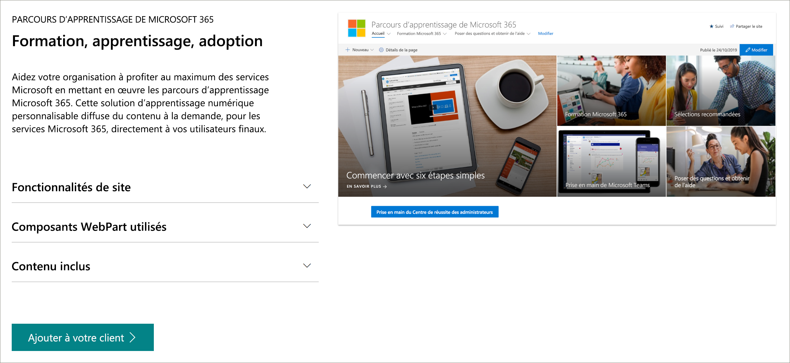

# Chemins d’apprentissage Microsoft 365 
Les voies d’apprentissage de Microsoft 365 sont une solution d’apprentissage à la demande personnalisable conçue pour améliorer l’utilisation et l’adoption des services 365 Microsoft au sein de votre organisation.   

## Formation personnalisée à la demande de Microsoft

Les voies d’apprentissage de Microsoft 365 :

- **Un site de communication SharePoint Online entièrement personnalisable** : le portail de formation sur les voies d’apprentissage peut être personnalisé pour ajouter l’aide, le support et le contenu de la communauté de votre organisation.
- **Provisionnement facile** : provisionnez des voies d’apprentissage à partir du service de mise en service SharePoint Online en quelques étapes simples
- **La possibilité de créer vos propres sélections de formation** , avec des voies de formation, vous permet de créer des listes de sélection de formation ciblées pour répondre aux besoins uniques de votre environnement.
- **Contenu à jour** : les voies d’apprentissage fournissent du contenu via un catalogue de contenu Microsoft Online, de sorte que le contenu de votre site est régulièrement mis à jour.

## Service de mise en service SharePoint Online 
Les voies de formation peuvent être configurées à partir du service de mise en service SharePoint Online. Lorsque les chemins d’apprentissage Microsoft 365 sont configurés, les organisations reçoivent un site de communication SharePoint Online conçu pour être un portail de formation « out-of-Box », ainsi qu’un composant WebPart de voies d’apprentissage connecté à un catalogue en ligne de contenu de formation. 

## 3 étapes simples
Nous allons commencer à créer une expérience de voies d’apprentissage pour votre environnement.
1. Choisissez une [option de configuration](custom_setupoptions.md) et approvisionnez les voies d’apprentissage de Microsoft 365.  
2. Personnalisez les voies d’apprentissage pour votre environnement.
3. Partagez les voies de formation avec vos utilisateurs à l’aide de nos [Outils d’adoption](driveadoption.md).

## Commentaires et assistance

Les voies d’apprentissage Microsoft 365 sont un projet open source pris en charge par notre [liste de problèmes en ligne](https://aka.ms/CustomLearningHelp) sur GitHub. La solution de voies d’apprentissage et ses composants ne sont pas couverts par les contrats de support technique Microsoft existants.  

## Ressources supplémentaires
Vous pouvez utiliser le site des chemins d’apprentissage Microsoft 365 pour fournir des liens vers les forums de la communauté d’utilisateurs nouveaux ou existants. Pensez à démarrer un groupe d’utilisateurs interne, si vous n’en avez pas encore, pour permettre aux utilisateurs de partager leur réussite et d’apprendre les uns des autres.  Si vous n’avez pas le temps d’entretenir un groupe d’utilisateurs interne, vous et vos employés pouvez rejoindre la [communauté office 365 champion](https://aka.ms/O365Champions) pour la formation mensuelle, l’appartenance à la communauté en ligne et l’accès anticipé aux outils et ressources pour Office 365.