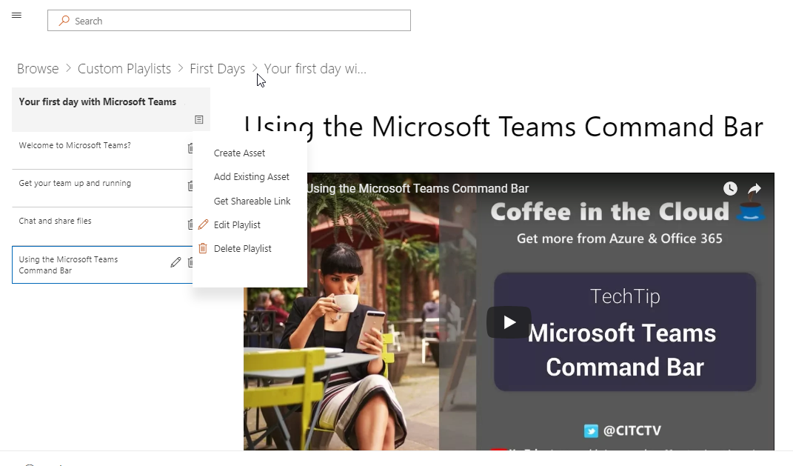

# Personnalisé de formation pour Office 365Custom Learning for Office 365

## Libre-service, solutions personnalisables de formation de MicrosoftSelf service, customizable training solutions from Microsoft

Personnalisé de formation pour Office 365 est un ensemble de formation et d’adoption outils open source conçu pour augmenter l’utilisation d’Office 365 dans votre organisation. Créé en partenariat avec groupes Teams Microsoft et l’ingénierie produit SharePoint et l’équipe d’Assistance moderne et l’expérience, ces solutions simples d’utilisation peuvent être installées et personnalisées dans votre client de SharePoint Online.Custom Learning for Office 365 is a set of training and adoption open source tools designed to increase usage of Office 365 in your organization. Created in partnership with Microsoft Teams and SharePoint Product Engineering groups and the Modern Assistance and Experience team, these simple-to-use solutions can be installed and customized in your SharePoint Online tenant. 

Ces solutions permettent aux utilisateurs finals de tout le contenu de formation que Microsoft offre et met à jour les que le contenu à la demande.  Le site peut être intégré facilement avec votre installation de Microsoft Teams ou d’autres sites SharePoint Online existants dans votre société.These solutions bring to your end-users all the training content that Microsoft has to offer and keeps that content up to date on demand.  The site can easily be integrated with your installation of Microsoft Teams or other existing SharePoint Online sites in your company.

Nos apprentissage personnalisé actuellement limitée à partir de contenu pour les produits Office 365.  Si vous souhaitez voir davantage de contenu inclus, faites-nous part [vos suggestions et commentaires](feedback.md) sur notre forum en ligne.Our custom learning content is currently scoped to beginning content for Office 365 products.  If you'd like to see more content included, give us [suggestions and feedback](feedback.md) in our online forum.  

## Composants Open Source de formation personnaliséCustom Learning Open Source Components

Personnalisé de formation pour Office 365 offre deux options :Custom Learning for Office 365 provides two options: 

**Option 1**: [formation SharePoint Online Site Package personnalisé](installsitepackage.md)**Option 1**: [The Custom Learning SharePoint Online Site Package](installsitepackage.md)

Sélectionnez Installer et configurer ce package de site de communication SharePoint Online pour créer un portail de formation pour votre entreprise. Anciennement appelé Toolkit pour le travail d’équipe, ce portail de formation peut être personnalisé pour ajouter du contenu de la Communauté, l’aide et prise en charge de votre organisation. Vous pouvez également supprimer n’importe quel contenu lié aux services non pris en charge au sein de votre organisation. Personnalisée du package de site comprend également le composant WebPart personnalisé de formation qui fournit un flux de contenu de formation Office 365 à votre organisation à jour de formation.Select, install, and configure this SharePoint Online communication site package to create a training portal for your company. Formerly known as Toolkit for Teamwork, this training portal can be customized to add your organization's help, support, and community content. You can also remove any content related to services not supported within your organization. The custom learning site package also includes the Custom Learning web part that provides an up-to-date feed of Office 365 training content to your organization. 

**Option 2**: option de composant web [L’apprentissage personnalisé pour le composant WebPart Office 365](installwebpart.md) l’apprentissage de personnalisé est conçue pour les organisations qui souhaitent intégrer formation Office 365 dans un site existant de communication SharePoint Online. Le composant WebPart personnalisé formation peut être installé sur n’importe quelle page SharePoint Online et fournit un flux de mise à jour de la suite complète du contenu de formation Office 365 à partir du site de Microsoft Support.Office.com. Formation de contenu fourni par le composant WebPart se compose des sélections à utiliser. Les administrateurs pouvant également utiliser le composant WebPart pour créer des sélections de formation personnalisé, combinaison de contenu à partir de YouTube, contenu hébergé localement. Fichiers PDF et le contenu de formation Office 365, pour fournir une expérience de formation adaptée aux besoins de l’organisation.**Option 2**: [The Custom Learning for Office 365 web part ](installwebpart.md) The Custom Learning web part option is designed for organizations that want to integrate Office 365 training into an existing SharePoint Online communication site. The Custom Learning web part can be installed on any SharePoint Online page and provides an up-to-date feed of the full suite of Office 365 training content from Microsoft's Support.Office.com site. Training content delivered through the web part is organized in easy-to-consume playlists. Administrators can also use the web part to build custom training playlists, combining content from YouTube, locally hosted content like .PDFs, and Office 365 training content, to provide training experiences tailored to the unique needs of the organization.

## 4 étapes simples4 Easy Steps

Vous permet de [Démarrer](getstarted.md) création une formation simple avec Microsoft à jour de contenu.Lets [get started](getstarted.md) creating a simple training solutions with up to date Microsoft content.

1. Sélectionnez la solution à droite pour vousSelect the solution right for you
2. Complète & de votre installation personnaliser votre contenuComplete your installation & customize your content
3. Partager votre site avec vos utilisateurs à l’aide de nos [Outils d’adoption](driveadoption.md)Share your site with your users using our [adoption tools](driveadoption.md)
