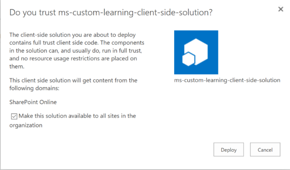

# Installation personnalisée du composant Webpart de Solution de formation

## Conditions requises pour une installation de client à l’échelle

- Pour installer le composant webpart de formation personnalisé pour votre client entière, vous devez disposer des autorisations d’administration Office 365.  Si vous n’avez pas ces autorisations, vous pouvez l’administrateur Office 365 ou installez le composant webpart d’une collection de sites individuelles.
- Votre administrateur ou vous Office 365 doit avoir le programme d’installation et configuré un [Catalogue d’applications](https://docs.microsoft.com/en-us/sharepoint/dev/spfx/set-up-your-developer-tenant) de client à l’échelle ou un [Catalogue d’applications de Collection de sites](https://docs.microsoft.com/en-us/sharepoint/dev/general-development/site-collection-app-catalog)pour recevoir le composant webpart.]
- Il prend en charge SharePoint Online uniquement. Le composant WebPart n’est pas prise en charge pour l’installation sur n’importe quelle version de SharePoint sur site.

## Ajouter le composant webpart personnalisé apprentissage à votre client 

1. Téléchargez le composant webpart personnalisé apprentissage et enregistrez-le sur votre disque local.  Ce fichier est nommé « ms-personnalisé-learning.sppkg ».  Ne modifiez pas le nom ou le suffixe du fichier. 
2. Accédez au [portail d’administration d’Office 365](https://admin.microsoft.com/AdminPortal/Home#/homepage) pour votre client
3. Dans le volet de navigation gauche Sélectionnez centres d’administration de SharePoint. Il s’ouvre dans un nouvel onglet, dans le centre d’administration SharePoint sélectionnez applications, catalogue d’applications, les applications pour SharePoint 
4. Sélectionnez Télécharger le composant webpart et choisissez le fichier « ms-personnalisé-learning.sppkg » que vous avez téléchargé
5. Pour cette vérification de l’installation du client à l’échelle la case en regard de « Rendre cette solution disponible pour tous les se trouve dans l’organisation ».  

## Ajouter le composant webpart client formation à la Page SharePoint Online

Une fois l’apprentissage personnalisé est installé sur votre client, vous pouvez ajouter le composant WebPart à une page SharePoint. Lorsque vous le faites, formation Office 365 est soudainement à votre disposition. 

1. Ajoutez le composant webpart personnalisé Learning dans une disposition de colonne pleine largeur :

2. Dans la page SharePoint, sélectionnez la section Ajouter, puis sélectionnez colonne pleine chasse.  Vous verrez le message suivant :

3. Sélectionnez Microsoft Learning.  Vous devez maintenant voir les éléments suivants : 

 Vous pouvez maintenant sur les mosaïques pour Explorer le contenu par défaut inclus dans la solution.  

## Étapes suivantes
- Explorez le [contenu par défaut](webpartcontent.md) inclus dans le composant webpart.
- [Personnaliser](customization.md) l’expérience de formation pour votre organisation.
- [Lecteur d’adoption](driveadoption.md) de votre solution de formation.

