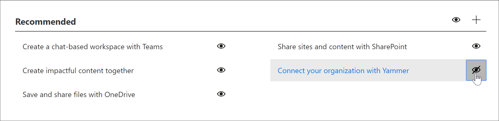

# Comment masquer et afficher des playlists

Pour personnaliser les parcours d'apprentissage pour votre environnement, vous devrez peut-être masquer les playlists fournies par Microsoft et les remplacer par des playlists que vous créez pour votre organisation. Par exemple, un cas d'utilisation client courant consiste à masquer la playlist Six Étapes simples de Microsoft et à la remplacer par une playlist que vous créez pour votre organisation ou groupe d'utilisateurs. 

## Masquer une playlist

1. Dans la **page** d'accueil du parcours d'apprentissage, cliquez sur la vignette de formation Office **365.**
2. Dans le volet Web du parcours d'apprentissage, sélectionnez le menu **Système,** puis **sélectionnez Administrer la playlist.** Vous devez maintenant avoir deux onglets ouverts : un avec la page **d'administration du parcours d'apprentissage** ; et un avec la page **de formation Office 365.** 
3. Dans la page **Administration de l'apprentissage** personnalisé, sous **Catégorie,** sélectionnez une sous-catégorie, puis sélectionnez le regard d'une playlist pour la masquer. Pour cet exemple, cliquez sur la sous-catégorie **First Days,** puis masquez la playlist **Six Simple Steps.**  

### Vérifier que la playlist est masquée
- Pour vérifier que la playlist est masquée, sélectionnez l'onglet du navigateur avec la page Démarrer avec **Office 365** chargée, puis actualisez la page. Vous devez maintenant voir la sous-catégorie **First Days** et **six étapes simples** sont masquées. Dans ce cas, il n'y a qu'une seule playlist dans la sous-catégorie et elle est masquée, de sorte que le parcours d'apprentissage masque également la sous-catégorie au lieu d'afficher une sous-catégorie vide. 

## Unhide a playlist

- Dans la page **Administration** de l'apprentissage personnalisé, sous **Catégorie,** sélectionnez une sous-catégorie, sélectionnez une sélection, puis sélectionnez le regard de la playlist masquée pour la démasquer. Pour cet exemple, démasquer la sélection **Six Étapes** simples sous la sous-catégorie **First Days.**  

