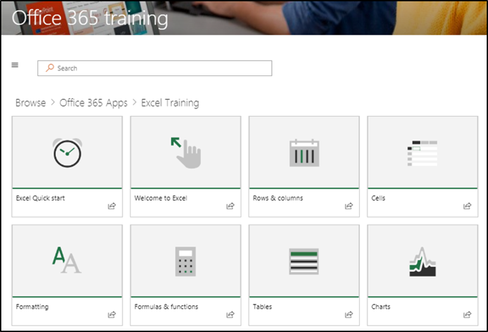

# Explorer le site et le contenu par défautExplore the site and default content

### Visite guidée du siteTour the site 

Accédez à la page d'accueil et sélectionnez formation Office 365. Chaque page du site SharePoint Online est configurée pour héberger le composant WebPart formation Microsoft. Cela permet à la page d'afficher tout le contenu disponible dans le composant WebPart.Navigate to the Home page and select Office 365 Training. EAch page in the SharePoint Online site is configured to host the Microsoft Learning webpart. This enables the page to  display all the content available within the webpart.

Dans la barre de menus, sélectionnez l'élément de navigation **Office 365 formation** , puis sélectionnez **prise en main de OneDrive**. Dans ce cas, le composant WebPart Filtre le contenu de sorte qu'il n'affiche que le contenu OneDrive.From the menu bar, select the navigation item **Office 365 Training** and then select **Get Started with OneDrive**. In this case, the Web part filters the content to show only OneDrive content.

Répétez ces étapes pour les deux autres options de menu, **prise en main** de teams et **prise en main de SharePoint Online** pour examiner son contenu et tester la navigation.Repeat these steps for the other two menu options, **Get Started with Teams** and **Get Started with SharePoint Online** to review their content and test the navigation.

Revenez à la page d'accueil et sélectionnez **Démarrer avec six étapes simples**. Cette opération vous permet d'accéder à la sélection de six étapes simples.Navigate back to the Home page and select **Start with Six Simple Steps**. This takes you to the Six Simple Steps playlist.

> [!TIP]
> Les six étapes simples sont issues d'une équipe de recherche Microsoft. Voici les étapes que les chercheurs de Microsoft ont jugés les plus permanentes, ce qui signifie que si les utilisateurs passent par ces étapes, leur utilisation d'Office 365 augmentera et ils deviendront plus productifs. Et cela est idéal pour tout le monde.The Six Simple Steps are derived from a Microsoft research team. These are the steps that Microsoft researchers have found to be the most sticky, meaning if users go through these steps, their use of Office 365 will increase and they will become more productive workers. And that’s good for everybody.

### Accédez au menu démarrer en six étapes simplesGo to Start with Six Simple Steps
- À partir de la page d'accueil, cliquez sur Démarrer avec six étapes simples.From the Home page, click Start with six simple steps. 
- Vous voyez la page formation Office avec le composant WebPart formation personnalisée routé vers la sélection démarrer avec six étapes simples.You see the Office Training page with the Custom Learning web part routed to the Start with six simple steps playlist.  

### Afficher une liste de sélections pour une catégorieView a list of playlists for a category

À partir de la page formation Office 365, sélectionnez formation Excel pour accéder à une liste de sélections de formation Excel.From the Office 365 training page select Excel Training to go to a list of Excel Training playlists.

### Afficher une sélectionView a Playlist

Cliquez sur **Bienvenue dans Excel** pour afficher la sélection.Click **Welcome to Excel** to view the playlist

Votre site est maintenant configuré avec le contenu correct affiché sur chaque page.Your site is now set up with the correct content being displayed on each page. 

## Étapes suivantesNext Steps
- [Personnaliser le contenu du siteCustomize site content](customization.md)
- [Adoption des lecteursDrive adoption](driveadoption.md) 
