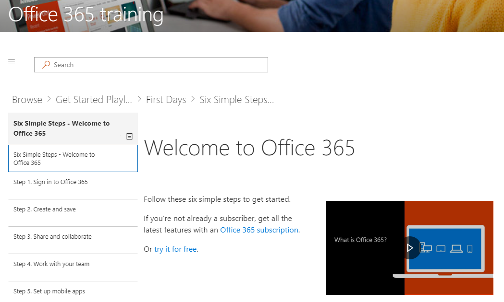

# Composant Webpart de formation et de contenu de site

Passons en revue le contenu fourni dans cet ensemble de la solution.  Nous allons commencer avec le contenu du composant webpart qui est diffusé directement 

Les six étapes simples proviennent d’une équipe de recherche de Microsoft. Ce sont les étapes chercheurs Microsoft ont constaté plus difficiles, ce qui signifie que si les utilisateurs de passer par ces étapes, leur utilisation d’Office 365 augmentera et ils deviendront des employés plus productifs. Et qui convient pour tout le monde.

Accédez à démarrer avec six étapes simples
- Dans la page d’accueil, cliquez sur Démarrer avec six étapes simples. 
- Vous voyez la page de formation Office avec le composant WebPart personnalisé Learning acheminé vers le début avec six étapes de la sélection.  

