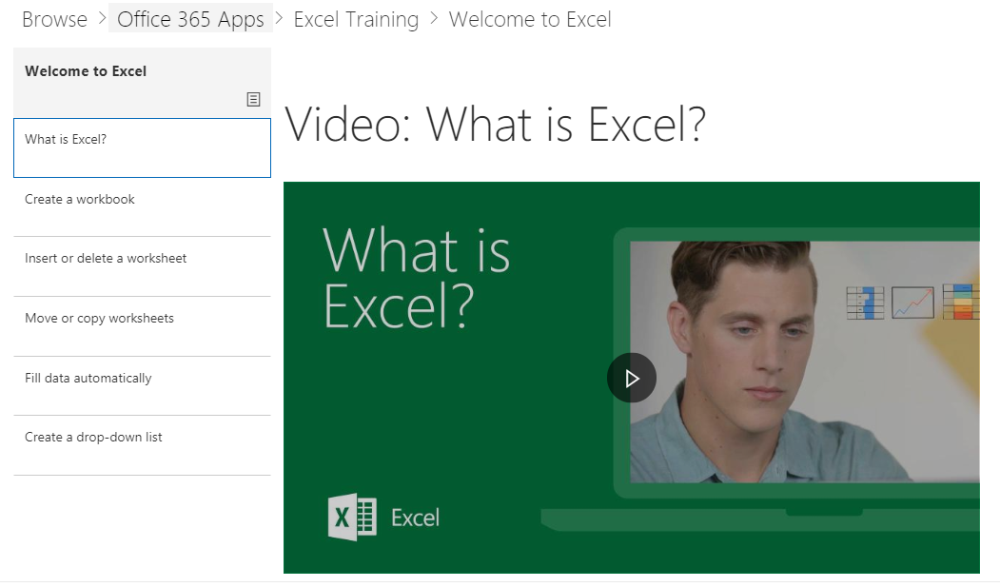

# Contenu par défaut du composant WebPartWebpart Default Content

## Modèle de la playlistThe Playlist Model

Notre composant WebPart utilise un modèle de playlist familier pour organiser le contenu.Our webpart uses a familiar playlist model to organize the content.  Ce modèle est simple pour les utilisateurs finals à comprendre et à personnaliser si vous le souhaitez.This model is simple for your end users to understand and for you to customize should you choose to.  La personnalisation n'est pas obligatoire.Customization is not required.  Notre expérience out-of-Box vous fournit un contenu de formation efficace basé sur notre recherche approfondie.Our out of the box experience provides you with effective training content based on our extensive research.

Ces playlists sont conçues pour aider les organisations à personnaliser l'expérience d'apprentissage pour les utilisateurs et à les présenter avec des playlists faciles à utiliser pour les animer et les comportements plus productifs.These playlists are designed to help organizations tailor the learning experience for users and present them with easy-to-consume playlists to teach them new, and more productive behaviors. Le contenu de serve de Support.Office.com et les biens sont courts et doux, avec Peppy, attirant des vidéos.The serve content from Support.Office.com, and the assets are short and sweet, with peppy, engaging videos. 

Chaque vignette représente une sélection individuelle ou une catégorie de contenu.Each tile represents either an individual featured playlist or a content category. Le fait de cliquer sur une sélection ou une vignette de catégorie permet de naviguer rapidement dans la zone sélectionnée.Clicking on any playlist or category tile quickly navigates the user into the selected area. Le graphique ci-dessous présente les deux listes en vedette sous «liste de sélection de prise en main» et les catégories d'applications Office 365 telles que Excel, Microsoft teams et autres.The graphic below shows both featured lists under "Get Started Playlist" and Office 365 App categories like Excel, Microsoft Teams and others. 

Si vous cliquez sur la catégorie Excel, l'instance se déplace vers une collection de playlists.Clicking the Excel category for instance navigates them to a collection of playlists.  Ils peuvent suivre le contenu dans l'ordre ou sélectionner les centres d'intérêt en fonction de leurs besoins de formation.They can watch content in order or select what interests them based on their learning needs. 

Vue de playlist sélectionnéeSelected playlist view

## Étapes suivantesNext Steps

- Parcourir et se familiariser avec le contenu existantBrowse and familiarize yourself with the existing content
- Procéder à la [personnalisation](customplaylists.md) des sélectionsProceed to [customize playlists](customplaylists.md)